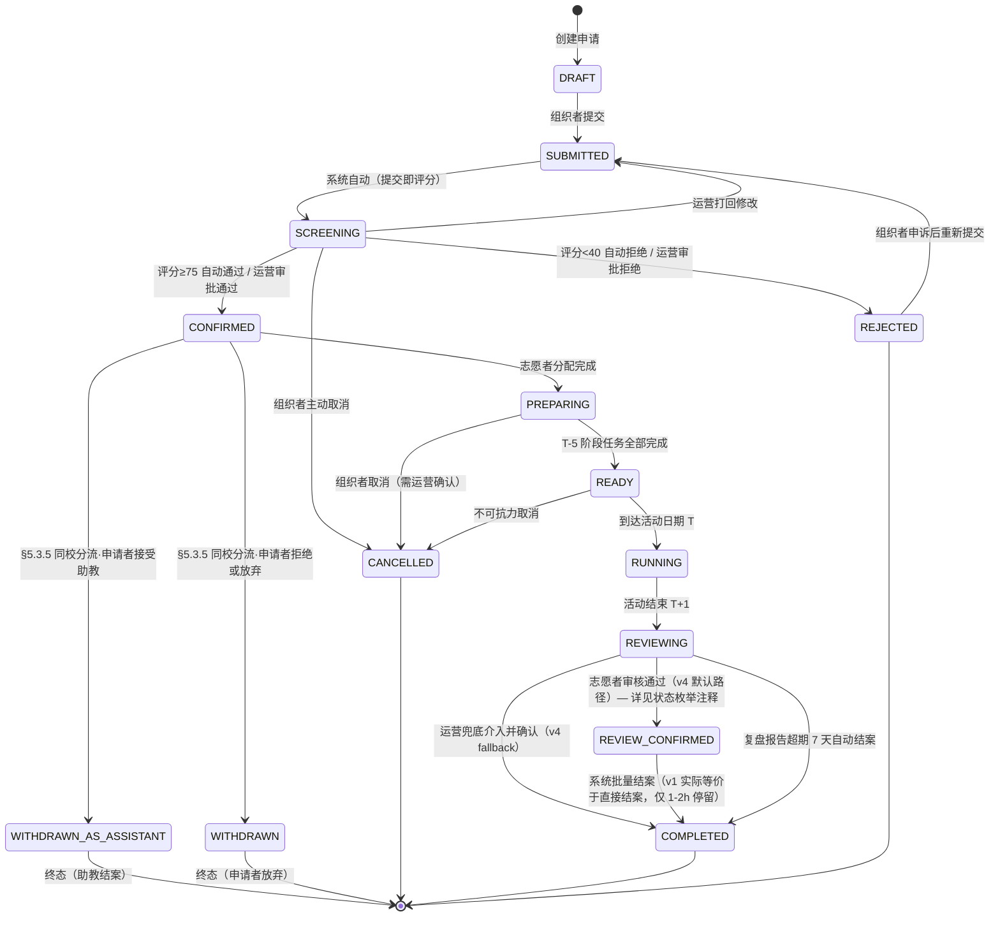
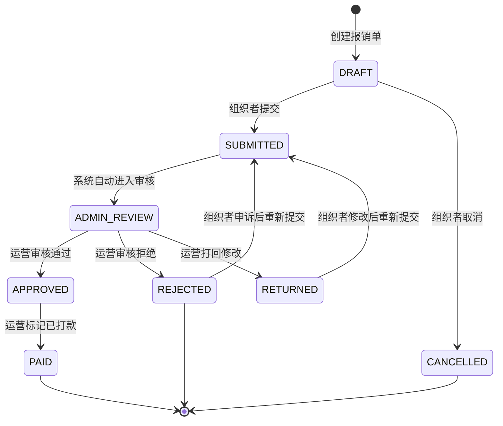
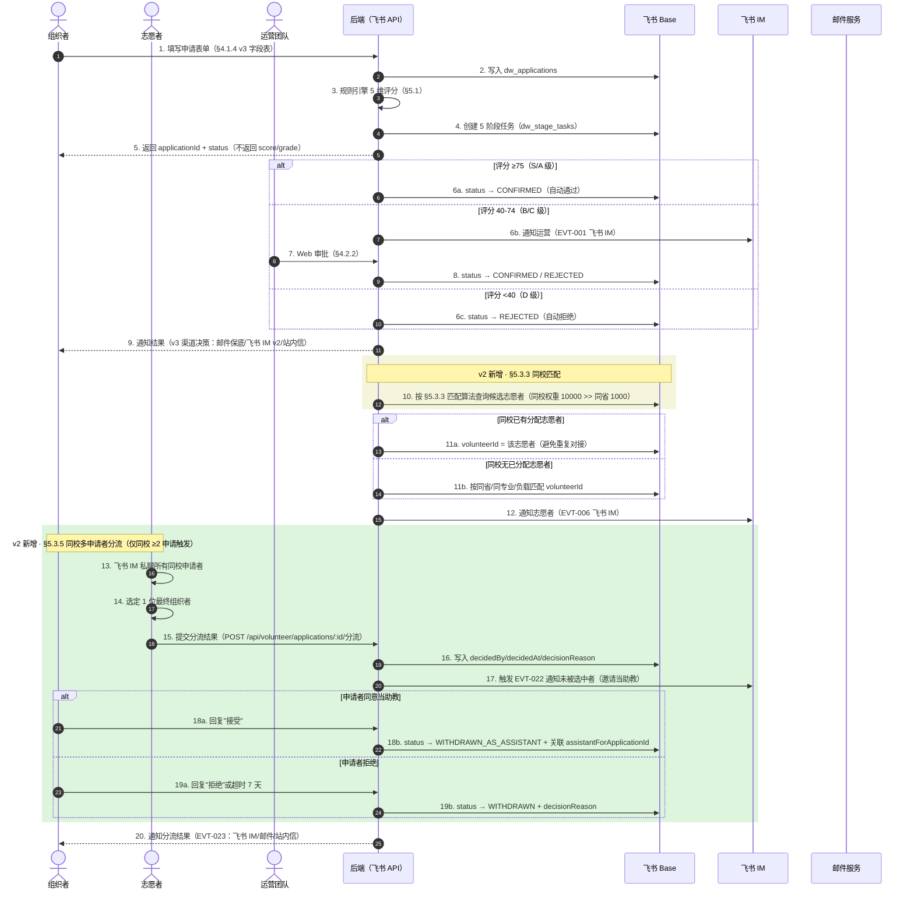
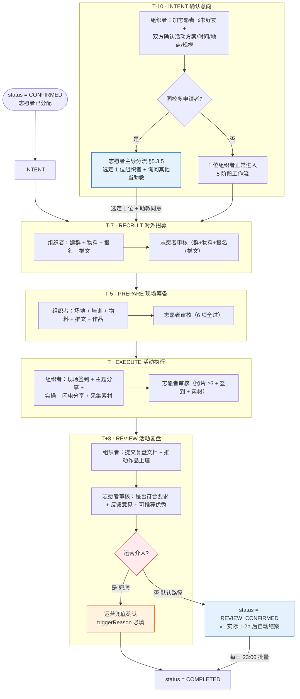
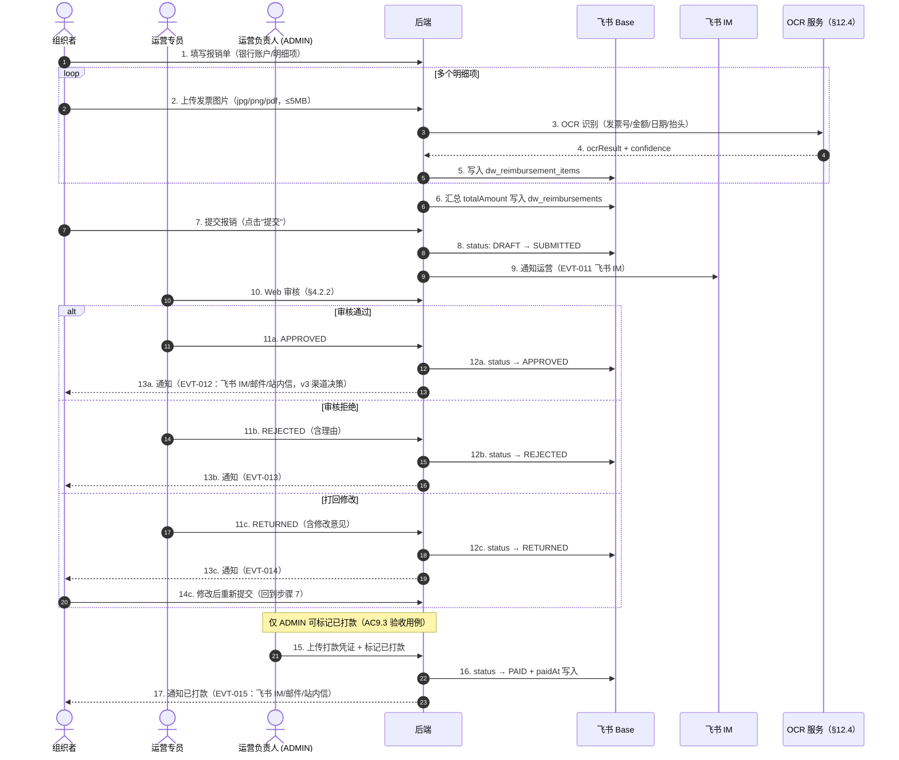
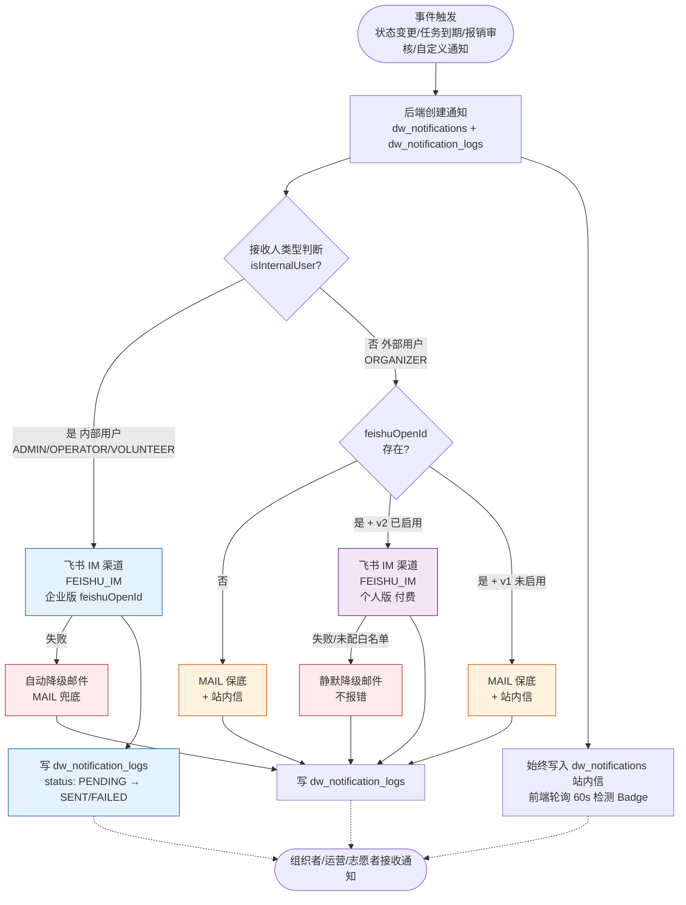

# Datawhale 高校活动智能管理系统 · PRD

> **定位**：Datawhale 企业级项目，部署在 Datawhale.cn 子路径下  
> **核心原则**：飞书优先，能不造轮子就不造；仅在飞书能力无法覆盖外部用户时才自建替代  
> **数据存储**：飞书多维表格（Base）作为唯一数据源  
> **文件存储**：飞书云空间（Drive）  

---

## 1. 项目概述

### 1.0 读者与目标

- **目标读者**：项目负责人 Frank（懂业务，不懂技术）+ 后续接手开发/测试的 AI agent 与工程师
- **本文档作用**：
  - 业务规则、状态机、约束、节奏的"唯一真相源"
  - 后续技术文档（API、数据字典、UI 流程）的"业务基线"
- **交付节点**：v1 上线 = **2026-08-25**（硬节点，质量优先于速度）
- **不在本文档范围**：详细接口定义、UI 原型、部署脚本、QA 用例全集（→ `docs/`）
- **文档维护**：本文档随业务变化持续迭代；多轮对话修订记录见文末"修订记录"章节

### 1.1 背景

Datawhale 面向全国高校开展 AI+X 创造节、学习沙龙、算法大赛等活动。每年 200+ 高校参与，涉及申请收集、智能初筛、进度跟踪、物料下发、报销闭环等环节。目前这些环节分散在邮件、微信、飞书群和多份在线表格中，效率低、易遗漏、体验差。

### 1.2 运营痛点与解决对照

| # | 运营痛点 | 现状 | 系统解决方案 |
|---|---------|------|-------------|
| 1 | 申请收集散乱 | 邮件/微信零散收集，遗漏率高 | 统一 Web 申请入口，提交即自动评分 |
| 2 | 筛选效率低 | 人工逐个审核，标准不统一 | 5 维规则引擎自动评分 + 分级（A/B/C/D） |
| 3 | 进度不可视 | 组织者不知道下一步做什么 | 5 阶段任务看板（T-10→T+3），每阶段有明确任务和截止日 |
| 4 | 物料分发乱 | 网盘链接散落，版本不统一 | 飞书 Drive 统一存储，Web 物料中心按活动分类下载 |
| 5 | 报销繁琐 | 手工核对发票，手工算金额 | 发票上传 → OCR 自动识别、初审 → 人工复审 → 明细自动汇总 |
| 6 | 通知不到位 | 关键节点遗漏，外部用户收不到飞书消息 | 多通道通知（v2 修订）：内部用户→飞书 IM（企业版），外部用户→邮件（保底）+ 站内信；v2 启用后外部用户可加**飞书 IM（个人版）**——**付费功能**，详见 [飞书帮助中心](https://www.feishu.cn/hc/zh-CN/articles/986962389649-在工作流和自动化中发送消息) |
| 7 | 数据分散 | 多个表格/文档，数据不一致 | 飞书 Base 唯一数据源，运营可在多维表格直接查看/编辑 |
| 8 | 志愿者匹配凭感觉 | 没有科学的分配逻辑 | 按地域 + 专业 + 负载自动推荐志愿者 |
| 9 | 申请者入群断链 | 申请者填完问卷后未加入活动群，志愿者无法加微信，流程在节点 3 断裂 | 申请提交成功后**强制显示活动群二维码**，要求扫码加入；入群状态自动检测（群 API 校验） |

### 1.3 设计原则

1. **飞书优先**：数据存飞书 Base，文件存飞书 Drive，内部通知走飞书 IM —— 不造轮子
2. **外部隔离**：志愿者和高校组织者不在 Datawhale 飞书企业内，通过 Web 操作，后端代理调用飞书 API
3. **一套数据源**：所有数据在飞书 Base 中统一管理，运营可在多维表格中直接查看/编辑
4. **渐进增强**：当前用个人版飞书应用跑通流程；接入企业应用后，内部用户可启用飞书 SSO / 审批 / 消息
5. **v3 通知策略（2026-08-20）**：v1 因时间紧迫，外部用户通知**邮件保底**；**v2 启用后飞书 IM（个人版）优先 + 邮件兜底**（用户原话："可以优先使用飞书通知，邮件兜底"）
6. **v4 运营原则（2026-08-20）**：运营**尽量不参与陪跑**，仅在志愿者有事情无法确认/争议/超时/严重违规时介入兜底

---

## 2. 用户角色

### 2.1 角色定义

| 角色 | 代号 | 身份 | 飞书账号 | 登录方式 | 关键能力 |
|------|------|------|---------|---------|---------|
| 运营负责人 | ADMIN | Datawhale 内部 | 是（企业版后） | 飞书 SSO（企业版）/ 账号密码 | 系统配置 + 打款确认 |
| 运营专员 | OPERATOR | Datawhale 内部 | 是（企业版后） | 飞书 SSO（企业版）/ 账号密码 | 审批 + 分配志愿者 + **REVIEW 兜底介入**（v4 修订） |
| 对接志愿者 | VOLUNTEER | 外部社区成员 | 否 | 邮箱 / 手机号 | 分管申请任务跟进 + 凭证审核 + **同校多申请者分流**（v2 新增） |
| 高校组织者 | ORGANIZER | 外部高校学生 | 否 | 邮箱 | 活动申请 + 活动筹备 + 进度查看 + 活动举行 + 报销提交 |
| **助教**（v2 新增） | **ASSISTANT** | 外部高校学生 | 否 | 邮箱 | 协助主组织者准备活动（由 `WITHDRAWN_AS_ASSISTANT` 申请自动产生） |
| **参与者**（v2 新增） | **PARTICIPANT** | 外部用户 | 否 | 邮箱 | 活动报名 + 现场打卡（**v1 简化：仅打卡；v2 启用后有作品墙认证等扩展**） |
| **普通用户**（v2 新增） | **USER** | 外部用户 | 否 | 邮箱 | 浏览活动大厅 + 注册参与（**默认注册角色**） |

**角色对比要点**：
- **ADMIN vs OPERATOR**：仅 ADMIN 有"系统配置"和"打款标记已打款"权限（详见 §10 AC9.3）
- **VOLUNTEER**：是"对接"角色，由运营分配到具体申请；直接联系组织者，确认意向，全程跟进活动，参与反馈与沉淀
- **ORGANIZER**：**自助注册起点是 USER**——用户注册时默认 USER 角色（v1 修订，**不是 ORGANIZER**），需通过申请组织者并经审批通过后才升级为 ORGANIZER（详见角色升级路径）
- **ASSISTANT**（v2 新增）：**从 ORGANIZER 派生**——同校多申请者分流后，未被选中的申请者接受助教邀请即获此角色（详见 §5.3.5 + US-O13）；**不走 5 阶段工作流**，由主组织者直接管理
- **PARTICIPANT**（v2 新增）：**从 USER 派生**——用户报名某活动 + 活动当天成功打卡（POST `/api/participants/:id/checkin`）后自动升级为 PARTICIPANT；之后保持 PARTICIPANT 角色（不再回退）；ORGANIZER/ADMIN/OPERATOR/VOLUNTEER 跳过此升级路径
- **USER**（v2 新增）：**系统默认注册角色**——所有邮箱注册的用户默认 USER 角色，**不是 ORGANIZER**（v1 旧逻辑 bug 修复）；USER 角色在未申请任何活动前 = 普通用户

**角色升级路径图（v2 修订）**：

```
注册 → USER（普通用户）
  ├─ 申请组织者 + 审批通过 → ORGANIZER（同时自动初始化 19 个 5 阶段子任务，详见 §5.4.4）
  │  └─ 同校多申请者分流未被选中 + 接受助教邀请 → ASSISTANT
  ├─ 报名活动 + 活动当天成功打卡 → PARTICIPANT
  └─ ADMIN/OPERATOR/VOLUNTEER 由 admin 后台手动创建（不在前台注册）
```

> **v1 测试模式（临时约束）**：v1 飞书个人版期间，Frank 一人扮演 7 角色、所有邮件/通知收件人统一为 `frank-fangyz@139.com`；企业版应用到位后此约束自动废止。完整约定见 [AGENTS.md](./AGENTS.md)「项目偏好 → 测试场景临时约束」。

### 2.2 权限矩阵

> ✓ = 允许；✗ = 拒绝；**R/W** = 读写；**R** = 只读
> **v2 修订（2026-08-20）**：新增 **ASSISTANT**（助教）列——同校多申请者分流后未被选中者接受助教邀请即获此角色（详见 §5.3.5 + US-O13）。
> **v2 修订（2026-08-22 · Frank 反馈）**：新增 **USER**（普通用户）和 **PARTICIPANT**（参与者）列——USER 是注册默认角色，PARTICIPANT 是打卡升级角色（详见 §2.1 升级路径）。

| 功能模块 | ADMIN | OPERATOR | VOLUNTEER | ORGANIZER | **ASSISTANT** | **PARTICIPANT** | **USER** |
|----------|-------|----------|-----------|-----------|---------------|------------------|----------|
| **数据看板** | ✓ 全局 | ✓ 全局 | ✓ 分管范围 | ✗ | ✗ | ✗ | ✗ |
| **审批工作台** | ✓ | ✓ | ✓ R（看自己分管） | ✗ | ✗ | ✗ | ✗ |
| **申请管理** | R/W | R/W | R（分管） | R/W（自己） | R（关联主申请） | ✗（只浏览活动） | ✗（只浏览活动） |
| **任务管理** | ✓ | ✓ | ✓（分管） | R/W（自己） | R（主组织者分配） | ✗ | ✗ |
| **报销管理** | R/W + 打款 | R/W（审核） | ✗ | R/W（自己） | ✗ | ✗ | ✗ |
| **活动库** | R/W | R/W | ✗ | R | R | ✗ | ✗ |
| **高校库** | R/W | R/W | ✗ | ✗ | ✗ | ✗ | ✗ |
| **志愿者管理** | R/W | R/W | R/W（自己） | ✗ | ✗ | ✗ | ✗ |
| **物料管理** | R/W | R/W | R（分管） | R（下载） | R（下载，关联活动） | R（下载） | R（下载） |
| **报名参与** | ✗ | ✗ | ✗ | ✗ | ✗ | ✓ R/W（自己） | ✓ R/W（自己） |
| **我的报名** | ✗ | ✗ | ✗ | ✗ | ✗ | ✓ R | ✗ |
| **现场打卡** | ✗ | ✗ | ✗ | ✗ | ✗ | ✓（自己） | ✗（先报名后打卡） |
| **FAQ 管理** | R/W | R/W | R + 提问 | R + 提问 | R + 提问 | R + 提问 | R + 提问 |
| **通知日志** | ✓ | ✓ | ✗ | ✗ | ✗ | ✗ | ✗ |
| **系统配置** | ✓ | ✗ | ✗ | ✗ | ✗ | ✗ | ✗ |

**权限粒度说明**：
- **"自己"** = 当前用户 `userId` 匹配记录；**"分管"** = 当前用户作为 `assigneeId` / `volunteerId` 关联
- 列表/详情查询受"自己 / 分管 / 全局"三档限制（实现层按 SQL 过滤）
- 写操作（创建/更新/删除）需登录 + 对应角色权限；未授权 → HTTP 403
- 权限边界对应测试用例见 §10 验收标准（AC1-AC12）

---

## 3. 用户故事

> 格式说明：每个用户故事以 As a / I want / So that 描述价值，并以 GWT（Given-When-Then）给出可测试的验收点，补充异常场景、边界条件与权限边界，供开发与测试直接落地。

### 3.1 高校组织者（ORGANIZER）

#### US-O1 注册登录 [P0]
- **As a** 高校组织者
- **I want** 用邮箱注册账号并登录
- **So that** 在系统中申请 Datawhale 活动

**验收点（GWT）**：
- **Given** 用户未注册，**When** 填写有效邮箱+密码（≥6位），**Then** 注册成功，跳转登录页
- **Given** 用户已注册，**When** 输入正确邮箱+密码，**Then** 登录成功，获取 JWT，跳转活动大厅
- **Given** 用户已注册，**When** 输入错误密码，**Then** 提示"账号或密码错误"
- **Given** 邮箱格式错误，**When** 提交注册，**Then** 提示"邮箱格式不正确"
- **Given** 密码<6位，**When** 提交注册，**Then** 提示"密码至少6位"

**异常场景**：
- 邮箱已被注册 → 提示"该邮箱已注册，请直接登录"
- 网络超时 → 提示"网络异常，请重试"
- 登录接口 5xx → 提示"服务繁忙，请稍后重试"

**边界条件**：
- 邮箱/密码为空 → 提交按钮置灰或提示"必填项不能为空"
- 邮箱长度>254 字符 → 提示"邮箱长度超出限制"
- 密码=6 位（下边界）→ 注册成功
- 密码含特殊字符（如 `!@#￥%`）→ 允许，正常注册
- 邮箱前后含空格 → 自动 trim 后校验

**权限边界**：
- 未登录用户访问活动大厅 → 跳转登录页
- JWT 过期 → 自动跳转登录页并提示"登录已过期，请重新登录"

#### US-O2 浏览活动大厅 [P0]
- **As a** 高校组织者
- **I want** 在活动大厅浏览所有可申请的活动
- **So that** 了解活动详情和要求

**验收点（GWT）**：
- **Given** 活动大厅存在多个上架活动，**When** 组织者进入活动大厅，**Then** 按发布时间倒序展示活动卡片（封面/标题/截止日期/状态）
- **Given** 某活动处于"报名中"，**When** 点击活动卡片，**Then** 进入活动详情页，展示介绍/申请要求/截止时间/AI 评分维度
- **Given** 活动有报名截止时间，**When** 截止时间已过，**Then** 卡片标记"已截止"，申请按钮置灰

**异常场景**：
- 活动列表为空 → 展示空状态"暂无可申请的活动"
- 活动详情加载失败 → 提示"加载失败，请重试"

**边界条件**：
- 活动数量>20 → 分页加载，每页 20 条，支持滚动加载
- 活动标题超长 → 截断显示，hover 展示完整标题
- 活动封面图缺失 → 展示默认占位图

**权限边界**：
- 未登录访问活动大厅 → 跳转登录页
- 非组织者角色（志愿者/运营）登录 → 不展示"申请"按钮

#### US-O3 提交活动申请 [P0]
- **As a** 高校组织者
- **I want** 在线填写申请表（含场地能力）并提交
- **So that** 快速完成活动申请，而不是发邮件

**验收点（GWT）**：
- **Given** 组织者已登录且选择某活动，**When** 完整填写申请表（含场地题选择），**Then** 提交成功，生成申请单号，**自动跳转进度页**
- **Given** 进度页加载完成，**When** 进入页面，**Then** 前端**自动弹出活动大群飞书二维码**（提示"扫码加入活动飞书群"）
- **Given** 申请提交成功，**When** 后端返回成功，**Then** 前端**自动弹出活动大群飞书二维码**（提示"扫码加入活动飞书群"）
- **Given** 二维码弹窗已显示，**When** 用户**关闭二维码弹窗**，**Then** 询问"您是否已经加入活动飞书群？"（不强制）
- **Given** 申请表存在必填项，**When** 必填项为空提交，**Then** 提示"请填写 XXX"
- **Given** 组织者填写过程中，**When** 点击"暂存"，**Then** 草稿保存，下次进入可继续编辑

**异常场景**：
- 同一活动重复申请 → 提示"您已申请该活动，请勿重复提交"
- 提交时网络断开 → 本地保留草稿，提示"提交失败，已保存草稿"
- 服务端校验失败 → 提示具体字段错误并定位
- 二维码加载失败 → 提示"二维码加载失败，请联系运营"

**边界条件**：
- 简介字数<500 → 提示"简介不超过 500 字"
- 场地题未选 → 必填校验
- 活动时间早于当前 → 提示"活动时间须晚于当前"

**权限边界**：
- 未登录提交 → 跳转登录页
- 活动已截止 → 申请按钮置灰，提示"报名已截止"
- 非组织者角色 → 无申请入口

#### US-O4 查看 AI 评分结果 [P1]
- **As a** 高校组织者
- **I want** 在人工审核完成后查看 AI 评语和各维度评分
- **So that** 了解自己的申请竞争力，知道强弱项

**验收点（GWT）**：
- **Given** 申请已提交，**When** 组织者访问申请详情页（审核未完成），**Then** 评分区域置灰，提示"预计 3 个工作日内通知您结果"
- **Given** 审核流程结束（CONFIRMED/REJECTED），**When** 组织者访问申请详情页，**Then** 展示 AI 总分（0-100）、等级（S/A/B/C/D）+ 5 维明细 + 评语
- **Given** 评分展示中，**When** 组织者点击"展开详情"，**Then** 展示 5 维各维度得分 + 命中关键词 + 评分理由
- **Given** 审核结果为 REJECTED，**When** 组织者查看详情，**Then** AI 评分**仍展示**（与通过一致），用于复盘

**异常场景**：
- 评分服务超时 → 详情页展示"评分暂不可用"，由运营人工补评后回填
- 评分数据损坏 → 展示"评分数据异常，请联系运营"
- 审核已完成但评分未生成 → 展示"评分生成中…"

**边界条件**：
- 总分=100 → 等级 S
- 总分<=40 → 等级 D，提示"建议完善申请材料"
- 评语为空 → 展示"暂无 AI 评语"
- 申请状态非终态（SUBMITTED/SCREENING/PREPARING 等）→ 评分区域置灰

**权限边界**：
- 未登录 → 跳转登录页
- 非本人申请 → 无权查看他人评分

#### US-O5 查看进度页时间轴 [P0]
- **As a** 高校组织者
- **I want** 在进度页面看到 5 阶段时间轴（确认意向-对外招募-现场筹备-活动执行-活动复盘）和当前待办任务
- **So that** 知道下一步该做什么

> **注**：5 阶段指**组织者申请进度**（从确认意向到活动复盘）。**发票报销**是另一条审批进度线（DRAFT→SUBMITTED→ADMIN_REVIEW→APPROVED→PAID），详见 §4.1.7 报销中心 + §5.2 状态机。**两者独立，不要混在同一条时间轴**。

**验收点（GWT）**：
- **Given** 申请已提交，**When** 进入进度页，**Then** 展示 5 阶段时间轴（**确认意向-对外招募-现场筹备-活动执行-活动复盘**），高亮当前阶段
- **Given** 当前阶段有待办任务，**When** 查看时间轴下方，**Then** 展示待办任务列表（任务名/截止时间/操作按钮）
- **Given** 某阶段已完成，**When** 查看时间轴，**Then** 该节点标记"已完成"并展示完成时间
- **Given** 申请进入"活动复盘"阶段，**When** 进入进度页，**Then** 展示"待提交复盘报告"+ 复盘提交入口

**异常场景**：
- 申请被拒绝 → 时间轴标记终止，展示"申请未通过"及原因
- 时间轴数据加载失败 → 提示"加载失败，请刷新"

**边界条件**：
- 申请刚提交（第 1 阶段）→ 高亮"申请提交"，后续阶段置灰
- 全部阶段完成 → 展示"已完成"终态
- 待办任务无截止时间 → 截止时间列展示"—"

**权限边界**：
- 未登录 → 跳转登录页
- 非本人申请 → 无权查看

#### US-O6 上传阶段完成凭证 [P1]
- **As a** 高校组织者
- **I want** 上传阶段完成凭证（照片/文档）
- **So that** 证明任务已完成

**验收点（GWT）**：
- **Given** 当前阶段任务需上传凭证，**When** 组织者选择文件并上传，**Then** 上传成功，凭证列表展示文件名/大小/上传时间
- **Given** 凭证已上传，**When** 点击凭证，**Then** 支持预览（图片直接预览，文档下载）
- **Given** 任务需多个凭证，**When** 上传第二个凭证，**Then** 凭证列表追加展示

**异常场景**：
- 文件格式不支持 → 提示"仅支持 jpg/png/pdf/docx 格式"
- 文件大小超限（>10MB）→ 提示"文件不能超过 10MB"
- 上传中断 → 支持重新上传

**边界条件**：
- 文件名含特殊字符 → 上传时自动转义或重命名
- 空文件（0KB）→ 提示"文件不能为空"
- 凭证数量达到任务上限 → 提示"凭证数量已达上限"

**权限边界**：
- 未登录 → 跳转登录页
- 任务未到对应阶段 → 禁止上传
- 申请已结项 → 禁止上传

#### US-O7 下载活动物料 [P1]
- **As a** 高校组织者
- **I want** 在物料中心下载活动相关物料（海报/指南/模板）
- **So that** 准备活动

**验收点（GWT）**：
- **Given** 物料中心有活动相关物料，**When** 组织者进入物料中心，**Then** 按类型分组展示物料（海报/指南/模板）
- **Given** 选中某物料，**When** 点击下载，**Then** 文件下载到本地
- **Given** 物料有关联活动，**When** 查看物料，**Then** 展示所属活动名称

**异常场景**：
- 物料文件已删除/丢失 → 提示"物料不存在或已下架"
- 下载网络异常 → 提示"下载失败，请重试"

**边界条件**：
- 物料列表为空 → 展示"暂无物料"
- 文件名超长 → 截断显示
- 文件较大（>50MB）→ 异步打包下载并提示进度

**权限边界**：
- 未登录 → 跳转登录页
- 非组织者角色 → 按权限矩阵，志愿者仅查看分管范围

#### US-O8 提交报销申请 [P1]
- **As a** 高校组织者
- **I want** 在线提交报销申请并上传发票图片
- **So that** 快速完成报销而不邮寄纸质发票

**验收点（GWT）**：
- **Given** 申请进入报销阶段，**When** 组织者填写报销单（金额/事由/明细）并上传发票图片，**Then** 提交成功，状态变为"待审核"
- **Given** 报销单含多个明细，**When** 添加明细行，**Then** 明细列表追加，金额自动汇总
- **Given** 已提交报销，**When** 查看报销详情，**Then** 展示报销单信息及发票图片

**异常场景**：
- 报销金额为 0 或负数 → 提示"报销金额须大于 0"
- 发票图片未上传 → 提示"请上传发票图片"
- 报销阶段未开启 → 提示"当前阶段不可报销"

**边界条件**：
- 报销金额超大（>1000）→ 提示"金额超出单次报销上限，请联系运营"
- 明细行数>20 → 提示"明细行数已达上限"
- 发票图片模糊/损坏 → 允许上传但提示"建议上传清晰发票"

**权限边界**：
- 未登录 → 跳转登录页
- 申请未到报销阶段 → 禁止提交
- 非本人申请 → 无权操作

#### US-O9 查看发票 OCR 识别结果 [P2]
- **As a** 高校组织者
- **I want** 看到发票 OCR 自动识别的金额和明细
- **So that** 核对报销信息

**验收点（GWT）**：
- **Given** 发票图片已上传，**When** OCR 服务识别完成，**Then** 展示识别出的金额/日期/发票号/购买方
- **Given** OCR 识别完成，**When** 组织者核对发现错误，**Then** 支持手动修改识别字段
- **Given** 修改完成，**When** 保存，**Then** 报销单金额按修改后值更新

**异常场景**：
- OCR 识别失败 → 提示"识别失败，请手动填写"
- OCR 识别置信度低 → 字段标记"待核对"，提示用户确认

**边界条件**：
- 发票图片模糊 → 识别结果可能不完整，提示"建议重新上传清晰图片"
- 多张发票 → 逐张识别，汇总展示
- 发票号重复 → 提示"该发票号已存在，请核对"

**权限边界**：
- 未登录 → 跳转登录页
- 非本人报销单 → 无权查看

#### US-O10 收到审核结果通知 [P1]
- **As a** 高校组织者
- **I want** 收到审核结果通知（邮件/站内信）
- **So that** 及时知道是否通过

**验收点（GWT）**：
- **Given** 运营完成审批，**When** 审批结果落库，**Then** 系统发送邮件+站内信通知组织者
- **Given** 组织者收到站内信，**When** 点击通知，**Then** 跳转对应申请进度页
- **Given** 通知含审批意见，**When** 查看通知内容，**Then** 展示审批结果（通过/拒绝/打回）及意见

**异常场景**：
- 邮件发送失败 → 站内信仍发送，邮件记录失败日志
- 邮箱地址无效 → 邮件退回，记录退信日志

**边界条件**：
- 通知内容超长 → 邮件正文截断，详情见站内信
- 组织者关闭邮件通知偏好 → 仅发站内信
- 审批意见为空 → 通知正文展示"无附加意见"

**权限边界**：
- 未登录用户 → 邮件仍可送达，站内信需登录后查看
- 通知仅发送给申请人本人

#### US-O11 查看站内消息 [P1]
- **As a** 高校组织者
- **I want** 在站内消息中查看所有通知
- **So that** 不遗漏重要信息

**验收点（GWT）**：
- **Given** 组织者有未读消息，**When** 进入站内消息页，**Then** 按时间倒序展示消息列表，未读消息标记红点
- **Given** 选中某消息，**When** 点击查看，**Then** 展示消息详情，标记为已读
- **Given** 消息列表较多，**When** 滚动到底部，**Then** 分页加载更多

**异常场景**：
- 消息加载失败 → 提示"加载失败，请重试"
- 消息已被撤回 → 列表标记"已撤回"

**边界条件**：
- 消息列表为空 → 展示"暂无消息"
- 单条消息内容超长 → 列表截断，详情页完整展示
- 未读消息数>99 → 角标显示"99+"

**权限边界**：
- 未登录 → 跳转登录页
- 仅能查看自己账号的消息

#### US-O12 编辑个人信息与修改密码 [P2]
- **As a** 高校组织者
- **I want** 编辑个人信息和修改密码
- **So that** 管理自己的账号

> **🔧 TODO（待 Datawhale 官网 OAuth 共用身份决定）**：
> - 用户原话 2026-08-15："等待是否能取得与 Datawhale 官网共用身份认证的机会，**能就不用这部分了，不能才要**"
> - 若 OAuth 共用身份获得许可 → 本节 US-O12 + §4.1.9 整个撤掉，登录态走 OAuth（自动获取姓名/手机/邮箱等）
> - 若 OAuth 不许可 → 按本节实现邮箱注册 + 密码自管理
> - 详见 `TODO.md` 🟡 第 5 项

**验收点（GWT）**：
- **Given** 组织者已登录，**When** 进入个人中心编辑昵称/手机号/学校并保存，**Then** 信息更新成功
- **Given** 组织者修改密码，**When** 输入旧密码+新密码（≥6 位）+确认密码且三者一致、旧密码正确，**Then** 修改成功，需重新登录
- **Given** 修改密码时，**When** 新密码与确认密码不一致，**Then** 提示"两次密码不一致"

**异常场景**：
- 旧密码错误 → 提示"旧密码不正确"
- 手机号格式错误 → 提示"手机号格式不正确"
- 保存时网络异常 → 提示"保存失败，请重试"

**边界条件**：
- 昵称为空 → 使用默认昵称
- 昵称超长（>20 字符）→ 提示"昵称不超过 20 字符"
- 手机号含特殊字符 → 提示"手机号仅支持数字"
- 新密码=旧密码 → 提示"新密码不能与旧密码相同"

**权限边界**：
- 未登录 → 跳转登录页
- 仅能编辑本人信息

#### US-O13 助教角色（v2 新增 · §5.3.5 配套） [P2]
- **As a** 同校多申请者分流后被推荐为**助教**的高校学生
- **I want** 收到志愿者邀请、选择接受/拒绝；接受后能查看活动详情、协助组织者准备活动
- **So that** 仍能参与 Datawhale 高校活动，但以助教身份而非主组织者

> **背景（用户原话 2026-08-20）**："对于同一所学校多人同时申请为组织者的情况，最终确定一个成为组织者，剩余的人由志愿者通知，看看愿不愿意担任其他角色（助教等）"
>
> **v2 新增**：本 US 是 §5.3.5 同校多申请者分流流程的组织者侧入口；详见 §3.2 US-V4 INTENT 阶段分流。

**验收点（GWT）**：
- **Given** 同校多申请者分流后，**When** 志愿者通知"是否愿意担任助教"，**Then** 组织者门户收到 EVT-022 通知（含主组织者姓名+活动名）
- **Given** 组织者点击"接受助教邀请"，**When** 确认接受，**Then** 申请状态转 `WITHDRAWN_AS_ASSISTANT` + 触发 EVT-023
- **Given** 申请状态 = `WITHDRAWN_AS_ASSISTANT`，**When** 进入个人中心，**Then** 展示"您是 {activityTitle} @ {university} 的助教，主组织者 {organizerName}"+ 提供原主组织者飞书联系方式
- **Given** 助教身份，**When** 进入活动详情页，**Then** 展示完整活动信息（与组织者同权限查看）
- **Given** 助教身份，**When** 活动主组织者分配任务（场地布置/物料整理/活动签到等），**Then** 助教可接收任务（不通过 5 阶段工作流，由主组织者直接管理）

**异常场景**：
- 助教邀请超时未回复（7 天）→ 自动按"拒绝"处理，状态转 `WITHDRAWN`
- 助教中途退出 → 状态 `WITHDRAWN_AS_ASSISTANT` → `WITHDRAWN`，通知主组织者
- 主组织者申请被 REJECTED/CANCELLED → 助教身份自动失效，转 `WITHDRAWN`

**边界条件**：
- 助教**不**走 5 阶段任务工作流
- 助教**不**独立提交报销（如有费用由主组织者统一处理）
- 助教**不**接收 EVT-016/017 等阶段任务通知（仅接收活动主通知）

**权限边界**：
- 仅 `WITHDRAWN_AS_ASSISTANT` 状态的组织者享有助教身份
- 助教可登录但功能受限（仅查看活动详情 + 接收主组织者分配任务）

### 3.2 对接志愿者（VOLUNTEER）

#### US-V1 志愿者登录 [P0]
- **As a** 对接志愿者
- **I want** 用邮箱登录系统
- **So that** 查看分配给我的高校申请

> **🔧 TODO（待 Datawhale 官网 OAuth 共用身份决定）**：
> - 用户原话 2026-08-17："志愿者登录是老问题，要等 Datawhale 官网愿不愿意提供登录状态"
> - 若 OAuth 共用身份获得许可 → 本节 US-V1 整个撤掉，登录态走 OAuth
> - 若 OAuth 不许可 → 按本节实现邮箱注册 + 密码自管理
> - 详见 `TODO.md` 🟡 第 5 项

**验收点（GWT）**：
- **Given** 志愿者账号已由运营创建，**When** 输入正确邮箱+密码，**Then** 登录成功，获取 JWT（角色=VOLUNTEER），跳转志愿者工作台
- **Given** 志愿者首次登录，**When** 登录成功，**Then** 提示完善个人信息（可选）
- **Given** 志愿者输入错误密码，**When** 提交，**Then** 提示"账号或密码错误"

**异常场景**：
- 账号未激活 → 提示"账号未激活，请联系运营"
- 账号被禁用 → 提示"账号已被禁用，请联系管理员"
- 登录接口异常 → 提示"服务繁忙，请稍后重试"

**边界条件**：
- 邮箱/密码为空 → 提交按钮禁用
- 密码连续错误 5 次 → 锁定账号 15 分钟
- 邮箱大小写不一致 → 统一转小写匹配

**权限边界**：
- 组织者账号登录 → 无志愿者工作台入口
- 运营账号登录 → 跳转运营后台而非志愿者工作台
- 志愿者无注册入口（账号由运营创建）

#### US-V2 查看负责的申请列表 [P0]
- **As a** 对接志愿者
- **I want** 看到我负责的申请列表和当前状态
- **So that** 跟进进度

**验收点（GWT）**：
- **Given** 志愿者已被分配多个申请，**When** 进入工作台，**Then** 按更新时间倒序展示申请列表（高校/活动/当前阶段/状态/待办数）
- **Given** 申请有不同状态，**When** 按状态筛选，**Then** 仅展示对应状态申请
- **Given** 列表项，**When** 点击某申请，**Then** 跳转申请详情页

**异常场景**：
- 志愿者未被分配任何申请 → 展示空状态"暂无负责的申请"
- 列表加载失败 → 提示"加载失败，请重试"

**边界条件**：
- 申请数量>20 → 分页加载
- 状态筛选无结果 → 展示"无符合条件申请"
- 待办数=0 → 不展示角标

**权限边界**：
- 未登录 → 跳转登录页
- 志愿者仅能查看分配给自己的申请，不可查看他人负责的申请

#### US-V3 查看申请详情与评分 [P1]
- **As a** 对接志愿者
- **I want** 查看申请详情和评分信息
- **So that** 了解申请情况

**验收点（GWT）**：
- **Given** 志愿者点击某申请，**When** 进入详情页，**Then** 展示申请表信息/AI 评分/时间轴/凭证
- **Given** AI 评分已生成，**When** 查看评分区，**Then** 展示总分/等级/各维度得分
- **Given** 申请有审批意见，**When** 查看审批记录，**Then** 展示审批人/时间/意见

**异常场景**：
- AI 评分未生成 → 展示"评分生成中"
- 详情加载失败 → 提示"加载失败，请重试"

**边界条件**：
- 申请信息字段为空 → 展示"—"
- 凭证数量多 → 折叠展示，点击展开
- 审批记录多条 → 按时间倒序展示

**权限边界**：
- 未登录 → 跳转登录页
- 志愿者仅能查看分配给自己的申请详情

#### US-V4 分阶段审核组织者提交内容 [P1]
- **As a** 对接志愿者
- **I want** 在 5 阶段（确认意向-对外招募-现场筹备-活动执行-活动复盘）每阶段审核组织者提交的内容
- **So that** 推进申请到下一阶段

> **v2 修订（用户原话 2026-08-17）**：5 阶段**统一志愿者审核**（活动复盘由志愿者做出"优秀组织者"评估）。每阶段 = 组织者提交 + 志愿者审核（通过/打回）。

##### INTENT 阶段（确认意向）
- **Given** 申请状态进入 INTENT，**When** 志愿者收到分配通知，**Then** 志愿者**添加申请者联系方式**（飞书 IM 好友）+ **确认活动大致时间/举办地点/基本环节/合作伙伴**
- **Given** 完成上述沟通，**When** 志愿者**向申请者确认其成为活动组织者的意愿**，**Then** 得出初步沟通结论（**有意向 / 不合适 / 需跟进**）
- **Given** 完成沟通，**When** 志愿者在**飞书文档**（申请列表 / 帮组织者的飞书日历标识准确活动时间和站名地点等）上记录，**Then** INTENT 阶段审核通过
- **Given** 该校有**多个同校申请者**（v2 新增 · 用户原话 2026-08-20"同一所学校多人同时申请为组织者的情况，尽量交给同一个志愿者处理和沟通，最终确定一个成为组织者，剩余的人由志愿者通知，看看愿不愿意担任其他角色(助教等)"），**When** 志愿者主导分流，**Then** 确定 1 位最终组织者，**剩余申请者**询问是否愿意担任**助教**（详见 §5.3.5）
  - 同意 → 状态转 `WITHDRAWN_AS_ASSISTANT`（助教）
  - 拒绝 → 状态转 `WITHDRAWN`（放弃）
  - 无法抉择 → 志愿者联系运营兜底拍板

##### RECRUIT 阶段（对外招募）
- **Given** 组织者建立活动群聊，**When** 志愿者**加入群聊**，**Then** 群聊审核通过
- **Given** 组织者提交**定制物料**（海报/横幅/手举牌），**When** 志愿者审核，**Then** 物料审核通过
- **Given** 组织者提交**报名表单**，**When** 志愿者审核，**Then** 表单审核通过
- **Given** 各项都通过，**When** 志愿者点击"通过"，**Then** 进入下一阶段

##### PREPARE 阶段（现场筹备）
- **Given** 组织者提交**场地信息**，**When** 志愿者审核，**Then** 场地审核通过
- **Given** 组织者提交**学习内容**，**When** 志愿者审核，**Then** 学习内容审核通过
- **Given** 组织者提交**物料清单**，**When** 志愿者审核，**Then** 物料审核通过
- **Given** 组织者提交**现场团队**信息，**When** 志愿者审核，**Then** 现场团队审核通过
- **Given** 组织者提交**宣传推文**，**When** 志愿者审核，**Then** 宣传推文审核通过
- **Given** 参与者上传**作品 / 申请的认证**（视活动需要配置），**When** 志愿者审核，**Then** 作品/认证审核通过
- **Given** 各项都通过，**When** 志愿者点击"通过"，**Then** 进入下一阶段

##### EXECUTE 阶段（活动执行）
- **Given** 活动现场执行完成，**When** 组织者提交**现场记录**（现场照片≥3张+签到截图+视频/录音片段等），**Then** 志愿者审核

##### REVIEW 阶段（活动复盘）

> **v4 修订（用户原话 2026-08-20）**："运营不是完全不参加陪跑，而是**尽量不参加**，如果志愿者有事情无法确认，和运营联系就是**兜底措施**"——REVIEW 阶段以**志愿者主导**为准，运营**仅在志愿者无法确认/有争议时介入**。

- **Given** 组织者提交**活动现场素材**和**复盘报告**，**When** 志愿者**审核作品是否符合要求**，**Then** 志愿者完成审核
- **Given** 志愿者完成审核，**When** 志愿者给出**反馈意见**（**好的+不好的都要说**），**Then** 意见通过审核意见字段记录
- **Given** 志愿者认为该组织者"**值得推荐为优秀**"，**When** 志愿者填 `excellentOrganizer=Y` + 推荐理由，**Then** 推荐信息记录（**附加动作，不影响主流程**）
- **Given** 志愿者认为"普通"或"不推荐"，**When** 志愿者填 `excellentOrganizer=N`，**Then** 跳过推荐
- **Given** 志愿者审核完成 + `excellentOrganizer` 已填，**When** 志愿者提交审核，**Then** 申请进入 **REVIEW_CONFIRMED** 终态（运营**默认不介入**，仅在下列场景兜底）
- **运营兜底介入场景**（v4 修订 · 用户原话 2026-08-20）：
  - 志愿者**长时间未审核**（**v4 修订** · 阈值 = **下一阶段 ddl 前一天**，2026-08-20 拍板）→ 通知志愿者，超时仍未处理 → 运营介入
  - 志愿者与组织者**有争议**（如对作品是否符合要求分歧大） → 志愿者主动求助运营
  - 志愿者**无法决定** `excellentOrganizer` 字段 → 运营拍板
  - 复盘材料**严重缺失**或**违规**（如虚假宣传、违规收费）→ 志愿者上报 → 运营审核
- **Given** 运营介入（兜底），**When** 运营最终确认 `excellentOrganizer` 字段（**可覆盖志愿者的 Y/N**），**Then** 申请进入 COMPLETED
- **Given** 运营认为需要打回，**When** 运营填写原因，**Then** 申请打回志愿者重审

**异常场景**：
- 凭证文件无法打开 → 提示"凭证无法预览，请联系组织者重传"
- 凭证与提交要求不符 → 打回 + 填写具体不符项
- 志愿者与申请者飞书好友建立失败 → 提示"好友关系建立失败，请重试"
- 同一任务并发审核 → 提示"该任务已被其他志愿者处理"

**边界条件**：
- 任务为最后一个阶段（REVIEW）→ 审核通过后申请进入 COMPLETED
- 任何子项未通过 → 整体打回（除非是单子项独立性较高如物料/报名表单）
- 审核意见为空 → 提示"请填写审核意见"

**权限边界**：
- 未登录 → 跳转登录页
- 志愿者仅能审核分配给自己的申请任务
- 已结项申请 → 任务状态不可审核

#### US-V5 查看物料列表（仅查看，不分管） [P2]
- **As a** 对接志愿者
- **I want** 查看所有物料（仅查看，无管理权限）
- **So that** 协助组织者准备活动时下载参考

> **v2 修订（用户原话 2026-08-17）**：志愿者**不**分管物料，**仅**有查看/下载权限（无创建/编辑/删除/上下架权限）。

**验收点（GWT）**：
- **Given** 物料中心有物料，**When** 志愿者进入物料列表，**Then** 按类型/活动分组展示物料
- **Given** 选中某物料，**When** 点击下载，**Then** 文件下载到本地
- **Given** 物料关联活动，**When** 查看物料，**Then** 展示所属活动

**异常场景**：
- 物料不存在 → 提示"物料不存在"
- 下载失败 → 提示"下载失败，请重试"

**边界条件**：
- 物料列表为空 → 展示"暂无物料"
- 物料数量多 → 分页加载
- 文件名超长 → 截断显示

**权限边界**：
- 未登录 → 跳转登录页
- 志愿者**仅**查看（无创建/编辑/删除/上下架权限；不分管任何高校）

#### US-V6 收到任务到期提醒 [P1]
- **As a** 对接志愿者
- **I want** 收到任务到期提醒通知
- **So that** 不遗漏截止日期

> **🔧 TODO（到期提醒具体规则待 Datawhale 确认 · 用户原话 2026-08-17）**：
> - 哪些关键节点需要到期通知？**初步确定**：
>   - **5 阶段 ddl 前 1 天** 通知
>   - **5 阶段 ddl 当天** 通知（更紧急）
>   - **组织者提交资料当天** 通知（"待审核"提醒）
>   - **志愿者未处理时每天** 通知（每天一次，直到处理）
> - 通知频次/提前时间细节待 Datawhale 业务侧确认后定稿

**验收点（GWT）**：
- **Given** 任务 ddl 前 1 天，**When** 定时任务触发，**Then** 系统发送站内信+邮件提醒志愿者
- **Given** 任务到 ddl 当天，**When** 定时任务触发，**Then** 系统发送站内信+邮件提醒志愿者（更紧急标记）
- **Given** 组织者提交资料当天，**When** 志愿者未处理，**Then** 系统发送"待审核"提醒
- **Given** 志愿者未处理，**When** 第二天触发，**Then** 系统继续发送"待处理"提醒（每天一次）
- **Given** 志愿者点击通知，**When** 进入，**Then** 跳转对应申请任务页

**异常场景**：
- 邮件发送失败 → 站内信仍发送，记录失败日志
- 志愿者邮箱无效 → 邮件退回，记录退信

**边界条件**：
- 任务无截止时间 → 不发送到期提醒
- 志愿者关闭提醒偏好 → 仅发站内信
- 任务已完成 → 不再发送提醒

**权限边界**：
- 未登录志愿者 → 邮件可达，站内信需登录查看
- 仅提醒分配给本人的任务

### 3.3 运营专员（OPERATOR）

#### US-P1 查看全局 KPI 数据看板 [P0]
- **As a** 运营专员
- **I want** 在数据看板看到全局 KPI，支持**按时间区间切片**和**按活动切片**
- **So that** 了解整体运营状况（如单活动持续数月 + 多高校场景）

> **v2 修订（用户原话 2026-08-18）**：看板支持**双维度切片**（时间区间 + 活动）；KPI 指标细化为**规模/增量/转化/财务**四类。

**切片维度**：
- **时间区间**：可自选起止日期（如"2026-08-01 ~ 2026-08-31"），默认近 30 天
- **活动**：可下拉选择具体活动（如"AI+X 创造节 2026"），默认"全部活动"

**KPI 指标**（按 4 类组织）：

| 类别 | 指标 | 说明 |
|------|------|------|
| **规模**（累计） | 已参与高校数量 | 当前切片下，活动涉及的高校总数（去重） |
| **规模**（累计） | 已参与组织者数量 | 当前切片下，组织者（去重）总数 |
| **规模**（累计） | 已参与参与者数量 | 当前切片下，活动参与者（去重）总数 |
| **增量**（本月） | 本月新增高校数量 | 当前切片月份内新增的高校数 |
| **增量**（本月） | 本月新增组织者数量 | 当前切片月份内新增的组织者数 |
| **增量**（本月） | 本月新增参与者数量 | 当前切片月份内新增的参与者数 |
| **转化率** | 组织者申请通过率 | 通过申请 / 总申请 |
| **转化率** | 活动完成率 | COMPLETED 活动数 / 总活动数 |
| **财务** | 报销总额 | 当前切片下，所有已 APPROVED 报销金额合计 |
| **v2 新增 · 运营效率** | 同校合并率 | 走"同校合并"流程的申请数 / 同校多申请者总数（衡量 §5.3.3 同校匹配生效度） |
| **v2 新增 · 运营效率** | 助教转化率 | `WITHDRAWN_AS_ASSISTANT` 申请数 / 同校分流总申请数（衡量 §5.3.5 助教转化效果） |
| **v2 新增 · 运营效率** | 运营兜底介入率 | `triggerReason ≠ null` 的 REVIEW 申请数 / REVIEW 总申请数（衡量 §5.4.4 志愿者陪跑质量；越低越好） |

**验收点（GWT）**：
- **Given** 看板有数据，**When** 运营进入数据看板，**Then** 展示 12 项 KPI 卡片（规模 3 + 增量 3 + 转化 2 + 财务 1 + **v2 新增运营效率 3**）+ 趋势图
- **Given** 看板支持时间筛选，**When** 选择"近 30 天"或自选区间，**Then** KPI 按时间范围重新计算
- **Given** 看板支持活动筛选，**When** 选择具体活动（如"AI+X 创造节 2026"），**Then** KPI 按活动切片重新计算
- **Given** 双维度组合（时间 + 活动），**When** 运营同时选择，**Then** KPI 按两维度交集计算
- **Given** 看板支持下钻，**When** 点击某 KPI，**Then** 展示明细列表

**异常场景**：
- 数据加载失败 → 提示"数据加载失败，请刷新"
- 数据为空 → 展示"暂无数据"

**边界条件**：
- 时间范围为空 → 默认近 30 天
- 活动筛选为空 → 默认"全部活动"
- KPI 数值超大 → 千分位格式化展示
- 通过率/完成率分母为 0 → 展示"—"而非报错

**权限边界**：
- 未登录 → 跳转登录页
- 非运营角色 → 无看板入口
- 运营专员看板范围=全局（按权限矩阵）

#### US-P2 批量处理待审申请 [P0]
- **As a** 运营专员
- **I want** 在审批工作台批量处理待审申请
- **So that** 高效完成审批

**验收点（GWT）**：
- **Given** 存在多条待审申请，**When** 运营在工作台勾选多条，**Then** 支持批量"通过/拒绝"
- **Given** 批量操作，**When** 确认操作，**Then** 所选申请状态批量更新，记录操作日志
- **Given** 单条审批，**When** 点击某申请"审批"，**Then** 进入审批详情页

**异常场景**：
- 批量操作中部分失败 → 提示部分成功，列出失败项及原因
- 申请已被他人处理 → 提示"申请状态已变更，请刷新"
- 批量操作未填写统一意见 → 提示"请填写审批意见"

**边界条件**：
- 勾选数量>50 → 提示"单次最多处理 50 条"
- 待审列表为空 → 展示"暂无待审申请"
- 仅勾选 1 条 → 走单条审批流程

**权限边界**：
- 未登录 → 跳转登录页
- 非运营角色 → 无审批入口

#### US-P3 审批查看 AI 评分明细 [P1]
- **As a** 运营专员
- **I want** 审批时能看到 AI 评分明细和等级建议
- **So that** 辅助决策

**验收点（GWT）**：
- **Given** 申请有 AI 评分，**When** 运营进入审批详情，**Then** 展示总分/等级/AI 建议（建议通过/建议拒绝）
- **Given** 评分有各维度，**When** 查看明细，**Then** 展示各维度得分和 AI 评语
- **Given** 运营参考评分，**When** 做出审批决策，**Then** 决策与 AI 建议可不一致，记录实际决策

**异常场景**：
- AI 评分未生成 → 展示"评分生成中，可稍后审批或人工判断"
- AI 评分服务异常 → 展示"评分暂不可用"，不阻塞审批

**边界条件**：
- AI 建议与运营决策冲突 → 允许，但提示"您的决策与 AI 建议不一致，请确认"
- 评分等级为 D → AI 建议拒绝，运营可覆盖
- 评分为空 → 展示"—"，不阻塞

**权限边界**：
- 未登录 → 跳转登录页
- 非运营角色 → 无审批入口

#### US-P4 执行审批操作（通过/拒绝/打回/转交） [P0]
- **As a** 运营专员
- **I want** 审批操作包括通过/拒绝/打回/转交
- **So that** 灵活处理不同情况

**验收点（GWT）**：
- **Given** 运营在审批详情页，**When** 选择"通过"并填写意见，**Then** 申请进入下一阶段，通知组织者
- **Given** 运营选择"拒绝"并填写原因，**When** 提交，**Then** 申请终止，通知组织者
- **Given** 运营选择"打回"并填写修改建议，**When** 提交，**Then** 申请退回上一阶段，组织者需修改重提
- **Given** 运营选择"转交"并选择转交人，**When** 提交，**Then** 审批权转移，原运营无权再操作

**异常场景**：
- 拒绝/打回未填意见 → 提示"请填写审批意见"
- 转交人无审批权限 → 提示"该用户无审批权限"
- 转交给自己 → 提示"不能转交给自己"

**边界条件**：
- 审批意见超长（>500 字）→ 提示"意见不超过 500 字"
- 意见为空且操作为通过 → 允许（按配置，通过可不填）
- 转交人列表为空 → 提示"暂无可转交的运营人员"

**权限边界**：
- 未登录 → 跳转登录页
- 非运营角色 → 无审批操作权限
- 转交后原运营 → 无权再审批该申请

#### US-P5 为申请分配对接志愿者 [P0]
- **As a** 运营专员
- **I want** 为申请分配对接志愿者
- **So that** 推进后续流程

**验收点（GWT）**：
- **Given** 申请审批通过，**When** 运营选择志愿者并分配，**Then** 志愿者收到分配通知，申请出现在其工作台
- **Given** 志愿者已有负载，**When** 分配时展示志愿者当前负责数量，**Then** 运营可参考负载选择
- **Given** 已分配志愿者，**When** 运营改派并选择新志愿者，**Then** 原志愿者移除，新志愿者接手，双方均通知

**异常场景**：
- 志愿者账号被禁用 → 提示"该志愿者不可用"
- 志愿者无空闲负载 → 提示"该志愿者负载已满"，可强制分配
- 改派未填原因 → 提示"请填写改派原因"

**边界条件**：
- 志愿者列表为空 → 提示"暂无可用志愿者"
- 一个申请分配多个志愿者 → 按配置，默认一对一
- 志愿者负载上限（如 10）→ 达到上限标红提示

**权限边界**：
- 未登录 → 跳转登录页
- 非运营角色 → 无分配权限

#### US-P6 报销管理与打款标记 [P1]
- **As a** 运营专员
- **I want** 在报销管理中审核报销并标记打款
- **So that** 完成报销闭环

**验收点（GWT）**：
- **Given** 存在待审报销单，**When** 运营审核报销，**Then** 展示报销明细/发票图片/OCR 结果
- **Given** 运营审核通过，**When** 点击"标记打款"并填写打款流水号，**Then** 报销状态变为"已打款"，通知组织者
- **Given** 报销有问题，**When** 运营选择"打回"并填写原因，**Then** 报销退回组织者修改

**异常场景**：
- 发票金额与报销金额不符 → 提示"金额不一致，请核对"
- 打款流水号重复 → 提示"流水号已存在"
- 打款流水号格式错误 → 提示"流水号格式不正确"

**边界条件**：
- 报销金额超大 → 需上级复核（按配置）
- 打款流水号为空 → 提示"请填写打款流水号"
- 报销单无发票 → 禁止审核通过

**权限边界**：
- 未登录 → 跳转登录页
- 非运营角色 → 无报销管理权限

#### US-P7 管理活动库 [P1]
- **As a** 运营专员
- **I want** 管理活动库（创建/编辑/上下架）
- **So that** 控制活动发布

**验收点（GWT）**：
- **Given** 运营进入活动库，**When** 点击"创建活动"并填写信息，**Then** 活动创建成功，默认"未发布"状态
- **Given** 活动已创建，**When** 运营编辑活动信息并保存，**Then** 信息更新成功
- **Given** 活动处于"未发布"，**When** 运营点击"上架"，**Then** 活动在活动大厅可见，可被申请
- **Given** 活动处于"已上架"，**When** 运营点击"下架"，**Then** 活动在大厅隐藏，已有申请不受影响

**异常场景**：
- 创建活动必填项缺失 → 提示"请填写 XXX"
- 下架时存在进行中申请 → 提示"存在 N 个进行中申请，确认下架？"
- 活动封面图上传失败 → 提示"封面上传失败，请重试"

**边界条件**：
- 活动标题超长 → 提示"标题不超过 50 字符"
- 活动时间早于当前 → 提示"活动时间须晚于当前"
- 活动详情超长 → 提示"详情不超过 5000 字符"

**权限边界**：
- 未登录 → 跳转登录页
- 非运营角色 → 无活动库管理权限

#### US-P8 管理高校库和志愿者信息 [P2]
- **As a** 运营专员
- **I want** 管理高校库和志愿者信息
- **So that** 维护基础数据

**验收点（GWT）**：
- **Given** 运营进入高校库，**When** 新增/编辑高校信息（名称/联系人/地区）并保存，**Then** 数据更新成功
- **Given** 运营进入志愿者管理，**When** 新增志愿者（邮箱/姓名）并保存，**Then** 志愿者账号创建并发送激活邮件
- **Given** 志愿者信息变更，**When** 编辑保存，**Then** 信息更新

**异常场景**：
- 高校名称重复 → 提示"高校已存在"
- 志愿者邮箱重复 → 提示"该邮箱已注册"
- 激活邮件发送失败 → 提示"激活邮件发送失败，可重发"

**边界条件**：
- 高校列表为空 → 展示"暂无高校"
- 志愿者列表为空 → 展示"暂无志愿者"
- 高校联系人手机号为空 → 允许，标"未填写"

**权限边界**：
- 未登录 → 跳转登录页
- 非运营角色 → 无管理权限
- 运营专员创建/禁用志愿者账号 → 按配置，敏感操作可能需 ADMIN 审批

#### US-P9 查看通知发送日志 [P2]
- **As a** 运营专员
- **I want** 查看通知发送日志
- **So that** 排查通知未送达问题

**验收点（GWT）**：
- **Given** 系统有通知发送记录，**When** 运营进入日志页，**Then** 按时间倒序展示日志（收件人/类型/内容/状态/时间）
- **Given** 日志支持筛选，**When** 按状态筛选"失败"，**Then** 仅展示失败日志
- **Given** 某条日志失败，**When** 点击"重发"，**Then** 重新发送该通知

**异常场景**：
- 日志加载失败 → 提示"加载失败，请重试"
- 重发失败 → 提示"重发失败，请检查收件人邮箱"

**边界条件**：
- 日志数量大 → 分页加载，默认每页 50 条
- 时间范围跨度大 → 提示"请缩小查询范围"
- 日志内容超长 → 截断展示，点击查看全文

**权限边界**：
- 未登录 → 跳转登录页
- 非运营角色 → 无日志查看权限
- 日志为只读，不可修改

#### US-P10 自定义通知模板 + 人群 [P1]
- **As a** 运营专员
- **I want** 自定义通知模板和通知人群（按活动/站点/角色等条件选取）
- **So that** 精准触达目标用户群

> **v2 修订（用户原话 2026-08-18）**：从 §5.5 硬编码通知模板 + 默认人群 → 运营可自定义通知模板和发送人群。

**通知模板管理**：
- **Given** 运营进入通知模板管理，**When** 创建/编辑模板，**Then** 支持富文本 + 变量占位符（如 `{applicationNo}` `{university}` `{volunteerName}`，变量集合见 §5.5.3）
- **Given** 模板含变量，**When** 保存，**Then** 校验变量合法性（必须为 §5.5.3 已定义的变量）
- **Given** 模板创建，**When** 启用，**Then** 后续通知按此模板发送
- **Given** 模板禁用，**When** 系统触发通知，**Then** 回退到默认模板

**通知人群选择**（v2 新增）：
- **Given** 运营进入通知发送，**When** 选择人群条件（**活动 / 站点 / 角色 / 申请状态**），**Then** 系统按条件过滤目标用户
- **Given** 多条件组合，**When** 运营勾选（如"AI+X 创造节 2026" + "北京/上海" + "组织者" + "申请通过"），**Then** 用户列表 = 满足所有条件的用户
- **Given** 预览用户列表，**When** 运营点击预览，**Then** 展示匹配的用户数 + 前 10 个示例
- **Given** 发送通知，**When** 运营确认发送，**Then** 系统按人群列表触发通知（异步队列，每条重试 3 次）

**异常场景**：
- 模板含未定义变量 → 提示"变量 X 未在系统中定义"
- 人群条件无匹配用户 → 提示"当前条件无匹配用户，请调整"
- 发送失败 → 记录失败日志，支持重发（见 US-P9）

**渠道选择**（v2 修订 · 2026-08-19 同步 §5.5.4）：自定义通知发送时，**每个接收人按 §5.5.4 渠道决策**——内部用户→飞书 IM（企业版）+ 站内信；外部用户 v1→邮件 + 站内信，v2 启用后→飞书 IM（个人版）+ 邮件 + 站内信。

**边界条件**：
- 模板长度 > 5000 字符 → 提示"模板过长"
- 人群条件为空 → 默认"全部用户"
- 同时发送 > 1000 人 → 异步队列处理，进度可查

**权限边界**：
- 未登录 → 跳转登录页
- 非运营角色 → 无通知模板/人群管理入口
- 模板编辑权限：运营专员可管理自己创建的模板；运营负责人（ADMIN）可管理所有模板（按权限矩阵 §2.2）

### 3.4 运营负责人（ADMIN）

#### US-A1 全局数据看板与风险预警 [P0]
- **As a** 运营负责人
- **I want** 看到全局数据看板和风险预警
- **So that** 掌握整体运营健康度

**验收点（GWT）**：
- **Given** 系统有运营数据，**When** ADMIN 进入全局看板，**Then** 展示全局 KPI+趋势+风险预警（逾期任务/积压申请/异常报销）
- **Given** 存在风险项，**When** 查看风险预警区，**Then** 高亮展示风险类型/数量/涉及对象
- **Given** 风险项支持下钻，**When** 点击某风险，**Then** 展示明细列表

**异常场景**：
- 数据加载失败 → 提示"数据加载失败，请刷新"
- 风险计算异常 → 展示"风险预警暂不可用"，不阻塞 KPI 展示

**边界条件**：
- 无风险项 → 展示"暂无风险"
- 数据量大 → 看板分模块异步加载
- 风险数量>99 → 角标显示"99+"

**权限边界**：
- 未登录 → 跳转登录页
- 非 ADMIN 角色 → 无全局看板入口（运营专员看板为子集，无风险预警）

#### US-A2 管理系统配置与权限 [P1]
- **As a** 运营负责人
- **I want** 管理系统配置和权限
- **So that** 控制系统行为

**验收点（GWT）**：
- **Given** ADMIN 进入系统配置，**When** 修改配置项（如评分阈值/报销上限/通知模板）并保存，**Then** 配置生效
- **Given** ADMIN 进入权限管理，**When** 为用户分配/撤销角色，**Then** 用户权限即时更新
- **Given** 配置变更，**When** 保存，**Then** 记录操作日志（操作人/时间/变更前后）

**异常场景**：
- 配置值非法（如阈值>100）→ 提示"配置值不合法"
- 角色分配给已禁用账号 → 提示"账号已禁用，无法分配角色"
- 配置保存失败 → 提示"保存失败，请重试"

**边界条件**：
- 配置项为空 → 保持默认值
- 批量角色变更 → 逐条确认
- 通知模板含变量占位符 → 校验变量合法性

**权限边界**：
- 未登录 → 跳转登录页
- 非 ADMIN 角色 → 无配置/权限管理入口
- ADMIN 不可撤销自己的 ADMIN 角色 → 防止无管理员（系统至少保留 1 个 ADMIN）

#### US-A3 导出月度/季度报告 [P2]
- **As a** 运营负责人
- **I want** 导出月度/季度报告
- **So that** 向团队汇报

**验收点（GWT）**：
- **Given** ADMIN 进入报告导出，**When** 选择时间范围（月度/季度）和报告类型并点击导出，**Then** 生成报告文件（PDF/Excel）并下载
- **Given** 报告含 KPI 汇总，**When** 打开报告，**Then** 展示申请数/通过率/完成率/报销总额等
- **Given** 报告生成中，**When** 查看任务状态，**Then** 展示"生成中"，完成后通知

**异常场景**：
- 报告生成失败 → 提示"生成失败，请重试"
- 时间范围内无数据 → 提示"该时间段无数据，是否仍导出？"
- 导出服务异常 → 提示"导出服务暂不可用"

**边界条件**：
- 时间范围跨度过大（>1 年）→ 提示"范围过大，建议分段导出"
- 报告文件过大 → 异步生成，完成后站内信通知
- 报告格式不支持 → 提示"仅支持 PDF/Excel 格式"

**权限边界**：
- 未登录 → 跳转登录页
- 非 ADMIN 角色 → 无导出权限
- 报告含敏感数据 → 仅 ADMIN 可下载

#### US-A4 查看所有操作日志 [P2]
- **As a** 运营负责人
- **I want** 查看所有操作日志
- **So that** 审计追溯

**验收点（GWT）**：
- **Given** 系统记录操作日志，**When** ADMIN 进入日志审计页，**Then** 按时间倒序展示日志（操作人/操作/对象/时间/IP）
- **Given** 日志支持筛选，**When** 按操作人/操作类型/时间筛选，**Then** 展示符合条件的日志
- **Given** 某条日志，**When** 点击查看详情，**Then** 展示操作前后数据对比

**异常场景**：
- 日志加载失败 → 提示"加载失败，请重试"
- 日志数据完整性校验失败 → 标记异常并告警

**边界条件**：
- 日志数量大 → 分页加载，默认每页 50 条
- 时间范围跨度大 → 提示"请缩小查询范围"
- 操作人已注销 → 展示原账号名（保留历史）

**权限边界**：
- 未登录 → 跳转登录页
- 非 ADMIN 角色 → 无审计日志入口
- 日志为只读 → 任何人不可修改/删除

---

## 4. 功能需求

### 4.1 门户端（外部用户）

#### 4.1.1 登录/注册

**功能说明**：外部用户通过邮箱注册和登录。内部用户支持账号密码登录，后续可启用飞书 SSO。

> **🔧 TODO（待 Datawhale 官网 OAuth 共用身份决定 · 用户原话 2026-08-18）**：
> - 与 §3.2 US-V1 志愿者登录是同一个问题——Frank："登录/注册问题和之前遇到的注册登录问题类似，等询问 Datawhale 是否愿意共享登录状态后决定"
> - 若 OAuth 共用身份获得许可 → 本节整个撤掉，登录态走 OAuth（自动获取姓名/手机/邮箱等）
> - 若 OAuth 不许可 → 按本节实现邮箱注册 + 密码自管理
> - 详见 `TODO.md` 🟡 第 5 项（与志愿者登录放一起）

**接口**：

| 接口 | 方法 | 路径 | 权限 |
|------|------|------|------|
| 注册 | POST | `/api/auth/register` | 公开 |
| 登录 | POST | `/api/auth/login` | 公开 |
| 获取当前用户 | GET | `/api/auth/me` | 已登录 |
| 修改密码 | PUT | `/api/auth/password` | 已登录 |

**输入（注册）**：

| 字段 | 类型 | 必填 | 约束 |
|------|------|------|------|
| email | string | ✓ | 合法邮箱格式，≤64 字符 |
| password | string | ✓ | 6-32 位，支持字母/数字/特殊字符 |
| name | string | ✓ | 1-20 字符 |
| role | enum | ✓ | 仅允许 `ORGANIZER`（内部角色由后台创建） |

**输出（登录成功）**：

```json
{ "code": 0, "data": { "token": "jwt-xxx", "expiresIn": 86400, "user": { "userId": "USR-0001", "role": "ORGANIZER", "name": "张三" } } }
```

**异常处理**：

| 场景 | HTTP | 错误码 | 说明 |
|------|------|--------|------|
| 邮箱已注册 | 409 | `USER_001` | "该邮箱已注册，请直接登录" |
| 邮箱格式错误 | 400 | `USER_002` | "邮箱格式不正确" |
| 密码 <6 位 | 400 | `USER_003` | "密码至少 6 位" |
| 账号或密码错误 | 401 | `USER_004` | "账号或密码错误" |
| 登录失败 ≥5 次 | 429 | `USER_005` | "登录失败次数过多，请 15 分钟后重试" |

**边界条件**：
- JWT 有效期 24h，过期后需重新登录
- 密码存储：bcrypt（cost=10），不存明文
- 登录失败计数按 email 维度，15 分钟滑动窗口
- ORGANIZER 可自行注册；VOLUNTEER/OPERATOR/ADMIN 由运营在后台创建
- 未登录用户可浏览活动大厅，但申请/进度/报销需登录

#### 4.1.2 活动大厅

**功能说明**：展示所有已发布活动，支持筛选和搜索。

**接口**：

| 接口 | 方法 | 路径 | 权限 |
|------|------|------|------|
| 活动列表 | GET | `/api/activities` | 公开 |
| 活动详情 | GET | `/api/activities/:id` | 公开 |

**输入（列表查询参数）**：

| 参数 | 类型 | 必填 | 说明 |
|------|------|------|------|
| keyword | string | ✗ | 搜索标题/描述 |
| status | enum | ✗ | ONGOING/UPCOMING/COMPLETED |
| page | number | ✗ | 默认 1 |
| pageSize | number | ✗ | 默认 12，上限 48 |

**输出**：

```json
{ "code": 0, "data": { "list": [{ "activityId": "ACT-0001", "title": "...", "coverImage": "url", "startDate": "2026-09-01", "location": "北京", "status": "UPCOMING" }], "total": 25, "page": 1, "pageSize": 12 } }
```

**异常处理**：
- 页码超出范围 → 返回空列表，不报错
- 状态值非法 → 忽略该筛选条件

**边界条件**：
- 仅返回 `status=PUBLISHED/ONGOING/COMPLETED` 的活动
- 响应式网格布局（PC 3 列，平板 2 列，手机 1 列）
- 卡片展示：封面图、标题、时间、地点、状态
- 列表缓存 5 分钟（前端）

#### 4.1.3 活动详情（3 层信息展示）

**功能说明**：活动信息按"**首屏卡片** / **hover 预览** / **详情页**"3 层展示，由我（AI agent）参考主流方案（GitHub / 掘金 / 活动平台 / Linear）设计。

> **v2 修订（用户原话 2026-08-18）**："什么信息该放在首屏，什么信息是鼠标移动到活动上再显示的，什么信息是用户感兴趣点击进入活动页面后显示的"——分层展示，避免首屏过载。

**接口**：复用 4.1.2 的 `/api/activities/:id` + 详情页 `GET /api/activities/:id/detail`

**3 层信息分布**：

| 层级 | 触发条件 | 展示内容 | 设计原则 |
|------|----------|---------|----------|
| **L1 首屏卡片**（活动大厅） | 列表渲染时默认展示 | ① 封面图 ② 标题 ③ 状态徽章（UPCOMING/ONGOING/COMPLETED/已截止） ④ 活动起止时间（年月） ⑤ 地点（省/市） ⑥ 截止时间倒计时（如"还剩 3 天"） | **精炼 + 可扫描**：让用户 1 秒判断"这个活动与我相关" |
| **L2 hover 预览**（鼠标悬停 0.5s+） | 鼠标进入卡片时浮窗 | ① 简短摘要（≤100 字） ② 关键标签（最多 3 个，如"AI+X" / "高校" / "线下"） ③ 申请要求 1 行 ④ 主办方 ⑤ 物料图标 | **补充关键信息**：在用户未点击前提供更多决策依据 |
| **L3 详情页** | 用户点击进入 | ① 完整描述 ② 5 阶段时间轴（T-10→T+3） ③ 关联物料列表（可下载） ④ 申请要求详情 ⑤ 主办方详情 ⑥ 申请按钮（"立即申请" / "已申请" / "已截止"） | **完整信息**：用户决定申请时看 |

**输出字段（详情页 L3）**：

```json
{
  "activityId": "ACT-0001",
  "title": "AI+X 创造节 - 清华大学站",
  "coverImage": "url",
  "description": "完整描述...",
  "status": "UPCOMING",
  "startDate": "2026-09-01",
  "endDate": "2026-09-30",
  "location": "北京",
  "maxParticipants": 200,
  "currentParticipants": 45,
  "organizer": { "name": "Datawhale 社区", "contact": "..." },
  "requirements": "申请要求详情...",
  "stages": [
    { "stage": "INTENT", "label": "确认意向", "date": "2026-08-22" },
    { "stage": "RECRUIT", "label": "对外招募", "date": "2026-08-25" },
    { "stage": "PREPARE", "label": "现场筹备", "date": "2026-08-27" },
    { "stage": "EXECUTE", "label": "活动执行", "date": "2026-09-01" },
    { "stage": "REVIEW", "label": "活动复盘", "date": "2026-09-04" }
  ],
  "materials": [ { "materialId": "MAT-0001", "title": "活动海报模板", "type": "POSTER", "size": 2048576 } ]
}
```

**异常处理**：
- 活动 ID 不存在 → 404，"活动不存在或已下架"
- 活动未发布 → 404
- 活动已截止（currentDate > 截止时间） → L1 状态徽章显示"已截止"，L3 申请按钮置灰

**边界条件**：
- 5 阶段时间轴展示（T-10→T+3，按当前日期高亮当前阶段）
- 物料下载列表仅展示 `isActive=true` 的物料
- L1 卡片响应式布局：PC 3 列 / 平板 2 列 / 手机 1 列
- L2 hover 浮窗 0.5s 延迟触发，避免误触
- L3 详情页直接刷新可访问（SEO 友好）
- "立即申请"按钮 → 跳转申请表单（未登录跳登录页，登录后回跳）
- 当前用户已申请 → 申请按钮改为"查看我的申请"

#### 4.1.4 活动申请

**功能说明**：高校组织者填写申请表单，提交后自动评分。

**接口**：

| 接口 | 方法 | 路径 | 权限 |
|------|------|------|------|
| 草稿保存 | POST | `/api/applications/draft` | ORGANIZER |
| 提交申请 | POST | `/api/applications/submit` | ORGANIZER |
| 我的申请列表 | GET | `/api/applications/mine` | ORGANIZER |
| 申请详情 | GET | `/api/applications/:id` | ORGANIZER/VOLUNTEER/OPERATOR |

**输入（提交申请）**：

> **v1.9 修订（v1.9.13 ~ v1.9.14 Frank 27 12:50 / 14:12 反馈）**：
> - 字段数从 v3 的 14 字段精简为 **13 字段**（删 `schoolOrOrg` 字段联动 + `expectedTimeWindow` 时间窗文本；合并 `expectedDate` 为 `expectedTimeRange`）
> - 字段名重命名：`identityStatus` → `applicantIdentity` / `city` → `currentCity` / `expectedDate` → `expectedTimeRange`
> - **`experience` 改必填**（v1.9 Frank 27 14:12 反馈："活动经历改必填"）
> - 段提示"以下信息请认真填写，涉及申请是否通过。" 放在基础信息后
> - 评估字段：v1.9 保留 `venueStatus` / `recruitChannel` / `motivation` / `participantValue` / `experience`，对应 §5.1 5 维评分

| # | 字段 | 类型 | 必填 | 约束 | 备注 |
|---|------|------|------|------|------|
| 1 | activityId | string | ✓ | 关联活动 ID | — |
| 2 | organizerName | string | ✓ | 1-20 字符 | 您的姓名 |
| 3 | organizerPhone | string | ✓ | 11 位手机号 | **基础信息：手机** |
| 4 | organizerEmail | string | ✓ | 邮箱格式 | **基础信息：邮箱** |
| 5 | applicantIdentity | enum | ✓ | **单选** | 在校 / 在职 / 自由职业 / 其他 |
| 6 | currentCity | string | ✓ | 现居城市 | 文本输入，≤50 字符 |
| 7 | location | string | ✓ | 活动地点 | 模糊地点（保留给报名者了解），≤100 字符 |

> **以下信息请认真填写，涉及申请是否通过。**

| # | 字段 | 类型 | 必填 | 约束 | 备注 |
|---|------|------|------|------|------|
| 8 | expectedTimeRange | string | ✓ | 时间窗文本 | 宽泛时间段（月份/季度，可日期 join）<br/>"您计划在哪个时间段落地活动？"（如"5月30日~6月20日"），≤500 字符 |
| 9 | venueStatus | enum | ✓ | **单选** | "**是否有预备场地**" — 已确定 / 有潜在 / 暂无 |
| 10 | recruitChannel | multi-enum | ✓ | **多选** | 5 个选项（社群/公众号/高校社团/企业园区/暂无） |
| 11 | motivation | string | ✓ | ≤500 字符 | "您为什么想参与 AI+X 创造节共创？" |
| 12 | participantValue | string | ✓ | ≤500 字符 | "您希望通过本活动，给参与者带来什么价值？" |
| 13 | experience | string | ✓ | ≤500 字符 | "介绍您组织过的活动经历"（**v1.9 改必填**，对应 RC-003） |

**字段联动**（**v1.9 简化**）：删 v3 的 `schoolOrOrg` 字段联动逻辑（v1.9 直接用 `applicantIdentity` 区分 + `location` 填活动地点，不再单独问"学校/单位"——简化申请者负担）

**提交后行为**（v2 设计）：
1. **API 响应 + 跳转**：API 返回 200 后，**前端自动跳转到进度页**（URL 携带 applicationId）
2. **弹出二维码**：进度页加载完成后，**立即弹出**活动大群飞书二维码（提示"扫码加入活动飞书群"）
3. **关闭二维码后询问**：用户**关闭活动群二维码弹窗**时，触发询问"您是否已经加入活动飞书群？"（不强制；不绑定浏览器 `beforeunload`）
4. **入群状态检测**：后端定期通过飞书群 API 校验用户是否已入群

**人工审核后查看**（无论是否通过）：
- 用户访问该申请详情页，可查看：
  - AI 评语（自然语言总结）
  - 各维度评分（5 维 RC-001/002/003/004/005 明细）
  - 审核结果（CONFIRMED / REJECTED）+ 理由

> **设计原则**：
> - 字段来源：飞书 ailc.datawhale.cn 实际报名问卷（用户手写摘录，存于 `data/test/AI+X创造节活动组织者申请问卷.md`）+ 用户 2026-08-17 v2 迭代意见（加基础信息手机/邮箱 + 改场地问题措辞 + 提交后行为重设计）
> - **5 维评分映射留待 §5.1 业务对齐**（8月第3周会议）：当前不在本表写 RC-xxx 映射
> - `expectedTimeRange` 是**时间窗文本**（v1.9 替代 v3 的 `expectedTimeWindow` + `expectedDate`，宽泛时间如"5月30日~6月20日"），由 §5.1 RC-004 时间合理性规则解析（**与学期/假期冲突的赋分规则待对齐**）
> - `currentCity` 字段**不需要**前端级联选择器（v1.9 改自由文本，≤50 字符）
> - `expectedDate`（历史 datetime 字段）保留但 **v1.9 存 null**（飞书 base datetime 必填，宽泛时间用 `expectedTimeRange`）；v1.9 不强制具体日期校验
> - `venueStatus` 措辞**改回原版**"是否有预备场地"——单选枚举（已确定 / 有潜在 / 暂无）；**预期参与人数不放在问卷里**，由后续志愿者接触通过的申请者时确认
> - **测试数据限制**：现有 11 条脱敏数据**没有"是否通过"标签**且样本量少，5 维评分阈值/权重需业务对齐后定稿
> - 用户原话"问卷有提升空间，等 AI 评审标准对齐时再说"：**当前字段为 v1.9 暂行版**

**输出（提交成功）**：

> **设计意图**：用户提交后**不立即看到 AI 评分**（先入为主风险；5 维规则未经 Datawhale 确认 + 测试数据无通过标签），仅返回申请 ID + 状态 + 通知文案。AI 评分在人工审核完成后（无论通过与否）才在申请详情页展示（见下方「人工审核后查看」段）。

```json
{ "code": 0, "data": { "applicationId": "APP-0001", "applicationNo": "APP-2026-001", "status": "SUBMITTED", "message": "预计 3 个工作日内通知您结果" } }
```

> **字段说明**：
> - `status` 提交后立即为 `SUBMITTED`；后端根据 §5.1 评分自动流转（`SCREENING → CONFIRMED/REJECTED`），前端通过 §5.5 通知触达
> - `score` / `grade` / `scoreBreakdown` **不返回前端**；详见 §5.1.1「评分不返回前端」说明

**异常处理**：

| 场景 | HTTP | 错误码 | 说明 |
|------|------|--------|------|
| 必填字段缺失 | 400 | `APP_001` | "请填写完整：xxx" |
| 预期日期 <7 天 | 400 | `APP_002` | "活动日期需提前 7 天以上申请" |
| 重复申请同一活动 | 409 | `APP_003` | "您已申请该活动，请勿重复提交" |
| 评分服务超时 | 200 | — | 申请正常写入，score=-1，后台人工补评 |

**边界条件**：
- 草稿支持自动保存（每 30s 或失焦时触发）
- 同一用户同一活动仅允许一个有效申请（DRAFT/SUBMITTED/CONFIRMED 状态）
- 评分 ≥75（S/A 级）自动通过 → CONFIRMED；40-74（B/C 级）需人工确认 → SCREENING；<40（D 级）自动拒绝 → REJECTED（**评分仅用于后端流转，不返回前端**，详见 §5.1.1）
- 提交后同步创建 5 阶段任务记录（见 5.4）
- 申请写入飞书 Base dw_applications 表

#### 4.1.5 进度跟踪

**功能说明**：组织者 / 志愿者 / 运营 3 类角色**按权限**查看申请进度和待办任务。

> **v2 修订（用户原话 2026-08-18）**："不只是组织者可以查看进度，像陪跑的**志愿者能看到自己管理的组织者的进度**，**运营可以看到所有人的进度**"

**接口**：

| 接口 | 方法 | 路径 | 权限 |
|------|------|------|------|
| 我的申请列表 | GET | `/api/applications/mine` | ORGANIZER |
| **我管理的组织者申请列表** | GET | `/api/applications/managed` | VOLUNTEER（**v2 新增**） |
| **所有申请列表** | GET | `/api/applications/all` | OPERATOR/ADMIN（**v2 新增**） |
| 申请详情（含阶段任务） | GET | `/api/applications/:id` | ORGANIZER/VOLUNTEER/OPERATOR/ADMIN（**v2 扩展权限**） |
| 阶段任务列表 | GET | `/api/applications/:id/tasks` | ORGANIZER/VOLUNTEER/OPERATOR/ADMIN（**v2 扩展权限**） |
| 更新任务状态 | PUT | `/api/tasks/:taskId` | VOLUNTEER |
| 上传完成凭证 | POST | `/api/tasks/:taskId/proof` | ORGANIZER |

**权限矩阵（v2 新增）**：

| 角色 | 可见范围 | 可操作 |
|------|----------|--------|
| **ORGANIZER**（组织者） | 仅自己的申请 | 上传凭证 / 编辑草稿 |
| **VOLUNTEER**（志愿者） | **自己管理的**所有组织者的申请（按 `assigneeId` 或 `volunteerId` 关联） | 审核任务（通过/打回）/ 推荐优秀 |
| **OPERATOR**（运营专员） | **所有**申请 | 审批 / 分配志愿者 / 标记打款 |
| **ADMIN**（运营负责人） | **所有**申请 | 全部 OPERATOR 权限 + 系统配置 |

**输入（上传凭证）**：`multipart/form-data`，file 字段，支持 jpg/png/pdf，单文件 ≤10MB

**输出（任务列表）**：

```json
{ "code": 0, "data": [{ "taskId": "TSK-0001", "stage": "RECRUIT", "title": "完成招募海报", "status": "PENDING", "reviewStatus": null, "dueDate": "2026-08-20", "proofFile": null }] }
```

**异常处理**：
- 凭证文件超 10MB → 400，"文件过大，请压缩后上传"
- 非图片/PDF 格式 → 400，"仅支持 JPG/PNG/PDF"
- 任务已 Completed → 409，"任务已完成，不可重复提交"
- **v2 新增**：志愿者查看非自己管理的申请 → 403，"无权查看该申请"
- **v2 新增**：非运营角色调用 `/api/applications/all` → 403

**边界条件**：
- 组织者仅可查看自己的申请
- 志愿者**仅可查看分配给自己**（`assigneeId` 匹配）的申请 + **不可越权查看**其他志愿者的申请
- 运营/ADMIN 可查看所有申请
- 任务逾期 → status 自动置为 OVERDUE（定时任务检测）
- 5 阶段进度条按任务完成率计算
- **v2 新增**：志愿者工作台默认首页 = "我管理的组织者"列表（按 5 阶段当前进度排序）
- **v2 新增**：运营工作台默认首页 = "所有申请"列表（按 status/grade 筛选）

#### 4.1.6 物料下载

**功能说明**：按活动分类展示物料，支持下载。

**接口**：

| 接口 | 方法 | 路径 | 权限 |
|------|------|------|------|
| 物料列表 | GET | `/api/materials?activityId=xxx` | 公开 |
| 物料下载 | GET | `/api/materials/:id/download` | 已登录 |

**异常处理**：
- 物料不存在 → 404
- 飞书 Drive 文件失效 → 502，"文件暂不可用，请联系运营"

**边界条件**：
- 下载走后端代理（不暴露飞书 Drive 直链）
- 支持断点续传（Range 请求）
- 文件大小限制 100MB

#### 4.1.7 报销中心

> ⚠️ **v1 暂行版 · 未经 Datawhale 财务确认**（`TODO.md` 🔴 第 2 项）
> - 报销类别（TRANSPORT/ACCOMMODATION/MATERIAL/FOOD/OTHER）的具体限制
> - 发票抬头要求（Datawhale / 上海鲸歌教育科技有限公司）
> - 总金额上限（500 元/校 vs 1000 元/校 vs 特殊）
> - 财务打款周期
> 
> 8-25 上线前由 Frank 联系 Datawhale 财务对齐后定稿。

**功能说明**：组织者提交报销申请，上传发票，OCR 自动识别。

**接口**：

| 接口 | 方法 | 路径 | 权限 |
|------|------|------|------|
| 我的报销列表 | GET | `/api/reimbursements/mine` | ORGANIZER |
| 创建报销单 | POST | `/api/reimbursements` | ORGANIZER |
| 报销详情 | GET | `/api/reimbursements/:id` | ORGANIZER/OPERATOR |
| 上传发票+OCR | POST | `/api/reimbursements/:id/invoices` | ORGANIZER |
| 提交报销 | PUT | `/api/reimbursements/:id/submit` | ORGANIZER |

**输入（创建报销单）**：

| 字段 | 类型 | 必填 | 约束 |
|------|------|------|------|
| applicationId | string | ✓ | 关联申请 ID |
| bankAccount | string | ✓ | 银行账号 |
| bankName | string | ✓ | 开户行 |
| items | array | ✓ | 报销明细列表 |

**输入（明细项）**：

| 字段 | 类型 | 必填 | 约束 |
|------|------|------|------|
| type | enum | ✓ | TRANSPORT/ACCOMMODATION/MATERIAL/FOOD/OTHER |
| amount | number | ✓ | >0，≤50000 |
| description | string | ✓ | 1-200 字符 |
| invoiceFile | file | ✓ | jpg/png/pdf，≤5MB |

**输出（OCR 识别结果）**：

```json
{ "code": 0, "data": { "itemId": "ITEM-0001", "ocrResult": { "invoiceCode": "044001900111", "invoiceNumber": "12345678", "amount": 128.50, "date": "2026-08-10", "buyer": "Datawhale" }, "confidence": 0.95 } }
```

**异常处理**：

| 场景 | HTTP | 错误码 | 说明 |
|------|------|--------|------|
| 发票超 5MB | 400 | `REIM_001` | "发票文件过大，请压缩后上传" |
| OCR 识别失败 | 200 | — | 返回空 ocrResult，提示"识别失败，请手动填写" |
| 发票重复上传 | 409 | `REIM_002` | "该发票号码已上传，请勿重复提交" |
| 抬头不含 Datawhale | 200 | — | 返回警告标记，不阻断提交 |
| 总金额超预算 | 400 | `REIM_003` | "报销金额超出活动预算上限" |

**边界条件**：
- 发票上传前展示文字提示（6 要素、抬头、重复上传注意事项）
- 明细金额自动汇总为总金额
- 行程类发票日期需在活动日期 ±3 天内（前端校验+后端复核）
- 报销状态：DRAFT→SUBMITTED→ADMIN_REVIEW→APPROVED→PAID（REJECTED/RETURNED 可回退）

#### 4.1.8 站内消息

**功能说明**：接收系统通知。

**接口**：

| 接口 | 方法 | 路径 | 权限 |
|------|------|------|------|
| 消息列表 | GET | `/api/notifications` | 已登录 |
| 未读数 | GET | `/api/notifications/unread-count` | 已登录 |
| 标记已读 | PUT | `/api/notifications/:id/read` | 已登录 |
| 全部已读 | PUT | `/api/notifications/read-all` | 已登录 |

**输入（列表查询）**：

| 参数 | 类型 | 必填 | 说明 |
|------|------|------|------|
| type | enum | ✗ | SYSTEM/APPLICATION/APPROVAL/REIMBURSEMENT/TASK/REMINDER |
| isRead | boolean | ✗ | 筛选未读/已读 |
| page | number | ✗ | 默认 1 |
| pageSize | number | ✗ | 默认 20 |

**边界条件**：
- 消息保留 90 天，超期自动归档
- 导航栏 Badge 显示未读数，轮询间隔 60s
- 点击消息跳转到 linkUrl 并标记已读

#### 4.1.9 个人中心

**功能说明**：管理个人信息。

**接口**：

| 接口 | 方法 | 路径 | 权限 |
|------|------|------|------|
| 获取个人信息 | GET | `/api/users/me` | 已登录 |
| 更新个人信息 | PUT | `/api/users/me` | 已登录 |
| 上传头像 | POST | `/api/users/me/avatar` | 已登录 |
| 修改密码 | PUT | `/api/auth/password` | 已登录 |

**输入（更新信息）**：

| 字段 | 类型 | 必填 | 约束 |
|------|------|------|------|
| name | string | ✗ | 1-20 字符 |
| school | string | ✗ | ORGANIZER 可编辑 |
| department | string | ✗ | 院系 |
| province | enum | ✗ | 省份 |
| city | string | ✗ | 城市 |

**异常处理**：
- 旧密码错误 → 400，"旧密码不正确"
- 头像超 2MB → 400，"头像文件过大"
- 头像非图片格式 → 400，"仅支持 JPG/PNG"

**边界条件**：
- email 不可修改（绑定身份）
- role 不可自行修改
- 头像上传后自动压缩至 200x200

#### 4.1.10 AI 智能助手（点踩 + 真实问题记录 + 基建指标）

**功能说明**：浮窗式 FAQ 问答 + **点踩反馈** + **未匹配问题收集** + **基建指标统计**，为产品迭代提供数据支持。

> **v2 修订（用户原话 2026-08-18）**："可以设置点踩，然后记录用户的真实问题，有助于未来的产品迭代。我需要基建能支持判断我的这个功能做得好不好"——参考主流方案（Intercom Fin / Zendesk AI / ChatGPT thumbs）。

**接口**：

| 接口 | 方法 | 路径 | 权限 |
|------|------|------|------|
| 提问 | POST | `/api/ai/faq` | 已登录 |
| 热门问题 | GET | `/api/ai/faq/hot` | 已登录 |
| **点赞/点踩反馈** | POST | `/api/ai/faq/:logId/feedback` | 已登录（**v2 新增**） |
| **未匹配问题收集（用户主动提交）** | POST | `/api/ai/unmatched` | 已登录（**v2 新增**） |
| **AI 助手基建指标** | GET | `/api/admin/ai/metrics` | OPERATOR/ADMIN（**v2 新增**） |

**输入（提问）**：

| 字段 | 类型 | 必填 | 约束 |
|------|------|------|------|
| question | string | ✓ | 1-200 字符 |

**输出**：

```json
{ "code": 0, "data": { "matched": true, "question": "如何申请活动？", "answer": "1. 注册登录...", "faqId": "FAQ-0001", "confidence": 0.85, "logId": "FAQLOG-0001" } }
```

**输入（点赞/点踩反馈 · v2 新增）**：

| 字段 | 类型 | 必填 | 约束 |
|------|------|------|------|
| feedback | enum | ✓ | UP（点赞）/ DOWN（点踩） |
| comment | string | ✗ | 点踩时建议填原因（≤200 字符），帮助改进 FAQ |

**输出（反馈）**：
```json
{ "code": 0, "data": { "logId": "FAQLOG-0001", "feedback": "DOWN", "updatedAt": "2026-08-20T10:00:00Z" } }
```

**输入（未匹配问题收集 · v2 新增）**：
- 当 FAQ 未匹配时，UI 显示"没找到答案？告诉我们您的问题"，用户点击可输入真实问题
- 后端记录到 `dw_faq_unmatched` 表（userId / questionRaw / matchedFaqIds / submittedAt）

**AI 助手基建指标（GET /api/admin/ai/metrics · v2 新增）**：

> 设计目的：判断"AI 助手做得好不好"——参考主流方案（产品分析 dashboard）设计。

| 指标 | 计算公式 | 用途 |
|------|----------|------|
| **FAQ 命中率** | 命中数 / 总提问数 | 整体覆盖率 |
| **用户满意度**（点赞率） | 点赞数 / 总反馈数 | 回答质量 |
| **未匹配率** | 未匹配数 / 总提问数 | FAQ 缺口 |
| **Top 10 未匹配问题** | 按 questionRaw 频次排序 | 产品迭代输入（补 FAQ） |
| **Top 10 高频问题** | 按 question 频次排序 | FAQ 优先级 |
| **点踩问题 Top 10** | 按 DOWN 反馈频次排序 | 重点改进 |
| **点踩率** | 点踩数 / 总反馈数 | 辅助满意度 |

**输入（基建指标筛选）**：

| 参数 | 类型 | 必填 | 说明 |
|------|------|------|------|
| startDate / endDate | date | ✗ | 时间范围（默认近 30 天） |
| granularity | enum | ✗ | DAY / WEEK / MONTH |

**输出**：
```json
{
  "code": 0,
  "data": {
    "summary": { "totalQuestions": 1234, "hitRate": 0.78, "satisfactionRate": 0.85, "unmatchRate": 0.22, "downRate": 0.15 },
    "topUnmatchedQuestions": [{ "question": "...", "count": 45 }],
    "topQuestions": [{ "question": "...", "count": 89 }],
    "topDownQuestions": [{ "faqId": "FAQ-0001", "question": "...", "count": 12 }]
  }
}
```

**异常处理**：
- **v2 兜底策略**（用户原话 2026-08-18）：未匹配时**不显示"不知道"或"未找到"字样**，**不乱回答**——AI 框静默，UI 降级到"**试试这些问题**"快捷入口（Top 5 FAQ）+ **联系您的对接志愿者**通用引导
  - 输出：`{ "matched": false, "answer": null, "fallback": "TRY_HOT_FAQ", "logId": "FAQLOG-0001" }`（前端根据 `fallback` 字段自动降级 UI）
  - 后端**不**返回任何**看似合理但实际编造**的答案
  - 基建指标"未匹配率"内部统计（不向用户展示"未匹配"字样）
- 关键词为空 → 400，"请输入问题"
- 点赞/点踩已存在 → 409，"已反馈过，请勿重复"
- 非运营角色访问基建指标 → 403

**边界条件**：
- FAQ 库来源：`data/test/AI+X创造节常见问题QA.md`（40+ 条）
- 匹配算法：Jieba 分词 + 关键词命中（优先精确匹配，其次模糊召回）
- 右下角悬浮按钮，点击展开对话框
- 常见问题快捷入口（Top 5）
- **v2 新增**：每条提问/反馈都写 `dw_faq_logs`（question / matchedFaqId / confidence / feedback / feedbackComment / userId / submittedAt）
- **v2 新增**：未匹配问题写 `dw_faq_unmatched` 表
- **v2 新增**：基建指标 dashboard 在 §4.2.1 数据看板（OPERATOR/ADMIN 角色可见）
- **v2 新增**：FAQ 命中率 < 70% 时 → 提示运营"建议补充 FAQ"（可选）

#### 4.1.11 志愿者门户（待审核任务 + 审核操作）

**功能说明**：志愿者登录后查看自己的"**待审核任务列表**"并执行审核操作（US-V4 v3 配套）。

> **登录说明**：志愿者登录走 §3.2 US-V1 独立登录接口（角色=VOLUNTEER），不与 §4.1.1 组织者登录混用。

**接口**：

| 接口 | 方法 | 路径 | 权限 |
|------|------|------|------|
| 待审核任务列表 | GET | `/api/volunteer/tasks/pending` | VOLUNTEER |
| 5 阶段任务列表 | GET | `/api/volunteer/tasks` | VOLUNTEER |
| 任务详情 | GET | `/api/volunteer/tasks/:taskId` | VOLUNTEER |
| **审核操作** | POST | `/api/volunteer/tasks/:taskId/review` | VOLUNTEER |
| **求助运营**（v2 新增 · §5.4.4 v4 修订） | POST | `/api/volunteer/tasks/:taskId/escalate` | VOLUNTEER |
| **同校多申请者分流**（v2 新增 · §5.3.5） | POST | `/api/volunteer/applications/:id/分流` | VOLUNTEER |

**输入（审核操作）**（v3 新增，匹配 US-V4 5 阶段每阶段）：

| 字段 | 类型 | 必填 | 约束 |
|------|------|------|------|
| action | enum | ✓ | APPROVE/REJECT |
| reviewRemark | string | ✗ | 反馈意见（好的+不好的都要说），≤500 字符 |
| excellentOrganizer | enum | ✗ | 仅 REVIEW 阶段：Y/N（志愿者推荐优秀，附加动作，不影响主流程） |

**输出**：
```json
{ "code": 0, "data": { "taskId": "TSK-0001", "status": "COMPLETED", "reviewStatus": "APPROVED", "reviewerId": "USR-0010", "completedAt": "2026-08-15T10:00:00Z" } }
```

**异常处理**：
- 任务已被其他志愿者审核 → 409，"该任务已被其他志愿者处理，请刷新"
- 任务不在自己负责范围（assigneeId ≠ 当前 userId） → 403，"无权操作该任务"
- REJECT 时 reviewRemark 为空 → 400，"打回需填写原因"
- REVIEW 阶段申请未传 excellentOrganizer → 提示"是否推荐为优秀？（Y/N，留空表示不推荐）"

**边界条件**：
- 列表按 5 阶段顺序展示（INTENT → RECRUIT → PREPARE → EXECUTE → REVIEW）
- 列表过滤 `reviewStatus=PENDING` 或 `status=IN_PROGRESS 且 reviewStatus IS NULL`
- APPROVE 成功 → 任务 status=COMPLETED, reviewStatus=APPROVED, reviewerId+completedAt 写入
- REJECT 成功 → 任务保持 status=IN_PROGRESS, reviewStatus=REJECTED, 组织者收到 EVT-017
- REVIEW 阶段 APPROVE → 触发 EVT-018（如推荐优秀）或 EVT-016（如不推荐）
- INTENT 阶段：加飞书好友 + 飞书日历登记（见 §3.2 US-V4 INTENT 段）

**权限边界**：
- 未登录 → 跳转 §3.2 US-V1 志愿者登录
- 仅能审核分配给自己（assigneeId = 当前 userId）的任务
- 已结项申请（status=COMPLETED/CANCELLED）→ 任务不可审核

### 4.2 管理后台（内部用户）

#### 4.2.1 数据看板（双维度切片 + 自定义布局）

**功能说明**：全局运营数据可视化 + **用户自定义看板布局**。

> **v2 修订（用户原话 2026-08-18）**："支持自定义数据看板"——运营可选择显示哪些 KPI 卡片、调整位置、设置默认布局（参考主流方案：Grafana / Tableau / Mixpanel）。

**接口**：

| 接口 | 方法 | 路径 | 权限 |
|------|------|------|------|
| KPI 汇总 | GET | `/api/admin/dashboard/kpi` | OPERATOR/ADMIN |
| 申请趋势 | GET | `/api/admin/dashboard/trend?days=7` | OPERATOR/ADMIN |
| 省份分布 | GET | `/api/admin/dashboard/province` | OPERATOR/ADMIN |
| 评分等级分布 | GET | `/api/admin/dashboard/grade` | OPERATOR/ADMIN |
| 志愿者负载 | GET | `/api/admin/dashboard/volunteer-load` | OPERATOR/ADMIN |
| 报销状态分布 | GET | `/api/admin/dashboard/reimbursement` | OPERATOR/ADMIN |
| **同校合并 KPI**（v2 新增 · §5.3.3） | GET | `/api/admin/dashboard/kpi/same-school-merge` | OPERATOR/ADMIN |
| **助教转化 KPI**（v2 新增 · §5.3.5） | GET | `/api/admin/dashboard/kpi/assistant-conversion` | OPERATOR/ADMIN |
| **运营兜底介入 KPI**（v2 新增 · §5.4.4） | GET | `/api/admin/dashboard/kpi/operator-escalation` | OPERATOR/ADMIN |
| **保存自定义看板布局** | POST | `/api/admin/dashboard/layout` | OPERATOR/ADMIN（**v2 新增**） |
| **获取我的看板布局** | GET | `/api/admin/dashboard/layout` | OPERATOR/ADMIN（**v2 新增**） |
| **重置为默认布局** | DELETE | `/api/admin/dashboard/layout` | OPERATOR/ADMIN（**v2 新增**） |
| **运营兜底介入列表**（v2 新增） | GET | `/api/admin/escalations` | OPERATOR/ADMIN |

**v2 新增 · 双维度切片**（与 §3.3 US-P1 同步）：
- 时间区间（自选 / 近 7/30 天 / 全部）
- 活动切片（全部 / 单活动）
- 9 项 KPI 卡片：规模 3（已参与高校/组织者/参与者）+ 增量 3（本月新增）+ 转化 2（通过率/完成率）+ 财务 1（报销总额）

**v2 新增 · 自定义看板布局**：
- 运营可从**全部可用图表**中挑选要显示的卡片（含默认 9 项 KPI + 趋势图 + 省份分布 + 等级分布 + 志愿者负载 + 报销状态 + **AI 助手基建指标**）
- 调整卡片位置（拖拽）和大小
- 保存为"我的看板布局"（每个运营用户独立）
- 可重置为默认布局
- 可设置"团队默认布局"（ADMIN 权限，团队内所有人默认用这套）

**输入（保存自定义看板布局）**：

| 字段 | 类型 | 必填 | 约束 |
|------|------|------|------|
| name | string | ✗ | 布局名称（"我的运营看板"），1-50 字符 |
| layout | array | ✓ | 卡片配置数组：[{ cardId, x, y, w, h, visible }] |
| isTeamDefault | bool | ✗ | 是否设为团队默认（仅 ADMIN） |

**可用图表（cardId 列表）**：

| cardId | 图表 | 来源 |
|--------|------|------|
| `kpi_participating_universities` | 已参与高校数量 | §3.3 US-P1 |
| `kpi_participating_organizers` | 已参与组织者数量 | §3.3 US-P1 |
| `kpi_participating_participants` | 已参与参与者数量 | §3.3 US-P1 |
| `kpi_monthly_new_universities` | 本月新增高校数量 | §3.3 US-P1 |
| `kpi_monthly_new_organizers` | 本月新增组织者数量 | §3.3 US-P1 |
| `kpi_monthly_new_participants` | 本月新增参与者数量 | §3.3 US-P1 |
| `kpi_pass_rate` | 组织者申请通过率 | §3.3 US-P1 |
| `kpi_completion_rate` | 活动完成率 | §3.3 US-P1 |
| `kpi_total_reimbursement` | 报销总额 | §3.3 US-P1 |
| **`kpi_same_school_merge_rate`**（v2 新增） | 同校合并率 | §3.3 US-P1 |
| **`kpi_assistant_conversion_rate`**（v2 新增） | 助教转化率 | §3.3 US-P1 |
| **`kpi_operator_escalation_rate`**（v2 新增） | 运营兜底介入率 | §3.3 US-P1 |
| `chart_application_trend` | 申请趋势图 | 默认 |
| `chart_province_distribution` | 省份分布 | 默认 |
| `chart_grade_distribution` | 评分等级分布 | 默认 |
| `chart_volunteer_load` | 志愿者负载 | 默认 |
| `chart_reimbursement_status` | 报销状态分布 | 默认 |
| `chart_ai_metrics` | AI 助手基建指标 | §4.1.10 |

**输出（KPI）**：

```json
{ "code": 0, "data": { "totalApplications": 156, "passRate": 0.68, "completionRate": 0.45, "totalReimbursement": 128500.00, "pendingApprovals": 12, "pendingPayments": 5 } }
```

**边界条件**：
- 数据从飞书 Base 聚合查询，缓存 5 分钟
- 时间范围默认近 7 日，可切换 30 日/全部
- 仅统计非 CANCELLED/REJECTED 的申请
- **v2 新增**：自定义布局每用户最多保存 5 套（避免卡片爆炸）
- **v2 新增**：团队默认布局仅 ADMIN 可设置
- **v2 新增**：看板布局版本号（layoutVersion）— 后续 KPI 增减时兼容老布局
- **v2 新增**：AI 助手基建指标接入看板（参考 §4.1.10 指标）

#### 4.2.2 审批工作台

**功能说明**：运营在 Web 上审批申请 + REVIEW 阶段最终确认。

**接口**：

| 接口 | 方法 | 路径 | 权限 |
|------|------|------|------|
| 待审批列表 | GET | `/api/admin/applications/pending` | OPERATOR/ADMIN |
| 审批操作 | POST | `/api/admin/applications/:id/approve` | OPERATOR/ADMIN |
| 审批记录 | GET | `/api/admin/applications/:id/audit-log` | OPERATOR/ADMIN |
| **待 REVIEW 最终确认列表** | GET | `/api/admin/applications/review-pending` | OPERATOR/ADMIN |
| **REVIEW 最终确认操作** | POST | `/api/admin/applications/:id/review-confirm` | OPERATOR/ADMIN |

**输入（审批操作）**：

| 字段 | 类型 | 必填 | 约束 |
|------|------|------|------|
| action | enum | ✓ | APPROVE/REJECT/RETURN/TRANSFER |
| comment | string | ✗ | ≤200 字符，REJECT/RETURN 必填 |
| transferTo | string | ✗ | TRANSFER 时必填，目标用户 ID |

**输入（REVIEW 阶段兜底确认操作）**（**v4 修订** · 运营**默认不介入**，仅在 §5.4.4 列出的兜底场景触发）：

| 字段 | 类型 | 必填 | 约束 |
|------|------|------|------|
| action | enum | ✓ | CONFIRM/REJECT |
| excellentOrganizer | enum | ✗ | Y/N（运营兜底决定，可覆盖志愿者推荐） |
| comment | string | ✗ | REJECT 必填，≤200 字符 |
| triggerReason | enum | ✓ | VOLUNTEER_TIMEOUT / VOLUNTEER_ESCALATION / MATERIAL_VIOLATION / OTHER（运营介入原因，记录到审计日志） |

**异常处理**：
- 申请已被他人审批 → 409，"该申请已被处理"
- 无权限审批 → 403
- RETURN 时缺少 comment → 400，"打回修改需填写原因"
- **REVIEW 阶段：申请未在 REVIEW 阶段** → 409，"该申请未在 REVIEW 阶段"
- **REVIEW 阶段：志愿者未完成审核 + 运营未触发介入** → 403，"REVIEW 阶段运营默认不介入；如需介入请先确认已收到志愿者求助/超时/违规上报"
- **REVIEW 阶段：运营覆盖志愿者推荐** → 提示"您覆盖了志愿者的推荐，是否确认？"

**边界条件**：
- 审批时显示 AI 评分明细（5 维）+ 申请人原始表单
- 高风险字段高亮（动机<30 字、经验<20 字）
- 审批通过后可分配志愿者（见 5.3）
- 审批结果通知申请人（邮件+站内信）
- 审批记录可追溯（操作人、时间、动作、备注、triggerReason）
- **REVIEW 阶段展示志愿者审核意见**（`reviewRemark`）+ **志愿者推荐**（`excellentOrganizer` 志愿者的值）
- **REVIEW 阶段运营确认通过 → 申请进入 COMPLETED**（v4 修订）
- **REVIEW 阶段运营确认打回 → 志愿者重审**（状态 → IN_PROGRESS + reviewStatus=REJECTED，触发 EVT-020）

> **飞书审批集成（企业版）**：内部用户可选择在飞书审批中处理。Web 审批和飞书审批操作同一份 Base 数据。
> **v4 修订原则**：REVIEW 阶段运营**默认不介入**，仅在 §5.4.4 列出的兜底场景触发；运营应优先信任志愿者的审核结果。

#### 4.2.3 申请管理

**功能说明**：管理所有活动申请。

**接口**：

| 接口 | 方法 | 路径 | 权限 |
|------|------|------|------|
| 申请列表 | GET | `/api/admin/applications` | OPERATOR/ADMIN |
| 申请详情 | GET | `/api/admin/applications/:id` | OPERATOR/ADMIN |
| 分配志愿者 | POST | `/api/admin/applications/:id/assign` | OPERATOR/ADMIN |
| 导出 Excel | GET | `/api/admin/applications/export` | OPERATOR/ADMIN |

**输入（列表筛选）**：

| 参数 | 类型 | 必填 | 说明 |
|------|------|------|------|
| status | enum | ✗ | 申请状态 |
| grade | enum | ✗ | S/A/B/C/D |
| activityId | string | ✗ | 活动筛选 |
| universityId | string | ✗ | 高校筛选 |
| volunteerId | string | ✗ | 志愿者筛选 |
| startDate / endDate | date | ✗ | 时间范围 |
| page / pageSize | number | ✗ | 分页 |

**异常处理**：
- 导出数据超 10000 条 → 400，"数据量过大，请缩小筛选范围"
- 志愿者已被分配 ≥5 个申请 → 400，"该志愿者负载已满"

**边界条件**：
- 详情页：申请信息、评分明细、志愿者分配、状态流转日志
- 分配志愿者需校验省份匹配（见 5.3）
- 导出 Excel 包含全部筛选结果（不分页）

#### 4.2.4 报销管理

**功能说明**：管理所有报销申请。

**接口**：

| 接口 | 方法 | 路径 | 权限 |
|------|------|------|------|
| 报销列表 | GET | `/api/admin/reimbursements` | OPERATOR/ADMIN |
| 报销详情 | GET | `/api/admin/reimbursements/:id` | OPERATOR/ADMIN |
| 审核操作 | POST | `/api/admin/reimbursements/:id/review` | OPERATOR/ADMIN |
| 标记已打款 | PUT | `/api/admin/reimbursements/:id/pay` | ADMIN |

**输入（审核操作）**：

| 字段 | 类型 | 必填 | 约束 |
|------|------|------|------|
| action | enum | ✓ | APPROVE/REJECT/RETURN |
| comment | string | ✗ | ≤200 字符，REJECT/RETURN 必填 |

**边界条件**：
- 详情页：发票明细、OCR 结果、审核记录
- 审核结果通知申请人（站内信+邮件）
- 仅 ADMIN 可标记已打款（OPERATOR 仅审核）
- 打款需上传打款凭证截图

#### 4.2.5 基础数据管理

**功能说明**：管理高校库、活动库、用户权限（v2 重构）、物料、FAQ、通知模板。

> **v2 修订（用户原话 2026-08-18）**："如果未来可以共享官网的状态，所有人都可以用自己的邮箱，志愿者不需要单独创建，权限只需要管理员去为用户配置一下即可"——用户管理从"创建账号"转向"**配置权限**"（共享官网登录态后，所有人从官网同步，管理员只为用户**分配角色 + 权限**）。

**接口**：

| 接口 | 方法 | 路径 | 权限 |
|------|------|------|------|
| 高校库 CRUD | GET/POST/PUT/DELETE | `/api/admin/universities` | OPERATOR/ADMIN |
| 活动库 CRUD | GET/POST/PUT/DELETE | `/api/admin/activities` | OPERATOR/ADMIN |
| **用户列表（共享官网登录态 · v2 新增）** | GET | `/api/admin/users` | OPERATOR/ADMIN |
| **用户权限配置（角色分配 · v2 新增）** | PUT | `/api/admin/users/:id/role` | ADMIN |
| **用户权限撤销（v2 新增）** | DELETE | `/api/admin/users/:id/role` | ADMIN |
| ~~志愿者管理~~ → **用户权限配置** | — | — | — |
| 物料管理 | GET/POST/PUT/DELETE | `/api/admin/materials` | OPERATOR/ADMIN |
| FAQ 管理 | GET/POST/PUT/DELETE | `/api/admin/faqs` | OPERATOR/ADMIN |
| **通知模板管理** | GET/POST/PUT/DELETE | `/api/admin/notification-templates` | OPERATOR/ADMIN |

**v2 新增 · 用户权限配置**（替代原"志愿者管理"）：

**输入（配置用户角色）**：

| 字段 | 类型 | 必填 | 约束 |
|------|------|------|------|
| userId | string | ✓ | 来自共享官网的用户 ID |
| role | enum | ✓ | ORGANIZER / VOLUNTEER / OPERATOR / ADMIN / **ASSISTANT**（**v2 新增**：助教角色，由 `WITHDRAWN_AS_ASSISTANT` 申请自动产生；ADMIN 可手动调整） |
| provinces | array | ✗ | 分管省份（多选，仅 VOLUNTEER/OPERATOR 用） |
| expertise | array | ✗ | 专业领域（多选，仅 VOLUNTEER 用） |
| remarks | string | ✗ | 配置备注，≤200 字符 |

**输出**：
```json
{ "code": 0, "data": { "userId": "USR-0001", "email": "xxx@datawhale.cn", "name": "张三", "role": "VOLUNTEER", "provinces": ["北京", "上海"], "assignedAt": "2026-08-20T10:00:00Z", "assignedBy": "ADMIN-USR-0001" } }
```

**输入（创建志愿者 · 旧版兼容，OAuth 不通过时 fallback）**：

| 字段 | 类型 | 必填 | 约束 |
|------|------|------|------|
| email | string | ✓ | 邮箱格式 |
| name | string | ✓ | 1-20 字符 |
| provinces | array | ✓ | 分管省份（多选） |
| expertise | array | ✗ | 专业领域（多选） |

**输入（创建/更新通知模板）**（v3 新增，US-P10 配套）：

| 字段 | 类型 | 必填 | 约束 |
|------|------|------|------|
| name | string | ✓ | 模板名称，1-50 字符 |
| type | enum | ✓ | APPLICATION / TASK / REIMBURSEMENT / CUSTOM（v3 新增 CUSTOM 类别） |
| channel | enum | ✓ | IM / EMAIL / STATION_LETTER / ALL |
| subject | string | ✗ | 邮件主题，IM 通知可为空，≤100 字符 |
| body | string | ✓ | 模板正文（支持富文本），≤5000 字符 |
| variables | array | ✗ | 使用的变量列表（必须为 §5.5.3 已定义的变量），变量合法性校验 |
| isActive | bool | ✓ | 是否启用（默认 true） |

**异常处理**：
- 删除高校时存在关联申请 → 409，"该高校存在关联申请，不可删除"
- 删除活动时存在关联申请 → 409，"该活动存在关联申请，不可删除"
- 志愿者邮箱已存在 → 409，"该邮箱已存在志愿者账号"
- **通知模板含未定义变量** → 400，"变量 {xxx} 未在系统中定义，请使用 §5.5.3 中的变量"
- **通知模板 body > 5000 字符** → 400，"模板过长（>5000 字符）"

**边界条件**：
- 志愿者账号由 ADMIN 创建，初始密码随机生成并发邮件
- 物料上传至飞书 Drive，关联活动 ID
- FAQ 支持批量导入（CSV：分类、问题、答案、关键词）
- **通知模板禁用后**，系统触发通知回退到默认模板
- **通知模板删除前检查**：是否有未发送的自定义通知（type=CUSTOM）引用此模板 → 409

#### 4.2.6 通知日志 + 自定义通知发送

**功能说明**：查看通知发送记录 + 运营主动发送自定义通知（US-P10 配套）。

**系统通知日志接口**：

| 接口 | 方法 | 路径 | 权限 |
|------|------|------|------|
| 通知日志列表 | GET | `/api/admin/notifications/logs` | OPERATOR/ADMIN |
| 渠道统计 | GET | `/api/admin/notifications/stats` | OPERATOR/ADMIN |
| 重发通知 | POST | `/api/admin/notifications/logs/:id/resend` | OPERATOR/ADMIN |

**输入（列表筛选）**：

| 参数 | 类型 | 必填 | 说明 |
|------|------|------|------|
| channel | enum | ✗ | IN_APP/EMAIL/SMS/FEISHU_IM |
| status | enum | ✗ | PENDING/SENT/FAILED/READ |
| startDate / endDate | date | ✗ | 时间范围 |

**边界条件**：
- 渠道统计：站内信/邮件/飞书 IM 分布
- 失败记录可重发（仅 1 次，避免死循环）
- 重发后原日志标记 RETRIED，新建日志记录重发结果

**v3 新增 · 自定义通知接口**（US-P10 落地）：

| 接口 | 方法 | 路径 | 权限 |
|------|------|------|------|
| **自定义通知预览** | GET | `/api/admin/notifications/custom/preview` | OPERATOR/ADMIN |
| **自定义通知发送** | POST | `/api/admin/notifications/custom/send` | OPERATOR/ADMIN |
| **自定义通知发送历史** | GET | `/api/admin/notifications/custom/history` | OPERATOR/ADMIN |

**输入（自定义通知发送）**：

| 字段 | 类型 | 必填 | 约束 |
|------|------|------|------|
| templateId | string | ✓ | 引用 `/api/admin/notification-templates`（§4.2.5） |
| audienceConditions | object | ✓ | 人群条件：activityId / city / role / applicationStatus 等（多条件组合） |
| scheduleAt | datetime | ✗ | 定时发送（不填则立即发送） |

**输出（立即发送）**：
```json
{ "code": 0, "data": { "batchId": "BAT-0001", "sentCount": 256, "failedCount": 3, "scheduledAt": null } }
```

**输出（定时发送）**：
```json
{ "code": 0, "data": { "scheduleId": "SCH-0001", "scheduledAt": "2026-08-20T10:00:00Z" } }
```

**输出（自定义通知预览）**：
```json
{ "code": 0, "data": { "matchedCount": 256, "samples": [{ "userId": "USR-0001", "name": "张三", "email": "..." }] } }
```

**异常处理**：
- 模板不存在 → 404，"通知模板不存在"
- 模板已禁用（isActive=false）→ 409，"通知模板已禁用，请先启用"
- 人群条件无匹配用户 → 400，"当前条件无匹配用户，请调整人群条件"
- 模板渲染失败（变量缺失）→ 400，"模板渲染失败，缺少变量：{xxx}"
- 发送权限不足 → 403

**边界条件**：
- 发送 > 1000 人 → 异步批次（每 1000 人一个批次），进度可查
- 发送历史按 batchId 聚合展示
- 定时发送：到点自动触发，写 dw_notification_logs
- 自定义通知也写 dw_notifications（每用户一条站内信）

---

## 5. 业务规则

> ⚠️ **本章 v1 暂行版 · 详细规则未经 Datawhale 业务确认**（`TODO.md` 🔴 第 3 项）
> - §5.1 5 维评分阈值/权重/关键词词典（已有 🔧 TODO 段，待 8月第3周业务会议对齐）
> - §5.2 状态机流转（含报销状态机 DRAFT→SUBMITTED→ADMIN_REVIEW→APPROVED→PAID 等）
> - §5.3 志愿者分配规则
> - §5.5 通知触发规则
> 
> 8-25 上线前由 Frank 联系 Datawhale 业务对齐后定稿。

### 5.1 申请评分规则

#### 5.1.1 评分总览
- **触发时机**：组织者在门户端提交活动申请（申请状态由 DRAFT → SUBMITTED）时
- **执行频率**：每次提交即时执行一次；申请被打回修改后再次提交时重新评分
- **执行方**：后端规则引擎（同步阻塞执行，超时 3s 兜底）
- **数据来源**：申请表单字段（dw_applications 写入后立即读取）
- **输出结果**：0-100 总分 + S/A/B/C/D 等级 + 5 维明细 JSON（scoreBreakdown）+ 评分理由文本（**仅写入数据库，不返回前端**）
- **写入字段**：dw_applications.score / grade / scoreBreakdown / updatedAt
- **后续动作**：根据等级触发状态流转（见 5.2）与通知（见 5.5）
- **评分可见性**（用户原话 2026-08-17）：
  - 申请提交时**不返回** `score/grade/scoreBreakdown` 给前端，避免用户先入为主
  - 申请详情页（§4.1.4 人工审核后查看段）**审核完成后**展示 AI 评语 + 5 维评分明细（无论通过与否）
  - 提交后用户仅看到「预计 3 个工作日内通知您结果」

> **🔧 TODO（5 维评分规则待对齐）**：当前 5 维权重、关键词词典、阈值表为 v1 暂行版。Frank 已在 2026-08-15 业务侧反馈"5 维评分还有改进空间"。**计划 8月第3周**由 Frank 牵头组织运营/业务对齐会议，根据真实通过率与 Badcase 调整：
> - 5 维满分分配（当前 20/20/25/15/20）是否合理
> - 关键词词典命中率（RC-003 / RC-005 关键词加权）
> - S/A/B/C/D 阈值（当前 90/75/60/40）
> - 等级与状态流转的耦合度
> 
> 规则调整后需同步更新 `docs/score-engine.md` 并通知所有相关方（运营/志愿者/组织者）。本节是唯一可能在后续迭代中大改的章节。
> 
> 对齐真实审核标准配置表 RC-001 ~ RC-005，详见 12.3.1 节。

> **🔧 测试数据限制**（用户原话 2026-08-17 "先完成后完美"）：
> - 现有 `AI+X创造节_测试数据.xlsx` 中 **11 条脱敏申请** 无「是否通过」标签
> - 样本量少，**5 维评分阈值/权重/关键词词典为 v1 暂行版**
> - 对齐后回填到本节 RC-001~RC-005 详细规则与 §5.1.3 阈值表
> - v1 上线后可继续用真实申请累积评测集（见 §12.3.3）

#### 5.1.2 评分输入字段映射

> **当前为 v1 暂行映射**：5 维规则待 Frank 业务对齐（8月第3周会议），**字段映射可能调整**。§4.1.4 申请表单字段已基于真实问卷补全。

| 评分维度 | 表单字段 | Base 字段 | 必填 | 评分依据 |
|---------|---------|----------|------|---------|
| RC-001 场地确认 | 是否有可承接的场地 | venueStatus | ✓ | 单选枚举（已确定/有潜在/暂无） |
| RC-002 招募能力 | 是否有本地招募渠道 | recruitChannel | ✓ | **多选**枚举（社群/公众号/高校社团/企业/暂无） |
| RC-003 组织经验 | 介绍您组织过的活动经历 | experience | **✓**（v1.9 改必填） | 关键词加权 + 文本长度（见 §5.1.6） |
| RC-004 时间合理性 | 预备落地的时间 | expectedTimeRange | ✓ | 文本解析为日期，与活动周期比对（见 §5.1.7） |
| RC-005 活动价值 | 参与动机 + 参与者价值 | motivation + participantValue | ✓ | 两字段关键词加权 + 文本长度综合（见 §5.1.8） |

> **数据模型影响**：需在 dw_applications 新增 `venueStatus`（单选：已确定/有潜在/暂无）、`recruitChannel`（**多选**：5 选多——社群/公众号/高校社团/企业园区/暂无）、`expectedTimeRange`（string，≤500，可日期 join）三个字段，并同步加入 4.1.4 申请表单。

#### 5.1.3 等级划分与处理

| 等级 | 分数区间 | 处理方式 | 状态流转 |
|------|---------|---------|---------|
| S | ≥90 | 自动通过 + 优先志愿者 + 标记优质申请 | SCREENING → CONFIRMED |
| A | 75-89 | 自动通过 + 分配志愿者 | SCREENING → CONFIRMED |
| B | 60-74 | 需人工确认 + 预分配志愿者（待确认后生效） | 停留 SCREENING，待运营审批 |
| C | 40-59 | 需人工复核 | 停留 SCREENING，待运营审批 |
| D | <40 | 自动拒绝（可申诉） | SCREENING → REJECTED |

> **阈值说明**：本表与 4.1.4「评分 ≥75（S/A 级）自动通过、40-74（B/C 级）需人工确认、<40（D 级）自动拒绝」及 5.2「评分≥75 自动通过」对齐；将原 5.1「A≥80」拆为 S（≥90）/A（75-89）两档，既覆盖 12.3.1 示例（86 分→A），又满足 ≥75 自动通过的逻辑。

**异常处理**：
- 评分服务超时（>3s）→ 申请进入 SCREENING，标记 `score=-1`，触发运营人工评分告警
- scoreBreakdown 写入失败 → 申请不回滚，记录日志并由补偿任务重算
- 总分越界（<0 或 >100）→ 截断至 [0,100]，记录 Badcase

#### 5.1.4 RC-001 场地确认（20 分）

- **触发条件**：申请提交且读取 venueStatus 字段
- **执行逻辑**：枚举值映射得分

| 输入字段 | 类型 | 必填 | 取值范围 |
|---------|------|------|---------|
| venueStatus | 单选 | ✓ | 已确定 / 有潜在 / 暂无 |

| 取值 | 得分 | 评分理由模板 |
|------|------|------------|
| 已确定 | 20 | "场地已确认，可直接推进" |
| 有潜在 | 12 | "有潜在场地，需协助最终确认" |
| 暂无 | 0 | "暂无场地，需协助寻找" |

**异常处理**：
- 字段为空 → 默认 0 分，理由"未填写场地信息"
- 取值不在枚举内 → 默认 0 分，记录 Badcase，理由"场地信息异常"

**数据影响**：读 dw_applications.venueStatus；写 scoreBreakdown.RC001

#### 5.1.5 RC-002 招募能力（20 分）

> **🔧 TODO（多选计分规则待业务对齐）**：
> - §4.1.4 v2 改稿后 `recruitChannel` 改为**多选**（5 选多：社群/公众号/高校社团/企业园区/暂无），不再是"单选 有/无"
> - "暂无"是与其他 4 个渠道互斥的（前端校验"已选'暂无'则其他选项禁用"）
> - 多选计分规则（按"非'暂无'渠道数"或"按渠道种类加权"）待 §5.1 5 维评分整体对齐时定稿
> - 下表为 **v1 暂行版**（按"非'暂无'渠道数"分段）：0→0 / 1→8 / 2→14 / ≥3→20

- **触发条件**：申请提交且读取 recruitChannel 字段
- **执行逻辑**：多选枚举值映射得分

| 输入字段 | 类型 | 必填 | 取值范围 |
|---------|------|------|---------|
| recruitChannel | **多选** | ✓ | 5 选多：社群 / 公众号 / 高校社团 / 企业园区 / 暂无 |

| 取值（非"暂无"渠道数） | 得分 | 评分理由模板 |
|------|------|------------|
| 0 | 0 | "暂无可用招募渠道，需协助搭建" |
| 1 | 8 | "已有 1 个本地招募渠道" |
| 2 | 14 | "已有 2 个本地招募渠道，招募能力良好" |
| ≥3 | 20 | "已有 3+ 个本地招募渠道，招募能力强" |

**异常处理**：
- 字段为空（全未选）→ 0 分，理由"未填写招募渠道"
- "暂无" + 其他渠道同时选 → 提示冲突，按"非'暂无'渠道数"计算（前端校验拦截，后端兜底）
- 取值不在枚举内 → 0 分，记录 Badcase

**数据影响**：读 dw_applications.recruitChannel（数组）；写 scoreBreakdown.RC002

#### 5.1.6 RC-003 组织经验（25 分）

- **触发条件**：申请提交，读取 experience 文本字段
- **执行逻辑**：关键词加权（每类关键词命中即加分，每类最多加一次）+ 文本长度加分，合计不超过 25

**关键词权重表**（不区分大小写，子串匹配）：

| 关键词类 | 匹配词（任一命中即加分） | 加分 |
|---------|----------------------|------|
| 组织行为 | 组织过 / 举办过 / 主办 / 承办 / 牵头 | +8 |
| 多场经验 | 多场 / 多次 / 数场 / 系列活动 / 连续 | +5 |
| Datawhale 经验 | Datawhale / DW / 数据鲸 | +4 |
| 规模数据 | 正则 `\d+\s*(人|名|参与者|\+|余)` 或 `百人|千人` | +3 |
| 负责人角色 | 负责人 / 会长 / 社长 / 队长 / 组织者 / 主理人 | +3 |
| 数字出现 | 正则 `\d+`（与规模数据不重复计） | +2 |

**文本长度加分**：

| 文本长度（字符数） | 加分 |
|------------------|------|
| < 10 | +0 |
| 10 ≤ len < 30 | +1 |
| 30 ≤ len < 60 | +2 |
| ≥ 60 | +3 |

**计算示例**：
- "曾组织过校内 AI 分享会、编程工坊等活动，累计参与人数 100+" → 组织过(+8) + 多场(+5) + 规模数据"100+"(+3) + 长度≥30(+2) = 18 分
- "曾参与 Datawhale 线下活动，对社区文化高度认同" → Datawhale(+4) + 长度(+2) = 6 分

**异常处理**：
- 字段为空或全为空白 → 0 分，理由"未填写组织经验"
- 关键词命中数 ≥ 3 但文本长度 < 5（疑似刷分）→ 仅保留文本长度分，记录 Badcase
- 合计分 > 25 → 截断为 25

**数据影响**：读 dw_applications.experience；写 scoreBreakdown.RC003（含命中关键词列表）

#### 5.1.7 RC-004 时间合理性（15 分）

> **🔧 TODO（时间窗赋分规则待对齐 · 用户原话 2026-08-17 + 2026-08-18）**：
> - **用户原话 2026-08-17**："时间合理性这题是让申请者自己填写的，**如何判断是否与学期/假期冲突，如何赋分？还没对齐**"
> - **用户原话 2026-08-18 改进建议**：把时间合理性**做成选择题**（给几个时间区间 slot 让用户**多选**），**多选 slot 的人可以得到更高的分数**
>   - 例：slot 候选 = ["开学前两周（8月底）", "国庆假期", "11 月中旬", "12 月初", "寒假（1-2 月）", "春季学期中（3-5 月）", "暑假（7-8 月）"]
>   - 多选语义：申请者勾选**所有可以接受的时间区间**，多选 = 灵活度高 → 得分更高（如选 1 个 slot → 5 分；选 2-3 个 → 10 分；选 ≥4 个 → 15 分）
>   - 此建议**待 Datawhale 业务对齐**后定稿；与"与学期/假期冲突的赋分规则"合并讨论
> - **v1.9 字段统一**：申请表单字段名 `expectedTimeWindow` → `expectedTimeRange`（string，≤500，可日期 join）；§5.1.2 + §4.1.4 同步
> - **与学期/假期冲突的赋分规则**待 Datawhale 业务会议对齐（计划 8月第3周）
> - v1 临时方案：仅按"是否能解析为日期"赋分（见下表），**不判断冲突**；对齐后本节整体重写

- **触发条件**：申请提交，读取 `expectedTimeRange` 字段
- **执行逻辑**：解析日期文本，与申请关联活动的周期 [dw_activities.startDate, dw_activities.endDate] 比对

| 解析结果 | 得分 | 评分理由模板 |
|---------|------|------------|
| 精确日期（含日）且 ∈ 活动周期 | 15 | "活动时间在周期内，安排合理" |
| 精确日期但 ∉ 活动周期（偏离） | 8 | "活动时间偏离周期，需协调" |
| 仅解析为月份（如"9月"），不在活动周期内 | 8 | "时间粒度为月，需明确具体日期" |
| 仅季节/相对时间词（暑假/下学期/开学后） | 5 | "时间表述模糊，需明确日期" |
| 无法解析或为空 | 0 | "未提供有效活动时间" |

**解析规则**：
- 优先按 `YYYY-MM-DD`、`M/D`、`M月D日` 解析为精确日期
- 仅匹配 `M月` 或月份名 → 月份级
- 匹配 `暑假 / 寒假 / 下学期 / 开学后 / 期末` 等 → 季节级
- 活动周期缺失（活动未设置 startDate/endDate）→ 一律按"偏离"8 分处理

**计算示例**（活动周期为 8 月）：
- "8/18" → 精确日期，在周期内 → 15
- "8/5" → 精确日期，在周期内 → 15
- "9月" → 月份级，不在 8 月周期 → 8

**异常处理**：
- 字段为空 → 0 分，理由"未填写活动时间"
- 日期解析异常（如"2026-13-45"）→ 0 分，记录 Badcase

**数据影响**：读 `dw_applications.expectedTimeRange`（v1.9 新增）+ `dw_applications.expectedDate`（v1.9 兼容字段，存 null）+ `dw_activities.startDate/endDate`；写 scoreBreakdown.RC004

#### 5.1.8 RC-005 活动价值（20 分）

- **触发条件**：申请提交，读取 motivation 文本字段
- **执行逻辑**：关键词加权（每类关键词命中即加分，每类最多一次）+ 文本长度加分，合计不超过 20

**关键词权重表**（不区分大小写，子串匹配）：

| 关键词类 | 匹配词（任一命中即加分） | 加分 |
|---------|----------------------|------|
| 目标清晰 | 目标 / 规划 / 计划 / 旨在 / 致力于 | +5 |
| 实操价值 | 实操 / 实战 / 项目 / 作品 / 落地 / 上手 | +4 |
| 社群建设 | 社群 / 社区 / 交流 / 平台 / 网络 | +3 |
| 就业指导 | 就业 / 职业 / 求职 / 简历 / 面试 | +3 |
| 学习习惯 | 习惯 / 坚持 / 打卡 / 共学 / 陪伴 | +3 |
| 工具使用 | 工具 / AI / 大模型 / 提示词 / Prompt | +2 |

**文本长度加分**：同 RC-003（<10→+0 / 10≤len<30→+1 / 30≤len<60→+2 / ≥60→+3）

**计算示例**：
- "目标清晰：让参与者掌握 AI 工具实操，完成可展示作品；搭建本地 AI 交流社群，助力就业" → 目标清晰(+5) + 实操(实操/作品)(+4) + 社群(交流/社群)(+3) + 就业(就业)(+3) + 工具(AI)(+2) + 长度≥30(+2) = 19 分

**异常处理**：
- 字段为空或全为空白 → 0 分，理由"未填写申请动机"
- 关键词命中数 ≥ 3 但文本长度 < 5（疑似刷分）→ 仅保留文本长度分，记录 Badcase
- 合计分 > 20 → 截断为 20

**数据影响**：读 dw_applications.motivation；写 scoreBreakdown.RC005（含命中关键词列表）

#### 5.1.9 评分汇总与持久化

**汇总逻辑**：
```
score = RC001 + RC002 + RC003 + RC004 + RC005        // 范围 [0,100]
grade = score>=90 ? S : score>=75 ? A : score>=60 ? B : score>=40 ? C : D
```

**scoreBreakdown JSON 结构**：
```json
{
  "RC001": {"score": 20, "max": 20, "reason": "场地已确认，可直接推进", "input": "已确定"},
  "RC002": {"score": 5,  "max": 20, "reason": "暂无本地招募渠道，需协助搭建", "input": "无"},
  "RC003": {"score": 18, "max": 25, "reason": "组织过多场活动，含 Datawhale 经验", "hitKeywords": ["组织过","多场","Datawhale"]},
  "RC004": {"score": 15, "max": 15, "reason": "活动时间在周期内，安排合理", "input": "2026-08-18"},
  "RC005": {"score": 19, "max": 20, "reason": "目标清晰，含实操/社群/就业价值", "hitKeywords": ["目标清晰","实操价值","社群建设","就业指导","工具使用"]},
  "total": 77, "grade": "A", "scoredAt": "2026-08-15T10:00:00Z", "engineVersion": "v1"
}
```

**数据影响**：写 dw_applications.score / grade / scoreBreakdown / updatedAt

### 5.2 状态流转规则

#### 5.2.1 申请状态机

**合法状态枚举**（对齐 7.2 dw_applications.status · **v2 修订 · 2026-08-20** 加 3 个新状态）：
DRAFT / SUBMITTED / SCREENING / CONFIRMED / PREPARING / READY / RUNNING / REVIEWING / **REVIEW_CONFIRMED** / COMPLETED / REJECTED / CANCELLED / **WITHDRAWN** / **WITHDRAWN_AS_ASSISTANT**

- **REVIEW_CONFIRMED**（v4 修订新增 · **2026-08-20 Frank 拍板保留**）：
  - **v1 实际表现等价于直接转 COMPLETED**——志愿者审核通过后立即批量（每日 23:00）转 COMPLETED，仅 1-2 小时停留在 `REVIEW_CONFIRMED` 状态
  - **v2 预留扩展点**：未来可挂"感谢信自动发送 / 证书发放 / 复盘报告归档"等后置动作
  - **保留此状态**而非直接 `REVIEWING → COMPLETED` 的原因：① 数据看板可区分"志愿者已审完"vs"已结案"；② 未来扩展不破坏接口兼容性
- **WITHDRAWN**（v2 修订新增）：同校多申请者分流后，**未被选中的申请者拒绝当助教**（§5.3.5）
- **WITHDRAWN_AS_ASSISTANT**（v2 修订新增）：同校多申请者分流后，**未被选中的申请者同意当助教**（§5.3.5）

**状态机图**：



**状态转换条件表**：

| 当前状态 | 目标状态 | 触发条件 | 触发动作 | 操作人 | 写入字段 |
|---------|---------|---------|---------|--------|---------|
| DRAFT | SUBMITTED | 必填字段校验通过 | 执行评分（5.1）、创建 5 阶段任务（5.4）、通知运营 | ORGANIZER | status, submittedAt, score, grade, scoreBreakdown |
| SUBMITTED | SCREENING | 提交即自动进入 | — | 系统 | status |
| SCREENING | CONFIRMED | score≥75（S/A 级）或 运营 Web 审批通过 | 分配志愿者（5.3）、通知组织者 | 系统/OPERATOR | status, volunteerId, assignedAt |
| SCREENING | REJECTED | score<40（D 级）或 运营审批拒绝 | 通知组织者（含拒绝理由） | 系统/OPERATOR | status, remark |
| SCREENING | CANCELLED | 组织者主动取消 | 通知运营 | ORGANIZER | status |
| SCREENING | SUBMITTED | 运营打回修改 | 通知组织者修改 | OPERATOR | status, remark |
| CONFIRMED | PREPARING | volunteerId 非空且志愿者已接受 | 解锁 INTENT 阶段任务 | OPERATOR | status |
| CONFIRMED | **WITHDRAWN_AS_ASSISTANT** | **§5.3.5 同校分流**·未被选中的申请者**接受**助教邀请 | 通知志愿者 + 申请者（EVT-023） | VOLUNTEER | status, assistantForApplicationId, decidedBy, decidedAt, decisionReason |
| CONFIRMED | **WITHDRAWN** | **§5.3.5 同校分流**·未被选中的申请者**拒绝**助教邀请 / 放弃 | 通知志愿者（EVT-023） | VOLUNTEER | status, decidedBy, decidedAt, decisionReason |
| PREPARING | READY | INTENT+RECRUIT+PREPARE 三阶段任务全部 COMPLETED | 通知组织者进入待执行 | 系统 | status |
| PREPARING | READY | INTENT+RECRUIT+PREPARE 三阶段任务全部 COMPLETED | 通知组织者进入待执行 | 系统 | status |
| PREPARING | CANCELLED | 组织者取消 + 运营确认 | 通知双方 | ORGANIZER+OPERATOR | status |
| READY | RUNNING | 当前日期 ≥ 申请 expectedDate（T） | — | 系统（定时任务） | status |
| READY | CANCELLED | 不可抗力取消 + 运营确认 | 通知双方 | OPERATOR | status |
| RUNNING | REVIEWING | 当前日期 > T（活动结束） | 解锁 REVIEW 阶段任务 | 系统（定时任务） | status |
| REVIEWING | **REVIEW_CONFIRMED** | **v4 修订**：REVIEW 阶段志愿者审核通过（运营**默认不介入**） | 通知组织者（EVT-019）+ 写入 `excellentOrganizer` | VOLUNTEER | status, excellentOrganizer, reviewerId |
| REVIEWING | COMPLETED | **v4 修订**：运营兜底介入并确认（triggerReason 必填） | 通知组织者（EVT-019）或打回（EVT-020） | OPERATOR | status, completedAt, excellentOrganizer, triggerReason |
| **REVIEW_CONFIRMED** | COMPLETED | **v4 修订**：系统批量结案（每日 23:00 扫描）<br/>**v1 实际表现等价于直接转 COMPLETED**——仅在 `REVIEW_CONFIRMED` 停留 1-2 小时，详见状态枚举注释 | — | 系统（定时任务） | status, completedAt |
| REVIEWING | COMPLETED | REVIEW 任务超期 7 天 | 自动结案 + 标记"复盘未提交" | 系统（定时任务） | status, completedAt, remark |
| REJECTED | SUBMITTED | 组织者申诉且运营同意重审 | 重新评分 | ORGANIZER+OPERATOR | status, score, grade |

**非法转换处理**：
- 任何未列于上表的转换（如 RUNNING → DRAFT）→ 拒绝操作，返回 `INVALID_TRANSITION`，记录 Badcase
- 操作人无权限（如 ORGANIZER 尝试 CONFIRMED → COMPLETED）→ 拒绝，返回 `FORBIDDEN`
- 定时任务触发时申请已被取消 → 跳过，记录日志

**定时检查任务**（系统，每日 00:30 执行）：
- 扫描 READY 状态且 today ≥ expectedDate → 转 RUNNING
- 扫描 RUNNING 状态且 today > expectedDate → 转 REVIEWING
- 扫描 REVIEWING 状态且 REVIEW 任务超期 7 天 → 转 COMPLETED（标记"复盘未提交"）
- **v4 新增**：扫描 REVIEW_CONFIRMED 状态 → 批量转 COMPLETED（每日 23:00）
- **v4 修订（用户原话 2026-08-20）**：志愿者超时阈值 = **下一阶段 ddl 前一天**（而非固定 7 天）——扫描时若 `nextStage.dueDate - 1天 ≤ today ≤ nextStage.dueDate` 且当前阶段 `submittedAt` 为空 / `reviewStatus=REJECTED` 未重新提交 → 通知志愿者 + 升级运营介入（`dw_escalation_requests` 表）
  - 例：EXECUTE 阶段 ddl = 8/20，PREPARE 阶段 ddl = 8/15 → 8/14 触发"PREPARE 即将到期 + 志愿者未审"提醒
  - 例：REVIEW 阶段 ddl = 8/25 → 8/24 触发提醒
  - 边界：已是最后一阶段（REVIEW）→ 触发"复盘即将到期 + 升级运营"（详见 §5.4.4）

#### 5.2.2 报销状态机

**合法状态枚举**（对齐 7.2 dw_reimbursements.status）：
DRAFT / SUBMITTED / ADMIN_REVIEW / APPROVED / PAID / REJECTED / RETURNED / CANCELLED

**状态机图**：



**状态转换条件表**：

| 当前状态 | 目标状态 | 触发条件 | 触发动作 | 操作人 | 写入字段 |
|---------|---------|---------|---------|--------|---------|
| DRAFT | SUBMITTED | 银行信息 + 至少 1 条明细 + 发票 | OCR 识别、汇总金额、通知运营 | ORGANIZER | status, totalAmount, submittedAt |
| DRAFT | CANCELLED | 组织者取消 | — | ORGANIZER | status |
| SUBMITTED | ADMIN_REVIEW | 提交即自动 | — | 系统 | status |
| ADMIN_REVIEW | APPROVED | 运营审核通过 | 通知组织者（含预计打款日期） | OPERATOR | status, reviewedBy, reviewedAt |
| ADMIN_REVIEW | REJECTED | 运营拒绝（含理由） | 通知组织者 | OPERATOR | status, reviewedBy, reviewedAt, remark |
| ADMIN_REVIEW | RETURNED | 运营打回（含修改意见） | 通知组织者修改 | OPERATOR | status, reviewedBy, remark |
| RETURNED | SUBMITTED | 组织者修改后重新提交 | 重新 OCR、重新汇总 | ORGANIZER | status, totalAmount |
| APPROVED | PAID | 运营标记已打款 | 通知组织者已打款 | OPERATOR | status, paidAt |
| REJECTED | SUBMITTED | 组织者申诉重新提交 | — | ORGANIZER | status |

**异常处理**：
- 明细金额汇总后 totalAmount ≤ 0 → 拒绝进入 ADMIN_REVIEW，返回 `INVALID_AMOUNT`
- 发票 OCR 失败 → 允许提交但标记 `ocrPending=true`，进入 ADMIN_REVIEW 后高亮提醒运营人工核对
- APPROVED 状态超过 30 天未打款 → 系统告警通知运营

### 5.3 志愿者分配规则

#### 5.3.1 分配总览
- **触发时机**：申请状态进入 CONFIRMED 时（自动通过或运营审批通过）
- **执行频率**：每次确认即时执行；运营手动更换志愿者时单独执行
- **执行方**：后端分配服务（同步，超时 2s 兜底）
- **数据来源**：dw_users（志愿者）、dw_applications（申请）、dw_universities（高校省份）、dw_activities（领域）
- **输出结果**：选定 volunteerId，写入 dw_applications.volunteerId / assignedAt
- **后续动作**：通知志愿者与组织者；状态可由 CONFIRMED → PREPARING（待志愿者接受）

#### 5.3.2 候选志愿者筛选

**筛选条件**（必须同时满足）：
- dw_users.role = VOLUNTEER
- dw_users.status = ACTIVE
- 当前分管进行中申请数 < 10

**进行中申请定义**：dw_applications.volunteerId = 该志愿者 且 status ∈ {CONFIRMED, PREPARING, READY, RUNNING, REVIEWING}

#### 5.3.3 匹配算法

> **v2 修订（用户原话 2026-08-20）**：**同一所学校多人同时申请为组织者的情况，尽量交给同一个志愿者处理和沟通**——优先级 = **同校 > 同省 > 同专业 > 负载**。

对候选志愿者按以下优先级排序，取第一名：

1. **同校匹配**（**最高优先 · v2 新增**）：申请高校 universityId = 该志愿者**已分管的同校其他申请**的大学 ID
   - 例：志愿者已对接清华的申请 A，又来一个清华的申请 B → **直接分配给同一志愿者**
   - 避免一个学校多个志愿者重复沟通
2. **同省份匹配**：志愿者 province = 申请高校 province
3. **同专业领域匹配**：志愿者 expertise 与申请关联活动的领域有交集
4. **负载最低**：当前分管进行中申请数最少
5. **信用分最高**：dw_users.creditScore 最高
6. **最后分配时间最早**：assignedAt 最早的优先（避免同一人持续被分配）

**排序键**（取权重最大者；权重相同则取 userId 最小者，保证稳定排序）：
```
权重 = (同校 ? 10000 : 0)
     + (同省份 ? 1000 : 0)
     + (同专业 ? 100 : 0)
     + (10 - currentLoad)
     + creditScore/1000
```

**兜底策略**：
- 候选集为空（所有志愿者负载 ≥ 10）→ 不自动分配，标记 `assignPending=true`，通知运营手动分配
- 候选集非空但无同校/同省/同专业匹配 → 取全局负载最低者（按上述排序键自然落入此情况）

**专业领域匹配说明**：
- 志愿者 expertise 为多选字段
- 申请侧匹配来源：申请关联活动 dw_activities 的领域标签
- ⚠️ dw_activities 当前无领域字段，需新增 `domain`（多选，如 AI/编程/求职/学习方法）以支持精确匹配；MVP 阶段可降级为关键词匹配（活动 title/description 命中 expertise）

#### 5.3.4 分配上限与异常

- **硬上限**：每位志愿者同时分管进行中申请 ≤ 10；超限拒绝分配，返回 `VOLUNTEER_OVERLOADED`
- **更换志愿者**：运营在申请管理页可手动更换，更换后原志愿者负载 -1，新志愿者按 5.3.3 重新校验上限
- **志愿者离职**：dw_users.status → DISABLED 时，其名下进行中申请标记 `assignPending=true`，触发重分配

**数据影响**：
- 读：dw_users（志愿者画像）、dw_applications（负载统计 + 同校已分配志愿者）、dw_universities（省份）、dw_activities（领域）
- 写：dw_applications.volunteerId / assignedAt

#### 5.3.5 同校多申请者处理流程（v2 新增 · 用户原话 2026-08-20）

> **场景**：同一所学校（universityId 相同）多人同时申请为组织者（如 3 个清华学生都申请 AI+X 创造节组织者）。
>
> **目标**：**1 个学校 1 个志愿者 + 1 个最终组织者**，避免多志愿者重复对接同一学校。

**处理流程**（由对接志愿者主导，运营仅作 fallback）：

1. **分配阶段（自动）**：第 1 个该校的申请 → 按 §5.3.3 分配志愿者；后续同校申请 → **同校匹配优先**（权重 10000），自动分配给同一志愿者
2. **INTENT 阶段（志愿者主导）**：
   - 志愿者**添加所有同校申请者为飞书 IM 好友**（批量加好友）
   - 志愿者与每位申请者**私聊确认意向**（飞书 IM）
   - **确定 1 位最终组织者**（最有意愿/最匹配活动主题/最有人脉资源的）
   - **无法抉择** → 志愿者联系**运营兜底**（通过 `dw_internal_messages` 或 `feishu_external_im`），运营拍板
3. **通知分流**（关键）：
   - **被选中的组织者**：进入 5 阶段任务（INTENT → RECRUIT → ...），状态保持不变
   - **未被选中的申请者**：志愿者私聊通知 → 询问"是否愿意担任**助教**（协助组织者准备活动、辅助现场执行）？"
     - **同意** → 申请状态转 `WITHDRAWN_AS_ASSISTANT`（**v2 新增状态**），写入 `dw_applications.assistantForApplicationId`（关联主申请 ID），原组织者自动成为其 mentor
     - **拒绝** → 申请状态转 `WITHDRAWN`（**v2 新增状态**），记录原因
4. **数据影响**：
   - 写 dw_applications：`status`（新状态）、`assistantForApplicationId`（助教关联）、`decidedBy`（最终决定人，volunteerId/operatorId）
   - 触发 EVT-022 通知被分流者（见 §5.5.2）
5. **志愿者陪跑**：
   - 志愿者继续陪跑"最终组织者"5 阶段任务
   - 助教**不**走 5 阶段；其任务由最终组织者直接分配（场地布置/物料整理/活动签到等）
   - 志愿者**只对接组织者**，不直接管理助教

**典型场景示例**（清华大学 3 个学生申请）：

| 阶段 | 行为 |
|------|------|
| 申请提交 | 清华-张三、清华-李四、清华-王五 同时提交申请 |
| 自动分配 | §5.3.3 同校匹配 → 3 个都分给**志愿者 A**（首位分配的志愿者） |
| INTENT 阶段 | 志愿者 A 飞书好友 3 人 → 私聊确认 → 选定**张三**为最终组织者 |
| 询问分流 | 私聊李四、王五："张三成为组织者，你们是否愿意担任助教？" |
| 同意 | 李四/王五 → 状态转 `WITHDRAWN_AS_ASSISTANT`，关联主申请 |
| 拒绝 | 某人拒绝 → 状态转 `WITHDRAWN` |
| 后续陪跑 | 志愿者 A 继续陪跑张三的 5 阶段；李四/王五 由张三管理 |

**异常场景**：
- 志愿者无法联系某申请者（飞书好友失败/不回复）→ 标记 `unreachable=true`，联系运营兜底
- 志愿者私聊所有申请者后**仍无法确定**组织者 → 联系运营拍板（运营通过私聊/电话/视频会议等）
- 同校多申请者 + 多活动并存（如清华同时有 AI+X 创造节 + 学习方法分享会）→ 按"同校同活动"分组，分别走本流程

**边界条件**：
- 同校仅 1 个申请者 → 不触发本流程，正常走 5 阶段
- 助教同意后**中途退出** → 状态 `WITHDRAWN_AS_ASSISTANT` → `WITHDRAWN`，通知原组织者

### 5.4 阶段任务规则

> **5 阶段任务图依据**：本节基于飞书 wiki「高校组织者筹备任务清单」（5 阶段：T-10 启动 → T+3 收尾），是组织者侧从「确定意向」到「活动复盘」的端到端任务闭环。**节点 1-3 / 9（运营侧）不在 5 阶段范围内**，详见 §6 业务流程。

#### 5.4.1 阶段任务总览
- **触发时机**：申请状态 SCREENING → CONFIRMED（运营 APPROVE 通过或 S/A 级自动通过）时，**后端自动**按本节模板初始化 5 阶段 19 条子任务（不再需要运营手动点"初始化"按钮），同步触发用户角色升级（USER/PARTICIPANT → ORGANIZER，详见 §2.1）
- **执行频率**：每个通过的申请创建一次，共 **5 阶段 19 条子任务**（INTENT 4 + RECRUIT 4 + PREPARE 5 + EXECUTE 3 + REVIEW 3）
- **时间基准 T**：T = 申请 expectedDate（审核通过后与活动 startDate 对齐；v1.9 expectedDate 兼容字段，新逻辑用 `expectedTimeRange` 解析宽泛时间）
- **数据来源**：dw_applications.expectedDate、dw_activities
- **输出结果**：dw_stage_tasks 19 条记录，初始 status=PENDING（INTENT 阶段为 IN_PROGRESS，其余 PENDING）
- **解锁规则**：前一阶段**所有子任务** COMPLETED → 解锁下一阶段（INTENT→RECRUIT→PREPARE→EXECUTE→REVIEW）
- **v1.9.18 lock 逻辑**（前端实现）：上一阶段子任务没全完成 → 下一阶段子任务按钮 disabled + 顶部 lock banner（"上一阶段「XX」未全部完成"）
- **v1.9.27 全部 Tab**：`selectedStage='all'` 模式按阶段分组渲染所有 19 子任务（PARTICIPANT 等不可操作角色可看完整工作流）

**工作流设计原则**（核心目标 = 减少运营劳动 · **v4 修订**：运营**尽量不参与陪跑**，仅作兜底）：

| 环节 | 自动化策略 |
|------|-----------|
| 申请评分 | AI 规则引擎先评，**不达标才转人工**（§5.1） |
| 志愿者分配 | 申请通过后**自动分配**（按同校 > 同省 > 同专业 > 负载硬规则），不需运营手动（§5.3） |
| 意向沟通 | **志愿者主导**与申请者对接意向（节点 4），运营**尽量不介入**（无法抉择时由运营兜底拍板，§5.3.5） |
| 进度跟进 | **志愿者陪跑**5 阶段任务（INTENT/RECRUIT/PREPARE/EXECUTE），运营**不直接介入** |
| 复盘审核 | 复盘材料**先到志愿者**，志愿者审核通过后**默认直接 COMPLETED**；运营**仅在志愿者无法确认/有争议时介入**（v4 修订，详见 §5.4.2 REVIEW 阶段） |
| 报销审核 | 发票 OCR 通过后才转运营审核，OCR 失败不进入审核（§5 报销） |
| 结算打款 | 仅 ADMIN 可标记已打款，OPERATOR 只审核（§2 权限矩阵） |

> **运营介入原则**（v4 修订 · 用户原话 2026-08-20"运营不是完全不参加陪跑，而是尽量不参加，如果志愿者有事情无法确认，和运营联系就是兜底措施"）：
> 1. 运营**默认不参与 5 阶段陪跑**
> 2. 志愿者**有事情无法确认**（如长时间未审、争议、无法决定）→ 主动求助运营
> 3. 运营**收到求助后介入**——读志愿者审核记录、与志愿者/组织者沟通、最终拍板
> 4. 介入不替换志愿者的审核权，仅作 fallback

#### 5.4.2 五阶段任务定义

| 阶段 | 代号 | 启动 | 任务标题 | 流程 | 凭证要求 | 截止日期 | 成功标志 |
|------|------|------|---------|------|---------|---------|---------|
| 确认意向 | INTENT | T-10 | 志愿者加组织者飞书 IM 好友 + 双方最终确认活动方案/时间/地点/规模 | **组织者提交**（飞书日历+好友关系）→ **志愿者审核** | 飞书日历登记截图 + 飞书 IM 好友关系建立 | T-10 | 志愿者审核通过：飞书日历出现准确活动时间和站点名称 + 志愿者与组织者互为飞书好友 |
| 对外招募 | RECRUIT | T-7 | 建群、定制物料、发布报名、启动本地招募 | **组织者提交**（海报+报名+群）→ **志愿者审核** | 海报截图+报名链接+群二维码+推文截图 | T-7 | 志愿者审核通过：海报发布、有人扫码报名、进了活动群 |
| 现场筹备 | PREPARE | T-5 | 确认场地、培训团队、准备物料 | **组织者提交**（场地+物料+培训+宣传推文+参与者作品/认证）→ **志愿者审核** | 场地照片+物料清单+培训完成截图+宣传推文+参与者作品/认证 | T-5 | 志愿者审核通过：场地✅学习内容✅物料✅现场团队✅宣传推文✅ |
| 活动执行 | EXECUTE | T | 现场签到、主题分享(20min)+带教演示(30min)+参与者实操(40+min)+闪电分享(20-30min)+采集素材 | **组织者提交**（现场记录）→ **志愿者审核** | 现场照片≥3张+签到截图+视频/录音片段 | T+1 | 志愿者审核通过：参与者满意、有作品上传、拿到徽章 |
| 活动复盘 | REVIEW | T+3 | 提交复盘文档（含现场素材）、推动作品上墙 | **组织者提交 → 志愿者审核（是否符合要求 + 反馈意见 + 可推荐优秀）→ 默认进入 COMPLETED**（运营**仅作兜底**，v4 修订） | 复盘文档 + 志愿者审核意见（志愿者有疑问时可求助运营） | T+3 | 复盘提交、志愿者审核通过、申请进入 REVIEW_CONFIRMED（运营默认不介入） |

**负责人分工**（基于工作流设计原则 · **v4 修订**）：
- **志愿者主导** INTENT/RECRUIT/PREPARE/EXECUTE/REVIEW **全部 5 阶段**的陪跑、初步筛选、进度跟进
- **组织者** 自身任务自助完成（提交凭证、上传素材）
- **运营（OPERATOR）** **尽量不参与 5 阶段陪跑**，仅在志愿者有事情无法确认时介入（兜底）
- **管理员（ADMIN）** 不参与 5 阶段任务（仅在打款/系统配置介入）

#### 5.4.3 子任务拆分

> **v1.9 修订（v1.9.13 ~ v1.9.27 Frank 多次反馈）**：5 阶段共 **19 条子任务**（INTENT 4 + RECRUIT 4 + PREPARE 5 + EXECUTE 3 + REVIEW 3）
>
> - 删 4 个"**志愿者审核**"独立子任务（v1.6 时代）——志愿者审核是 SUBTASK 流程的内嵌环节，不是独立子任务
> - 删 1 个"**运营兜底确认**"独立子任务（v1.9 合并到 REVIEW-3 志愿者审核）
> - 删 1 个"组织者+助教完成实操教程培训"在 RECRUIT 阶段（移到 PREPARE-2）
> - 加 "**阅读并确认行动指南**"（INTENT-2，ORGANIZER 填）
> - 凭证按 v1.9.19 字段类型（`text` / `timeRange` / `multiImage` / `singleUrl` / `url`）分类渲染（详见 §5.4.5）
> - **ownerType 语义**：表示"第一个操作者"（step1），不是 step2 的人。志愿者先 → `VOLUNTEER`；组织者先 → `ORGANIZER`

| 阶段 | 子任务 | ownerType | 凭证 |
|------|--------|-----------|------|
| INTENT | 志愿者和组织者互加飞书好友 | VOLUNTEER | 好友关系建立（双向） |
| INTENT | 阅读并确认行动指南 | ORGANIZER | 飞书文档 https://datawhaler.feishu.cn/docx/K5G8dnWOEoxTC8xgxHHcSUMbni1（已读 + 确认） |
| INTENT | 双方最终确认活动方案/时间/地点/规模 | ORGANIZER | 组织者填写具体时间（必填到日，几点到几点可选）、具体地点、预计规模 + 活动方案飞书链接 → 同步飞书 base |
| INTENT | 飞书日历登记活动 | VOLUNTEER | 志愿者在飞书日历创建事件（标题/时间/地点/共同参与者），组织者后确认 |
| RECRUIT | 建活动群聊 | ORGANIZER | 微信群二维码（必填）+ 飞书群 URL（可选）+ QQ 群 URL（可选） |
| RECRUIT | 定制视觉物料（海报/横幅/手举牌） | ORGANIZER | 海报链接 |
| RECRUIT | 复制专题并发布报名表单 | ORGANIZER | 报名链接 |
| RECRUIT | 启动本地招募宣传（公众号/朋友圈/群转发） | ORGANIZER | 推文截图 |
| PREPARE | 确认场地并上传场地信息 | ORGANIZER | **3 类凭证**（v1.9.19）：精确地址（text 填空）+ 使用时段（timeRange 下拉）+ 现场图片（multiImage ≥3 张 + 5 项设备 Checkbox：投影/网络/话筒/电源/桌椅） |
| PREPARE | 组织者+助教完成实操教程培训 | ORGANIZER | 培训完成截图 |
| PREPARE | 准备现场物料（接收/打印/任务卡PPT） | ORGANIZER | 物料清单（v1.9.20 PPT 分类改 singleUrl 单 URL Input） |
| PREPARE | 提交宣传推文 | ORGANIZER | 推文截图 |
| PREPARE | 参与者上传作品/申请的认证 | ORGANIZER | 作品链接 + 认证截图 |
| EXECUTE | 现场签到与引导 | ORGANIZER | 签到截图 |
| EXECUTE | 主题分享+带教演示+实操+闪电分享 | ORGANIZER | 现场照片 |
| EXECUTE | 采集现场素材（横版高清） | ORGANIZER | 现场照片 **≥1 张**（v1.9.22 改"一张即可"；v1.9.27 删 EXECUTE-3 视频分类） |
| REVIEW | 提交活动复盘（含现场素材到飞书文档） | ORGANIZER | 复盘文档 |
| REVIEW | 推动作品上墙（参与 OPC 能力认证） | ORGANIZER | 作品链接 |
| REVIEW | 志愿者审核作品+反馈+可推荐优秀（含运营兜底） | VOLUNTEER | 审核意见 + `excellentOrganizer=Y/N` + 推荐理由；运营默认不介入（v4），仅在志愿者求助/争议/超时介入 |

#### 5.4.4 任务流转规则

> **v4 修订（与 US-V4 v4 同步 · 用户原话 2026-08-20）**：5 阶段**统一志愿者审核**（不区分志愿者/运营）。REVIEW 阶段**运营不再每件都看**，仅在**志愿者有事情无法确认/有争议/超时**时介入兜底。
>
> **v2 修订（2026-08-22 · Frank 反馈 #11）**：申请状态从 `SCREENING` 变 `CONFIRMED` 时（运营 APPROVE 通过），**后端自动按本节模板初始化 19 个子任务**（不再需要运营手动点"初始化"按钮）。同步触发用户角色升级：如果当前用户是 `USER` 或 `PARTICIPANT`，自动升级为 `ORGANIZER`（详见 §2.1 角色升级路径）。
>
> **v1.9 修订**：5 阶段从 22 子任务精简为 **19 子任务**（详见 §5.4.3 表注）

**CONFIRMED 自动初始化子任务流程（v1.9 修订）**：

```
POST /api/admin/applications/:id/approve (action=APPROVE)
  ↓
更新 dw_applications.status = CONFIRMED
  ↓
查询当前用户角色
  ├─ USER / PARTICIPANT / '' → 更新 dw_users.role = ORGANIZER
  └─ ADMIN/OPERATOR/VOLUNTEER/ASSISTANT → 跳过（已是组织者或不需要升级）
  ↓
按 §5.4.3 模板创建 19 条 dw_stage_tasks 记录
  ├─ INTENT 阶段 4 个子任务（status: IN_PROGRESS）
  ├─ RECRUIT/PREPARE/EXECUTE/REVIEW 阶段（status: PENDING）
  └─ dueDate = application.expectedDate + 阶段 daysBeforeStart
  ↓
返回 { applicationId, status: CONFIRMED, taskCount: 19, roleUpgraded: true|false }
```

**实现位置**：`backend/src/modules/admin/controller.ts` 的 `POST /:id/approve` 路由，调 `import('../stages/controller').initializeStageTasks(applicationId, userId, expectedDate)`；`initializeStageTasks` 是 v6 已有的导出函数。

**失败处理**：如果子任务创建失败（飞书 lark-cli 句柄累积、Base 限频），catch 异常并记录到后端日志 `[STAGE-INIT]`，**不影响主流程**（CONFIRMED 状态 + 用户角色升级都已成功）；运营可在运营后台手动重试初始化。

**消息通知**：自动触发站内消息（类型 `APPLICATION_APPROVE`）给申请者，链接 `/my-applications`（不再跳 `/admin/approvals?focus=...` 避免申请者 403）。

**任务状态枚举**（对齐 7.2 dw_stage_tasks.status）：PENDING / IN_PROGRESS / COMPLETED / OVERDUE

| 当前状态 | 目标状态 | 触发条件 | 操作人 |
|---------|---------|---------|--------|
| PENDING | IN_PROGRESS | 阶段解锁 + 组织者开始提交 | 组织者 |
| IN_PROGRESS | IN_PROGRESS | 组织者提交凭证（`submittedAt` 写入）→ `reviewStatus=PENDING` | 组织者 |
| IN_PROGRESS | COMPLETED | 志愿者审核通过（`reviewStatus=APPROVED`，`reviewerId` 写入） | 志愿者（5 阶段统一） |
| IN_PROGRESS | IN_PROGRESS | 志愿者审核打回（`reviewStatus=REJECTED`，组织者收到 EVT-017） | 志愿者 → 组织者 |
| IN_PROGRESS | OVERDUE | 当前日期 > dueDate + 3 天 | 系统（定时任务） |
| OVERDUE | IN_PROGRESS | 负责人恢复处理 | 负责人 |

**凭证审核流程**（**v4 修订** · 5 阶段统一志愿者审核）：
1. 组织者上传凭证（图片/文档 → 飞书 Drive）→ 任务置 IN_PROGRESS + `submittedAt` 写入
2. **5 阶段统一志愿者审核**（运营**默认不直接介入** 5 阶段，**仅作兜底**）
3. 志愿者审核通过 → `status=COMPLETED`, `reviewStatus=APPROVED`, `reviewerId` + `completedAt` 写入，触发 EVT-016
4. 志愿者审核打回 → 任务保持 IN_PROGRESS, `reviewStatus=REJECTED`, `reviewRemark` 记录原因，组织者收到 EVT-017
5. **REVIEW 阶段特殊流程**（**v4 修订**）：
   - 志愿者审核通过 → 触发 EVT-018（如推荐优秀 `excellentOrganizer=Y`）或 EVT-016（如不推荐）→ 申请进入 **REVIEW_CONFIRMED**（v1 实际 1-2h 后自动转 COMPLETED，详见 §5.2 状态枚举注释）
   - **运营兜底介入场景**（仅触发下列之一才介入）：
     - 志愿者**超时未审**（**v4 修订** · 用户原话 2026-08-20：阈值 = **下一阶段 ddl 前一天**）→ 通知志愿者，超时未处理 → 运营介入（手动改派/直接审）
     - 志愿者**主动求助**（有争议/无法决定）→ 运营介入
     - 复盘材料**严重缺失/违规**（如虚假宣传、违规收费）→ 志愿者上报 → 运营介入
   - 运营最终确认 → 通过（CONFIRM）→ 申请 COMPLETED + 触发 EVT-019
   - 运营最终确认 → 打回（REJECT）→ 志愿者重审，触发 EVT-020

**阶段解锁逻辑**：
```
当前阶段所有子任务 COMPLETED → 下一阶段子任务 PENDING → IN_PROGRESS
若当前阶段为 PREPARE → 同时触发申请状态 PREPARING → READY（见 5.2.1）
REVIEW 阶段志愿者审核通过 → 申请直接进入 COMPLETED（v4 修订 · 运营默认不介入）
```

> **v1.9.18 lock 逻辑**（前端实现，详见 `frontend/src/pages/ActivityDetail.tsx`）：
> - 上一阶段子任务**没全完成**（存在 `status ≠ COMPLETED`）→ 下一阶段子任务按钮 `disabled`
> - 顶部加 **lock banner**："上一阶段「{prevStageName}」未全部完成"
> - 业务目的：防止组织者/志愿者越阶段提交/审核

**超期处理**（定时任务，每日 00:30）：
- 扫描 status ∈ {PENDING, IN_PROGRESS} 且 today > dueDate + 3 天 → 置 OVERDUE
- 触发通知：任务超期 EVT-008（见 5.5）
- 连续超期 2 个阶段 → 通知运营介入（运营**仅作 fallback**，不替换志愿者审核权 · v4 修订）

**异常处理**：
- 凭证文件上传失败 → 任务保持原状态，提示重试
- 阶段时间点倒推为负（expectedDate 距今 < 10 天）→ 各阶段截止日期压缩，但不早于 today；记录 `compressed=true`
- EXECUTE 阶段照片 < 1 张 → 志愿者审核拒绝，要求补传（v1.9.22 改"一张即可"；v1.9.27 删 EXECUTE-3 视频分类）
- INTENT 阶段志愿者 24h 内**未加组织者飞书好友** → 申请状态 SCREENING → CANCELLED（组织者失联处理）
- REVIEW 阶段志愿者审核未通过 → 同其他阶段打回流程
- REVIEW 阶段运营打回 → 志愿者重审，状态 → IN_PROGRESS

**数据影响**：
- 读：dw_applications.expectedDate、dw_stage_tasks
- 写：dw_stage_tasks.status / completedAt / proofFile / remark / **reviewerId / submittedAt / reviewStatus / reviewRemark**（v3 新增）
- REVIEW 阶段额外写：dw_applications.excellentOrganizer（志愿者初评 + 运营最终确认）

#### 5.4.5 凭证字段类型（v1.9.19 新增）

> **设计意图**：`proofCategories` 按类别渲染不同 Form 控件，**按类别名字查 PROOF_CATEGORY_TYPE_MAP 决定**（不是按子任务决定）。同一子任务下不同 category 可用不同控件。

| 字段类型 | Form 控件 | 触发关键词 | 例 |
|---------|-----------|-----------|-----|
| **text** | Input（填空题） | 精确地址（必填，填空 · 精确到门牌号） | PREPARE-1 精确地址 |
| **timeRange** | TimePicker.RangePicker | 使用时段（必填 · 几点到几点的下拉选择） | PREPARE-1 使用时段 |
| **multiImage** | Upload + ≥N 张验证 | 现场图片（必填，≥3 张） | PREPARE-1 现场图片 |
| **singleUrl** | Input（单 URL） | — | PREPARE-3 任务卡 PPT（v1.9.20 改） |
| **url** | TextArea（多行 URL，**默认**） | 任何不在 PROOF_CATEGORY_TYPE_MAP 里的 | 其他链接类凭证 |

**PROOF_CATEGORY_TYPE_MAP**（`frontend/src/data/stageCredentialSpec.ts` 4 个固定映射，**字符串精确匹配**）：

```ts
'精确地址（必填，填空 · 精确到门牌号）' → 'text'
'使用时段（必填 · 几点到几点的下拉选择）' → 'timeRange'
'现场图片（必填，≥3 张）' → 'multiImage'
// 其他 → 'url'（默认）
```

**可选 vs 必填**：`label` 含"（可选）" → 不加红星（`isProofCategoryOptional` 判断）；其余必填加红星（`required: true` + 视觉标记）

**5 项场地设备 Checkbox**（PREPARE-1 内嵌，Frank "保证有"）：投影设备 / 稳定网络 / 话筒 / 电源 / 桌椅。提交时拼成 JSON 存 `proofFile` 同 key 下

**v1.9.27 删 EXECUTE-3 视频分类**：原 "现场视频（可选 · 讲座/实操关键片段）" 字段删除（antd 5.22 红星机制 bug 4 版本未解，Frank 决定接受必填红星 + 删视频分类）

### 5.5 通知触发规则

#### 5.5.1 通知总览
- **触发时机**：申请状态变更、任务到期/超期、报销审核/打款、自定义通知等事件
- **执行频率**：事件触发即时执行（异步队列，每条重试 3 次）
- **渠道选择**（**v3 修订 · 用户原话 2026-08-20**："现在被迫发邮件通知外部用户是因为时间紧张，先跑通核心功能。未来会假设外部用户都有飞书账号，可以**优先使用飞书通知，邮件兜底**"）：
  - **内部用户**（ADMIN/OPERATOR/VOLUNTEER，Datawhale 飞书企业版）→ **飞书 IM（企业版）** + 站内信
  - **外部用户**（ORGANIZER，Datawhale 官网注册）→ **飞书 IM（个人版，付费功能）** + **邮件（兜底）** + 站内信
  - **未来默认**：v2 启用后**飞书 IM 优先**（外部用户默认都有个人版飞书 + 企业外部联系人白名单已配）
  - **v1 实际走保底**：v1 飞书企业版权限未到位时，所有外部用户仅 **邮件 + 站内信**；v1 测试模式统一收件人 `frank-fangyz@139.com`（详见 AGENTS.md）
  - 所有用户均收到站内信（不可关闭）
- **数据来源**：dw_users（接收人）、dw_applications、dw_stage_tasks、dw_reimbursements、dw_notification_templates
- **输出结果**：写 dw_notifications（站内信）+ dw_notification_logs（各渠道日志）

#### 5.5.2 事件-通知映射表

> **v2 修订（用户原话 2026-08-19）**：**"内部渠道"列 = 飞书 IM（企业版）+ 站内信；"外部渠道"列 v1 = 邮件 + 站内信（保底），v2 启用后追加飞书 IM（个人版，付费功能）**。详细渠道决策见 §5.5.4。

| 事件 ID | 触发事件 | 接收人 | 内部渠道 | 外部渠道 | 通知类型 | 模板 |
|---------|---------|--------|---------|---------|---------|------|
| EVT-001 | 申请提交（DRAFT→SUBMITTED） | 运营团队 | 飞书 IM | — | APPLICATION | "新申请 {applicationNo} 来自 {university}，评分 {score}({grade})" |
| EVT-002 | 申请通过（→CONFIRMED） | 组织者 | — | 邮件+站内信 | APPLICATION | "您的申请 {applicationNo} 已通过，志愿者 {volunteerName} 将对接您" |
| EVT-003 | 申请拒绝（→REJECTED） | 组织者 | — | 邮件+站内信 | APPLICATION | "您的申请 {applicationNo} 未通过，原因：{reason}" |
| EVT-004 | 申请打回修改 | 组织者 | — | 邮件+站内信 | APPLICATION | "您的申请 {applicationNo} 需修改：{remark}" |
| EVT-005 | 申请取消（→CANCELLED） | 组织者+运营 | 飞书 IM | 邮件+站内信 | SYSTEM | "申请 {applicationNo} 已取消" |
| EVT-006 | 志愿者分配 | 志愿者+组织者 | 飞书 IM | 邮件+站内信 | APPLICATION | "申请 {applicationNo} 已分配志愿者 {volunteerName}" |
| EVT-007 | 任务即将到期（dueDate - 3 天） | 负责人 | 飞书 IM / 邮件 | 邮件+站内信 | TASK | "任务 {title} 将于 {dueDate} 到期，请尽快完成" |
| EVT-008 | 任务超期（→OVERDUE） | 志愿者+运营 | 飞书 IM | 邮件 | TASK | "任务 {title} 已超期，请尽快处理" |
| EVT-009 | 任务审核不通过 | 组织者 | — | 邮件+站内信 | TASK | "任务 {title} 凭证未通过：{remark}" |
| EVT-010 | 阶段解锁 | 组织者+志愿者 | 飞书 IM | 站内信 | TASK | "{stageName} 阶段已解锁，请开始处理" |
| EVT-011 | 报销提交 | 运营 | 飞书 IM | — | REIMBURSEMENT | "新报销 {reimbursementNo}，金额 {totalAmount}" |
| EVT-012 | 报销审核通过（→APPROVED） | 组织者 | — | 邮件+站内信 | REIMBURSEMENT | "您的报销 {reimbursementNo} 已通过，金额 {totalAmount}，预计 {paidDate} 打款" |
| EVT-013 | 报销审核拒绝（→REJECTED） | 组织者 | — | 邮件+站内信 | REIMBURSEMENT | "您的报销 {reimbursementNo} 未通过，原因：{reason}" |
| EVT-014 | 报销打回（→RETURNED） | 组织者 | — | 邮件+站内信 | REIMBURSEMENT | "您的报销 {reimbursementNo} 需修改：{remark}" |
| EVT-015 | 报销已打款（→PAID） | 组织者 | — | 邮件+站内信 | REIMBURSEMENT | "您的报销 {reimbursementNo} 已打款 {totalAmount}，请查收" |
| EVT-016 | 志愿者审核通过（US-V4 5 阶段每阶段） | 组织者 | 飞书 IM | 邮件+站内信 | TASK | "任务 {title} 已被志愿者审核通过" |
| EVT-017 | 志愿者审核打回（reviewStatus=REJECTED） | 组织者 | 飞书 IM | 邮件+站内信 | TASK | "任务 {title} 被打回：{reviewRemark}，请修改后重新提交" |
| EVT-018 | REVIEW 阶段：志愿者推荐优秀（`excellentOrganizer=Y`） | 运营团队 | 飞书 IM | — | APPLICATION | "申请 {applicationNo} 被志愿者推荐为优秀组织者，请最终确认" |
| EVT-019 | REVIEW 阶段：运营最终确认通过 | 组织者 | 飞书 IM | 邮件+站内信 | APPLICATION | "您的活动复盘已通过运营最终确认" |
| EVT-020 | REVIEW 阶段：运营最终确认打回 | 志愿者+组织者 | 飞书 IM | 邮件+站内信 | APPLICATION | "活动复盘被打回：{remark}，请志愿者协助修改" |
| EVT-021 | 自定义通知发送（US-P10 运营主动） | 人群列表 | 飞书 IM | 邮件+站内信 | CUSTOM | "运营发送的自定义通知（按 {templateId} 模板渲染）" |
| **EVT-022**（**v2 新增**） | **同校多申请者分流**（§5.3.5）— 志愿者确定 1 位组织者后通知其他申请者 | 未被选中的申请者 | 飞书 IM | 邮件+站内信 | APPLICATION | "感谢您申请 {university} 站点的 {activityTitle} 活动组织者，{organizerName} 已被选为组织者。您是否愿意担任助教协助？回复 Y/N" |
| **EVT-023**（**v2 新增**） | **同校多申请者分流结果**（§5.3.5）— 申请者回复助教邀请的结果通知 | 志愿者 | 飞书 IM | 邮件+站内信 | APPLICATION | "{applicantName} 接受了/拒绝了 {university} 站点的助教邀请" |
| **EVT-024**（**v2 新增**） | **志愿者求助运营**（§5.4.4 v4 修订）— 志愿者主动申请运营介入 | 运营团队 | 飞书 IM | 邮件+站内信 | APPLICATION | "志愿者 {volunteerName} 申请运营介入 {applicationNo}：{escalationReason}" |

#### 5.5.3 模板变量说明

> **v3 扩展（用户原话 2026-08-18 推动 US-P10 通知模板落地）**：补全 7 个常用变量。

| 变量 | 来源 | 示例 |
|------|------|------|
| {applicationNo} | dw_applications.applicationNo | APP-2026-001 |
| {university} | dw_universities.name | 清华大学 |
| {score} | dw_applications.score | 86 |
| {grade} | dw_applications.grade | A |
| {reason} / {remark} | dw_applications.remark | 场地信息待补充 |
| {volunteerName} | dw_users.name | 张三 |
| {title} | dw_stage_tasks.title | 现场筹备 |
| {dueDate} | dw_stage_tasks.dueDate | 2026-08-10 |
| {stageName} | dw_stage_tasks.stage 中文名 | 现场筹备 |
| {reimbursementNo} | dw_reimbursements.reimbursementNo | REIM-2026-001 |
| {totalAmount} | dw_reimbursements.totalAmount | 1500.00 |
| {paidDate} | 预计打款日期（APPROVED + 7 天） | 2026-08-22 |
| **{activityTitle}**（v3 新增） | dw_activities.title | AI+X 创造节 2026 |
| **{activityStartDate}** / **{activityEndDate}**（v3 新增） | dw_activities.startDate / endDate | 2026-09-01 / 2026-09-30 |
| **{applicationStatus}**（v3 新增） | dw_applications.status 中文名 | 申请通过 |
| **{organizerName}**（v3 新增） | dw_applications.organizerName | 张三 |
| **{organizerPhone}**（v3 新增） | dw_applications.organizerPhone | 13800000000 |
| **{organizerEmail}**（v3 新增） | dw_applications.organizerEmail | zhangsan@xxx.edu.cn |
| **{excellentOrganizer}**（v3 新增） | dw_applications.excellentOrganizer | Y（"优秀组织者"） |
| **{templateId}**（v3 新增） | 自定义通知模板 ID | TEMPLATE-0001 |
| **{university}**（**v2 新增**） | dw_universities.name | 清华大学 |
| **{organizerName}**（EVT-022 中特指被选中的组织者） | dw_applications.organizerName | 张三 |
| **{applicantName}**（**v2 新增**） | dw_applications.organizerName | 李四 |
| **{escalationReason}**（**v2 新增**） | 志愿者求助时填写的理由 | "对复盘材料是否符合要求有争议" |

#### 5.5.4 渠道选择与发送逻辑

> **v2 修订（用户原话 2026-08-19）**："飞书也可以通过自动化工作流等方式给企业外部的指定用户/群组发送消息（**付费功能**），可以先跑通保底的方式（比如**邮件**）通知外部用户。**这个功能（外部飞书 IM）也先写上**，需要 Frank 手动配置。**默认外部人士都已有个人版飞书**"

```
接收人类型与渠道决策（v3 修订 · 用户原话 2026-08-20"未来默认外部用户都有飞书账号，优先飞书通知，邮件兜底"）：

1. 内部用户（Datawhale 企业内员工：ADMIN/OPERATOR/VOLUNTEER）
   - 必有 feishuOpenId（企业版飞书账号）
   - 渠道：飞书 IM（企业版）+ 站内信
   - 不发邮件（企业内部 IM 足够）

2. 外部用户（ORGANIZER，Datawhale 官网注册；默认都有个人版飞书）
   - **未来默认**（v2 启用后）渠道优先级：
     ① 飞书 IM（**个人版**，**优先**）—— 需 feishuOpenId ≠ null + 付费功能已开通
     ② 邮件（**兜底**）—— 飞书 IM 失败/未开通时必发
     ③ 站内信
   - **v1 实际**（时间紧，飞书企业版权限未到位）：v1 走保底路径（① 默认关闭，② 必发，③ 必发）
   - 飞书 IM 被拒（未配白名单/未付费）→ 静默降级邮件，不报错

3. 缺省（无飞书 + 无邮箱）：仅站内信

伪代码（v3 修订）：
  if user.feishuOpenId ≠ null and isInternalUser(user):
      # 内部用户（Datawhale 飞书企业版）
      渠道 = [飞书 IM, 站内信]
  elif user.feishuOpenId ≠ null and isExternalUser(user) and FEISHU_EXTERNAL_IM_ENABLED:
      # 外部用户有个人飞书 + 飞书 IM 通道已启用（v2 启用后）
      渠道 = [飞书 IM, 邮件, 站内信]  # 飞书优先 + 邮件兜底
  elif user.feishuOpenId ≠ null and isExternalUser(user):
      # 外部用户有个人飞书但通道未启用（v1 现状）
      渠道 = [邮件, 站内信]  # 邮件兜底
  else:
      # 外部用户无飞书
      渠道 = [邮件, 站内信]

始终写入：dw_notifications（站内信）
渠道日志：每渠道一条 dw_notification_logs（status: PENDING → SENT/FAILED）
```

**🔧 TODO（外部用户飞书 IM · 付费功能 · 用户原话 2026-08-19 + 2026-08-20）**：
- 飞书 IM 给企业外部用户发消息需付费（通过工作流/自动化），详见 [飞书帮助中心](https://www.feishu.cn/hc/zh-CN/articles/986962389649-在工作流和自动化中发送消息)
- **v1 现状**（时间紧）：所有外部用户**邮件 + 站内信**（飞书企业版权限未到位，外部用户飞书 OpenId 也未采集）
- **v2 启用后**：飞书 IM 优先 + 邮件兜底；Frank 需在飞书后台手动配置"企业外部联系人"白名单 + 给后端配置 `feishu-app-id`（企业版，**有外部联系人权限**）
- 详细启用步骤见 §11.6
- 详见 `TODO.md` 🟡 第 8 项（v2 新增）

**重试与失败处理**：
- 飞书 IM 发送失败 → 重试 3 次（间隔 1/5/15 分钟），仍失败降级为邮件
- 邮件发送失败 → 重试 3 次，仍失败标记 FAILED，记录 error
- 站内信写入失败 → 重试 3 次，仍失败触发系统告警
- **v2 新增**：飞书 IM 外部用户发送被拒绝（未配置白名单）→ 静默降级为邮件，不报错

**通知偏好**：
- 用户可在个人中心关闭某渠道（见 4.1.9 偏好设置）
- 关闭的渠道不发，但站内信不可关闭
- **v2 新增**：飞书 IM 渠道用户可关闭（默认开启）；邮件渠道可关闭（默认开启）；站内信不可关闭

**定时通知**（EVT-007 任务即将到期）：
- 每日 09:00 扫描：dw_stage_tasks.dueDate - 3 天 = today 且 status ∈ {PENDING, IN_PROGRESS} → 触发 EVT-007

**数据影响**：
- 写：dw_notifications（站内信）、dw_notification_logs（各渠道日志）
- **v2 新增**：dw_users 字段 `isExternalUser`（bool，区分内部/外部，外部用户决定是否走飞书 IM 外部通道）

### 5.6 飞书能力使用规则

#### 5.6.1 使用原则
- **内部用户**（role ∈ {ADMIN, OPERATOR, VOLUNTEER}，有飞书账号）：优先直接使用飞书原生能力
- **外部用户**（ORGANIZER，**默认有个人版飞书** · 用户原话 2026-08-19："我们会尽量让所有的外部人士也拥有飞书账号的，你可以默认外部人士都已有个人版的飞书"）：后端代理飞书 API 读写数据；消息/审批/任务走自建替代方案或 v2 启用后走个人版飞书 IM
- **所有飞书 API 调用**通过后端代理，外部用户不直接接触飞书

#### 5.6.2 能力使用映射表

| 能力 | 飞书 API | 内部用户 | 外部用户 | 自建替代 | 选择规则 |
|------|---------|---------|---------|---------|---------|
| 数据存储 | Bitable API | 后端代理 | 后端代理 | — | 内外用户统一走后端代理 Bitable，外部用户无直接权限 |
| 文件存储 | Drive API | 后端代理 | 后端代理 | — | 内外用户统一走后端代理 Drive，附件由后端代上传 |
| 即时消息 | IM API | ✓ 直接收（企业版） | **v1** ✗ 邮件+站内信（v1 时间紧，邮件保底） / **v2 启用后** ✓ 个人版 IM 优先 + 邮件兜底（付费） | 邮件+站内信 | 内部→飞书 IM（企业版）；外部 v1→邮件+站内信，v2→**飞书 IM（个人版）优先** + 邮件兜底 + 站内信（见 5.5.4 v3） |
| 审批流 | Approval API | ✓ 直接审 | ✗ 无法审批 | Web 审批工作台 | 内部可选飞书审批或 Web 审批；外部仅 Web 提交 |
| 任务管理 | Task API | ✓ 直接收 | **v1** ✗ 无 / **v2** ✓ 个人版（可选） | Web 进度看板 | 内部可选飞书 Task；外部 v1 仅 Web 进度看板，v2 可选飞书 Task（个人版） |
| 登录 | OAuth API | ✓ SSO | ✗ 不走飞书 SSO | 邮箱/手机号 | 内部可启用飞书 SSO；外部用邮箱/手机号注册登录（飞书个人版登录 v2 评估） |

#### 5.6.3 数据存储（Bitable）

- **触发时机**：所有业务数据读写（申请/任务/报销/通知等）
- **执行逻辑**：后端通过 Bitable API 代理读写，外部用户请求经后端鉴权后转发
- **输入**：业务表 CRUD 操作
- **输出**：数据写入/读取结果
- **异常处理**：
  - Bitable API 限流（429）→ 指数退避重试 3 次，仍失败降级缓存并告警
  - Bitable 不可用 → 切换只读模式，写操作入队列待恢复
- **数据影响**：读写全部 dw_* 业务表

#### 5.6.4 文件存储（Drive）

- **触发时机**：物料上传/下载、任务凭证上传、发票上传、头像上传
- **执行逻辑**：后端代理 Drive API 上传文件，返回 fileUrl 存入业务表
- **输入**：文件二进制 + 关联业务 ID
- **输出**：fileUrl（写入对应表 file / proofFile / invoiceFile / avatarUrl 字段）
- **异常处理**：
  - 文件 > 20MB → 拒绝上传，提示压缩
  - 上传超时 → 重试 3 次，仍失败提示用户重试
- **数据影响**：写 dw_materials.file / dw_stage_tasks.proofFile / dw_reimbursement_items.invoiceFile / dw_users.avatarUrl

#### 5.6.5 即时消息（IM）

- **触发时机**：通知规则（5.5）判定接收人（**内部用户** + **v2 启用的外部用户**）
- **执行逻辑**：后端通过 IM API 向接收人飞书账号发送消息
  - 内部用户：飞书 IM（企业版）+ 站内信
  - 外部用户 v1：邮件 + 站内信（不调 IM API）
  - 外部用户 v2 启用后：飞书 IM（个人版，付费功能）+ 邮件 + 站内信
- **输入**：接收人 feishuOpenId + 模板内容 + 接收人 `isExternalUser` 标志
- **输出**：dw_notification_logs（channel=FEISHU_IM，status=SENT，externalId）
- **异常处理**：
  - feishuOpenId 为空 → 降级为邮件
  - 发送失败 → 见 5.5.4 重试与降级
  - **v2 新增**：外部用户飞书 IM 被拒（未配置白名单/未付费）→ 静默降级邮件，不报错
- **数据影响**：写 dw_notification_logs

#### 5.6.6 审批流（Approval）

- **触发时机**：内部用户选择在飞书审批中处理申请
- **执行逻辑**：Web 审批与飞书审批操作同一份 Base 数据（dw_applications），双向同步状态
- **输入**：审批操作（通过/拒绝/打回）+ 申请 ID
- **输出**：更新 dw_applications.status，同步飞书审批实例状态
- **使用规则**：
  - 外部用户仅通过 Web 提交申请，不进入飞书审批流
  - 内部用户可选 Web 审批或飞书审批，二者数据一致
- **异常处理**：
  - 飞书审批实例创建失败 → 回退 Web 审批，记录日志
  - 双向同步冲突 → 以 Web 审批为准，飞书侧补偿同步
- **数据影响**：读写 dw_applications.status

#### 5.6.7 任务管理（Task）

- **触发时机**：内部用户选择接收飞书任务提醒
- **执行逻辑**：阶段任务创建时，可选同步创建飞书 Task 推送给负责人
- **输入**：dw_stage_tasks 任务信息 + 负责人 feishuOpenId
- **输出**：飞书 Task ID（可选记录到 dw_stage_tasks.remark）
- **使用规则**：
  - 外部用户 v1 无飞书个人版 Task（仅 Web 进度看板）；**v2 启用后**外部用户有个人版飞书，可选同步飞书 Task
  - 飞书 Task 为可选增强，Web 进度看板为唯一事实来源（Base dw_stage_tasks）
- **异常处理**：
  - 飞书 Task 创建失败 → 不影响 Web 任务，记录日志
- **数据影响**：读 dw_stage_tasks（不回写，避免双写冲突）

#### 5.6.8 登录（OAuth）

- **触发时机**：内部用户登录选择飞书 SSO
- **执行逻辑**：OAuth 获取 feishuOpenId，匹配 dw_users.feishuOpenId 完成登录
- **输入**：飞书授权码
- **输出**：JWT token
- **使用规则**：
  - 外部用户（ORGANIZER）使用邮箱/手机号注册登录，不走飞书 SSO
  - 飞书 SSO 需用户 dw_users.feishuOpenId 已绑定
- **异常处理**：
  - feishuOpenId 未绑定 → 提示联系运营绑定
  - OAuth 回调失败 → 回退账号密码登录
- **数据影响**：写 dw_users.lastLoginAt

---

## 6. 业务流程

### 6.1 活动申请全流程

> **v2 修订（2026-08-20）**：含 §5.3.3 同校匹配、§5.3.5 同校多申请者分流、§5.5 v3 通知渠道决策。



### 6.2 5 阶段进度跟踪

> **v4 修订（2026-08-20）**：5 阶段统一志愿者审核；REVIEW 阶段**运营默认不介入**，仅作兜底；每阶段 = **组织者提交 → 志愿者审核**。`REVIEW_CONFIRMED` 状态保留（v1 实际等价于直接转 COMPLETED，详见 §5.2 状态枚举注释）。



**v4 运营兜底介入 4 种场景**（详见 §5.4.4）：
- 志愿者**超时未审**（阈值 = 下一阶段 ddl 前一天）
- 志愿者**主动求助**（有争议/无法决定）→ 触发 EVT-024
- 复盘材料**严重缺失/违规**（如虚假宣传、违规收费）
- 系统自动检测异常 → 写 `dw_escalation_requests.triggerReason=SYSTEM_DETECTED`

### 6.3 报销流程

> ⚠️ **v1 暂行版 · 未经 Datawhale 财务确认**（`TODO.md` 🔴 第 2 项）—— 报销类别限制/发票抬头/金额上限/打款周期等待财务给标准。



### 6.4 通知流程

> **v3 修订（2026-08-20）**：v1 邮件保底（外部用户）；**v2 启用后飞书 IM（个人版，付费）优先 + 邮件兜底**（详见 §5.5.4）。



**渠道决策矩阵**（v3 修订）：

| 接收人 | 飞书 IM 企业版 | 飞书 IM 个人版（v2 启用后）| 邮件 | 站内信 |
|--------|---------------|--------------------------|------|--------|
| 内部用户（ADMIN/OPERATOR/VOLUNTEER）| ✅ 主渠道 | — | 失败降级 | ✅ 必发 |
| 外部用户 v1（ORGANIZER）| — | — | ✅ 保底 | ✅ 必发 |
| 外部用户 v2 启用后（feishuOpenId ≠ null）| — | ✅ 优先 | ✅ 兜底 | ✅ 必发 |
| 缺省（无飞书 + 无邮箱）| — | — | — | ✅ 唯一 |

**失败处理**：
- 飞书 IM 失败 → 重试 3 次（间隔 1/5/15 分钟），仍失败降级邮件
- 邮件失败 → 重试 3 次，仍失败标记 FAILED，记录 error
- 站内信写入失败 → 重试 3 次，仍失败触发系统告警
- **v3 新增**：飞书 IM 外部用户发送被拒（未配白名单/未付费）→ 静默降级邮件，**不报错**

---

## 7. 数据模型

### 7.1 飞书 Base 表总览

所有业务数据存储在飞书多维表格中，后端通过 Bitable API 读写。

| 表名 | 功能 | 预估记录量 |
|------|------|-----------|
| 用户表 | 所有用户账号 | 200+ |
| 高校表 | 高校信息库 | 200+ |
| 活动表 | 活动定义 | 10-30/年 |
| 申请表 | 活动申请单 | 200+/年 |
| 阶段任务表 | 5 阶段任务 | 1000+/年 |
| 物料表 | 物料文件 | 50+/年 |
| 报销表 | 报销申请 | 100+/年 |
| 报销明细表 | 发票明细 | 500+/年 |
| FAQ 分类表 | 问题分类 | 10+ |
| FAQ 表 | 常见问题 | 50+ |
| 通知表 | 站内通知 | 5000+/年 |
| 通知日志表 | 发送日志 | 10000+/年 |

### 7.2 表结构详述

#### 用户表 `dw_users`

| 字段 | 飞书类型 | 必填 | 说明 |
|------|---------|------|------|
| userId | 自动编号 | — | 主键 `USR-0001` |
| email | 邮箱 | ✓ | 登录邮箱，唯一索引 |
| phone | 电话 | ✗ | 登录手机号 |
| account | 文本 | ✗ | 登录账号（兼容飞书 SSO） |
| passwordHash | 文本 | ✗ | bcrypt 哈希（SSO 用户为空） |
| name | 文本 | ✓ | 姓名（1-20 字符） |
| avatarUrl | 链接 | ✗ | 头像 URL |
| role | 单选 | ✓ | ADMIN/OPERATOR/VOLUNTEER/ORGANIZER/**ASSISTANT**（**v2 新增**：助教角色），索引 |
| school | 文本 | ✗ | 所在学校 |
| department | 文本 | ✗ | 院系 |
| province | 单选 | ✗ | 省份，索引（志愿者省份匹配） |
| city | 文本 | ✗ | 城市 |
| expertise | 多选 | ✗ | 专业领域 |
| creditScore | 数字 | ✓ | 信用分（默认 100） |
| status | 单选 | ✓ | ACTIVE/DISABLED，索引 |
| feishuOpenId | 文本 | ✗ | 飞书 OpenId（内部用户，企业版启用后填充） |
| **externalUserId** | 文本 | ✗ | **v3 新增**：共享官网用户 ID（OAuth 启用后从官网同步） |
| **isExternalUser** | 复选框 | ✗ | **v2 新增**：是否为外部用户（ORGANIZER=true，内部三角色=false）；用于 §5.5.4 渠道决策——外部用户走邮件+站内信 v1 / 飞书 IM 个人版+邮件+站内信 v2 |
| **roleAssignedBy** | 关联→用户表 | ✗ | **v3 新增**：权限配置人 userId（ADMIN 配置时记录） |
| **roleAssignedAt** | 日期 | ✗ | **v3 新增**：权限配置时间 |
| **roleRemarks** | 文本 | ✗ | **v3 新增**：权限配置备注，≤200 字符 |
| lastLoginAt | 日期 | ✗ | 最后登录时间 |
| createdAt | 创建时间 | — | |
| updatedAt | 修改时间 | — | |

> **索引说明**：email（唯一）、role、province、status

#### 高校表 `dw_universities`

| 字段 | 飞书类型 | 必填 | 说明 |
|------|---------|------|------|
| universityId | 自动编号 | — | 主键 `UNI-0001` |
| name | 文本 | ✓ | 高校名称，唯一索引 |
| province | 单选 | ✓ | 省份，索引 |
| city | 文本 | ✓ | 城市 |
| level | 单选 | ✓ | 985/211/双一流/普通 |
| **campusList**（**v3 新增**·2026-08-22） | 文本 | ✗ | JSON 数组，存多校区列表，每项 `{campusId, campusName, district, address, isDefault}`；如 `[{campusId:"C-001",campusName:"主校区",district:"海淀区",address:"...",isDefault:true},{campusId:"C-002",campusName:"西校区",district:"朝阳区",address:"...",isDefault:false}]`；单校区可只填 1 项 |
| logoUrl | 链接 | ✗ | 校徽 URL |
| contactName | 文本 | ✗ | 联系人 |
| contactPhone | 电话 | ✗ | 联系电话 |
| isActive | 复选框 | ✓ | 是否活跃（默认 true） |
| createdAt | 创建时间 | — | |

> **多校区业务规则**（**v3 新增**·2026-08-22 用户原话"如果该学校有多个校区，可以在介绍里面说明"）：
> 1. 申请表单 §4.1.4 加「目标校区」下拉（`campusId`），数据源 = `dw_universities.campusList`，单校区学校只显示 1 项
> 2. 申请表 `dw_applications.campusId` 记录组织者目标校区（详见 §7.2 dw_applications 字段）
> 3. 活动详情页 `dw_activities.location` 展示精确地址 = `dw_activities.confirmedAddress`（如有），未确认前展示 `申请填写的 location` + `校区名`（`dw_universities.campusList[campusId].campusName`）
> 4. 同一学校多校区分支仅在前端展示区分，志愿者匹配/审批仍按 `universityId` 聚合（v1 简化）

#### 活动表 `dw_activities`

| 字段 | 飞书类型 | 必填 | 说明 |
|------|---------|------|------|
| activityId | 自动编号 | — | 主键 `ACT-0001` |
| title | 文本 | ✓ | 活动标题 |
| description | 文本 | ✓ | 活动描述 |
| coverImage | 附件 | ✗ | 封面图 |
| status | 单选 | ✓ | DRAFT/PUBLISHED/ONGOING/COMPLETED/ARCHIVED，索引 |
| startDate | 日期 | ✓ | 开始日期 |
| endDate | 日期 | ✓ | 结束日期（≥startDate） |
| **startTime**（**v3 新增**·2026-08-22） | 时间 | ✗ | 精确开始时间（HH:MM）；确认组织者（`status=CONFIRMED`）前为空 |
| **endTime**（**v3 新增**·2026-08-22） | 时间 | ✗ | 精确结束时间（HH:MM）；确认组织者前为空 |
| location | 文本 | ✓ | 活动地点 |
| **confirmedAddress**（**v3 新增**·2026-08-22） | 文本 | ✗ | 确认组织者后填写的精确地址（≤200 字符）；`status=CONFIRMED` 后必填，志愿者在 5 阶段-确认意向子任务中协助组织者录入 |
| maxParticipants | 数字 | ✓ | 最大参与人数 |
| budget | 货币 | ✗ | 预算金额 |
| requirements | 文本 | ✗ | 申请要求 |
| createdAt | 创建时间 | — | |

> **时间字段双轨规则**（**v3 新增**·2026-08-22 用户原话"确认组织者之前可以用模糊时间段、模糊地点，确认组织者后，需要精确到哪天几点到几点、精确的地点"）：
> 1. **确认前**（活动 `status ∈ {DRAFT, PUBLISHED}`）：展示 `startDate ~ endDate` + `location`（模糊地点，如"上海交大 校内"）
> 2. **确认后**（活动 `status=CONFIRMED`）：展示 `startDate startTime ~ endDate endTime` + `confirmedAddress`（精确地址，如"上海交大闵行校区 学术活动中心 3F-301"）
> 3. **活动大厅卡片**：CONFIRMED 之前显示日期区间；CONFIRMED 之后显示具体日期（`活动 startDate` 若同日则仅显示日期）

#### 申请表 `dw_applications`

| 字段 | 飞书类型 | 必填 | 说明 |
|------|---------|------|------|
| applicationId | 自动编号 | — | 主键 `APP-0001` |
| applicationNo | 文本 | ✓ | 申请编号 `APP-2026-001`，唯一索引 |
| activityId | 关联→活动表 | ✓ | 外键，索引 |
| userId | 关联→用户表 | ✓ | 外键，索引（按用户查询） |
| universityId | 关联→高校表 | ✓ | 外键 |
| **campusId**（**v3 新增**·2026-08-22） | 文本 | ✗ | 组织者目标校区 ID，对应 `dw_universities.campusList[].campusId`；如该校为单校区，可为空（活动落该校默认校区） |
| organizerName | 文本 | ✓ | 组织者姓名 |
| organizerPhone | 电话 | ✓ | 联系电话 |
| organizerEmail | 邮箱 | ✓ | 联系邮箱 |
| **applicantIdentity**（**v1.9 改名**） | 单选 | ✓ | 在校/在职/自由职业/其他（原 `identityStatus`，v1.9 简化枚举：删"创业中"合并到"在职"） |
| **currentCity**（**v1.9 改名**） | 文本 | ✓ | 现居城市（≤50 字符，原 `city` 字段；v1.9 不需要省→市级联） |
| expectedDate | 日期 | ✗ | **v1.9 兼容字段**（历史 datetime，飞书 base 必填，v1.9 存 null）；新逻辑用 `expectedTimeRange` |
| **expectedTimeRange**（**v1.9 新增**） | 文本 | ✓ | 计划落地时间窗（≤500 字符，月份/季度/可日期 join）→ RC-004 |
| location | 文本 | ✓ | 活动地点（≤100 字符） |
| motivation | 文本 | ✓ | 申请动机（≤500 字符）→ RC-005 |
| experience | 文本 | **✓**（v1.9 改必填） | 历史经验（≤500 字符）→ RC-003 |
| resources | 文本 | ✗ | 合作资源（≤200 字符） |
| venueStatus | 单选 | ✓ | 已确定/有潜在/暂无 → RC-001 ⚠️ 新增 |
| recruitChannel | 多选 | ✓ | 5 选多：社群/公众号/高校社团/企业园区/暂无 → RC-002 ⚠️ 新增 |
| status | 单选 | ✓ | DRAFT/SUBMITTED/SCREENING/CONFIRMED/PREPARING/READY/RUNNING/REVIEWING/REVIEW_CONFIRMED/COMPLETED/REJECTED/CANCELLED/**WITHDRAWN**/**WITHDRAWN_AS_ASSISTANT**（**v2 新增**两个），索引（状态筛选） |
| score | 数字 | ✗ | AI 评分（0-100），-1 表示待人工补评 |
| grade | 单选 | ✗ | S/A/B/C/D，索引（等级筛选） |
| scoreBreakdown | 文本 | ✗ | JSON 评分明细（5 维） |
| scoreDetails | 文本 | ✗ | JSON 评分理由（5 维） |
| volunteerId | 关联→用户表 | ✗ | 分配的志愿者，索引（志愿者负载查询） |
| assignedAt | 日期 | ✗ | 分配时间 |
| **applicantRole**（**v2 新增**·2026-08-21） | 单选 | ✗ | **同校多申请者分流角色**（§5.3.5）：PRIMARY（最终组织者）/ ASSISTANT（助教）；v1 走纯函数 detectApplicantRole 自动写入 |
| excellentOrganizer | 文本 | ✗ | **v3 新增**：志愿者"推荐优秀"标记（Y/N + 推荐理由/评语）；由志愿者在 REVIEW 阶段填写（**附加动作，不影响主流程**）；运营**仅作兜底**（v4 修订），可覆盖志愿者的 Y/N 做最终确认 |
| **assistantForApplicationId** | 关联→申请表 | ✗ | **v2 新增**：同校多申请者分流后，助教关联的主申请 ID（§5.3.5）；如本申请转助教，此字段指向最终组织者的申请 ID |
| **decidedBy** | 关联→用户表 | ✗ | **v2 新增**：分流决定人 userId（志愿者 / 运营）；同校多申请者最终选谁，由该字段记录决策人 |
| **decidedAt** | 日期 | ✗ | **v2 新增**：分流决定时间 |
| **decisionReason** | 文本 | ✗ | **v2 新增**：分流理由（"更匹配活动主题"/"有更多人脉资源"/"运营兜底拍板"），≤200 字符 |
| submittedAt | 日期 | ✗ | 提交时间，索引（时间范围查询） |
| createdAt | 创建时间 | — | |
| updatedAt | 修改时间 | — | |

> **索引说明**：applicationNo（唯一）、userId+status（复合）、volunteerId、status、grade、submittedAt

#### 阶段任务表 `dw_stage_tasks`

| 字段 | 飞书类型 | 必填 | 说明 |
|------|---------|------|------|
| taskId | 自动编号 | — | 主键 `TSK-0001` |
| applicationId | 关联→申请表 | ✓ | 外键，索引 |
| stage | 单选 | ✓ | INTENT/RECRUIT/PREPARE/EXECUTE/REVIEW |
| title | 文本 | ✓ | 任务标题 |
| description | 文本 | ✗ | 任务描述 |
| status | 单选 | ✓ | PENDING/IN_PROGRESS/COMPLETED/OVERDUE，索引 |
| assigneeId | 关联→用户表 | ✓ | 负责人，索引（志愿者任务查询） |
| dueDate | 日期 | ✓ | 截止日期，索引（逾期检测） |
| completedAt | 日期 | ✗ | 完成时间 |
| proofFile | 附件 | ✗ | 完成凭证 |
| remark | 文本 | ✗ | 备注 |
| createdAt | 创建时间 | — | |
| submittedAt | 日期 | ✗ | **v3 新增**：组织者提交时间（点击"提交审核"时写入） |
| reviewerId | 关联→用户表 | ✗ | **v3 新增**：志愿者审核人 userId（US-V4 审核流） |
| reviewStatus | 单选 | ✗ | **v3 新增**：PENDING/APPROVED/REJECTED；志愿者审核状态（US-V4 审核流） |
| reviewRemark | 文本 | ✗ | **v3 新增**：志愿者反馈意见 / 打回原因（US-V4 审核流） |

> **索引说明**：applicationId、assigneeId+status（复合）、status、dueDate

#### 物料表 `dw_materials`

| 字段 | 飞书类型 | 必填 | 说明 |
|------|---------|------|------|
| materialId | 自动编号 | — | 主键 `MAT-0001` |
| activityId | 关联→活动表 | ✓ | 外键，索引 |
| title | 文本 | ✓ | 物料标题 |
| type | 单选 | ✓ | POSTER/GUIDE/TEMPLATE/VIDEO/OTHER |
| file | 附件 | ✓ | 文件附件 |
| fileUrl | 链接 | ✗ | 飞书 Drive URL |
| fileSize | 数字 | ✗ | 文件大小（字节） |
| version | 文本 | ✗ | 版本号 |
| uploadedBy | 关联→用户表 | ✓ | 上传者 |
| createdAt | 创建时间 | — | |

#### 报销表 `dw_reimbursements`

| 字段 | 飞书类型 | 必填 | 说明 |
|------|---------|------|------|
| reimbursementId | 自动编号 | — | 主键 `REIM-0001` |
| reimbursementNo | 文本 | ✓ | 报销编号 `REIM-2026-001`，唯一索引 |
| applicationId | 关联→申请表 | ✓ | 外键，索引 |
| userId | 关联→用户表 | ✓ | 申请人，索引 |
| status | 单选 | ✓ | DRAFT/SUBMITTED/ADMIN_REVIEW/APPROVED/PAID/REJECTED/RETURNED/CANCELLED，索引 |
| totalAmount | 货币 | ✓ | 总金额（>0） |
| bankAccount | 文本 | ✓ | 银行账号 |
| bankName | 文本 | ✓ | 开户行 |
| remark | 文本 | ✗ | 备注 |
| reviewedBy | 关联→用户表 | ✗ | 审核人 |
| reviewedAt | 日期 | ✗ | 审核时间 |
| paidAt | 日期 | ✗ | 打款时间 |
| createdAt | 创建时间 | — | |

> **索引说明**：reimbursementNo（唯一）、userId+status（复合）、status、applicationId

#### 报销明细表 `dw_reimbursement_items`

| 字段 | 飞书类型 | 必填 | 说明 |
|------|---------|------|------|
| itemId | 自动编号 | — | 主键 `ITEM-0001` |
| reimbursementId | 关联→报销表 | ✓ | 外键，索引 |
| type | 单选 | ✓ | TRANSPORT/ACCOMMODATION/MATERIAL/FOOD/OTHER |
| amount | 货币 | ✓ | 金额（>0，≤50000） |
| description | 文本 | ✓ | 描述（1-200 字符） |
| invoiceFile | 附件 | ✓ | 发票图片 |
| ocrResult | 文本 | ✗ | OCR 识别结果 JSON |
| invoiceNumber | 文本 | ✗ | 发票号码，索引（重复检测） |
| createdAt | 创建时间 | — | |

#### FAQ 分类表 `dw_faq_categories`

| 字段 | 飞书类型 | 说明 |
|------|---------|------|
| categoryId | 自动编号 | `CAT-0001` |
| name | 文本 | 分类名称 |
| icon | 文本 | 图标名 |
| sortOrder | 数字 | 排序 |
| createdAt | 创建时间 | |

#### FAQ 表 `dw_faqs`

| 字段 | 飞书类型 | 说明 |
|------|---------|------|
| faqId | 自动编号 | `FAQ-0001` |
| categoryId | 关联→FAQ分类表 | 关联分类 |
| question | 文本 | 问题 |
| answer | 文本 | 回答 |
| keywords | 多选 | 关键词 |
| sortOrder | 数字 | 排序 |
| isActive | 复选框 | 是否启用 |
| createdAt | 创建时间 | |

#### 通知表 `dw_notifications`

| 字段 | 飞书类型 | 说明 |
|------|---------|------|
| notificationId | 自动编号 | `NOT-0001` |
| userId | 关联→用户表 | 接收人 |
| type | 单选 | SYSTEM/APPLICATION/APPROVAL/REIMBURSEMENT/TASK/REMINDER |
| title | 文本 | 通知标题 |
| content | 文本 | 通知内容 |
| isRead | 复选框 | 是否已读 |
| linkUrl | 链接 | 跳转链接 |
| createdAt | 创建时间 | |

#### 通知日志表 `dw_notification_logs`

| 字段 | 飞书类型 | 说明 |
|------|---------|------|
| logId | 自动编号 | `LOG-0001` |
| notificationId | 关联→通知表 | 关联通知 |
| channel | 单选 | IN_APP/EMAIL/SMS/FEISHU_IM |
| status | 单选 | PENDING/SENT/FAILED/READ |
| externalId | 文本 | 外部消息 ID |
| error | 文本 | 错误信息 |
| sentAt | 日期 | 发送时间 |
| createdAt | 创建时间 | |

#### FAQ 提问日志表 `dw_faq_logs`（v3 新增，§4.1.10 AI 助手 v2 落地）

| 字段 | 飞书类型 | 说明 |
|------|---------|------|
| logId | 自动编号 | 主键 `FAQLOG-0001` |
| userId | 关联→用户表 | 提问人 |
| question | 文本 | 原始问题 |
| matchedFaqId | 关联→FAQ 表 | 命中的 FAQ（未匹配为 null） |
| confidence | 数字 | 匹配置信度（0-1） |
| feedback | 单选 | UP / DOWN / null（点赞/点踩/null） |
| feedbackComment | 文本 | 点踩原因（≤200 字符） |
| fallback | 单选 | TRY_HOT_FAQ / null（兜底策略标记） |
| submittedAt | 日期 | 提交时间 |
| createdAt | 创建时间 | |

> **索引说明**：userId+submittedAt（用户提问历史）、feedback（点踩率统计）、fallback（未匹配率统计）

#### FAQ 未匹配问题收集表 `dw_faq_unmatched`（v3 新增，§4.1.10 兜底策略）

| 字段 | 飞书类型 | 说明 |
|------|---------|------|
| unmatchedId | 自动编号 | 主键 `UNMATCH-0001` |
| userId | 关联→用户表 | 提交人 |
| questionRaw | 文本 | 未匹配的真实问题（≤500 字符） |
| matchedFaqIds | 文本 | 尝试匹配的 FAQ ID 列表（JSON 数组） |
| submittedAt | 日期 | 提交时间 |

> **索引说明**：submittedAt（时间范围）、questionRaw（频次统计，FAQ 补全输入）

#### 数据看板布局表 `dw_dashboard_layouts`（v3 新增，§4.2.1 自定义看板落地）

| 字段 | 飞书类型 | 说明 |
|------|---------|------|
| layoutId | 自动编号 | 主键 `LAYOUT-0001` |
| userId | 关联→用户表 | 哪个运营用户的布局（null = 团队默认） |
| name | 文本 | 布局名称（"我的运营看板"），≤50 字符 |
| layout | 文本 | 卡片配置 JSON 数组 `[{ cardId, x, y, w, h, visible }]` |
| isTeamDefault | 复选框 | 是否团队默认布局（仅 ADMIN 可设） |
| layoutVersion | 数字 | 布局版本号（兼容老布局，§4.2.1 每次 KPI 增减时 +1） |
| createdAt | 创建时间 | |
| updatedAt | 修改时间 | |

> **索引说明**：userId（用户查布局）、isTeamDefault（团队默认布局查询）

#### 运营介入请求表 `dw_escalation_requests`（v2 新增 · §5.4.4 运营兜底机制）

| 字段 | 飞书类型 | 必填 | 说明 |
|------|---------|------|------|
| escalationId | 自动编号 | — | 主键 `ESC-0001` |
| applicationId | 关联→申请表 | ✓ | 哪个申请被介入 |
| requesterId | 关联→用户表 | ✓ | 谁发起的介入（志愿者 userId） |
| triggerReason | 单选 | ✓ | VOLUNTEER_TIMEOUT / VOLUNTEER_ESCALATION / MATERIAL_VIOLATION / SYSTEM_DETECTED |
| reason | 文本 | ✗ | 详细理由（≤500 字符） |
| status | 单选 | ✓ | PENDING / IN_PROGRESS / RESOLVED / IGNORED |
| handlerId | 关联→用户表 | ✗ | 哪个运营接单（接单时写入） |
| handledAt | 日期 | ✗ | 处理完成时间 |
| resolution | 文本 | ✗ | 处理结果（≤500 字符） |
| resolutionAction | 单选 | ✗ | CONFIRM / REJECT / TRANSFER / COMMENT_ONLY（对应 §4.2.2 操作） |
| createdAt | 创建时间 | — | |
| updatedAt | 修改时间 | — | |

> **索引说明**：applicationId（按申请查介入记录）、requesterId（按志愿者查）、status + createdAt（运营介入工作台列表）

---

## 8. 技术架构

### 8.1 整体架构

```
┌──────────────────────────────────────────────────────────┐
│                  Datawhale.cn/activity                    │
│                                                           │
│  ┌──────────┐    ┌──────────┐    ┌─────────────────────┐ │
│  │  前端 Web  │───▶│  后端 API  │───▶│   飞书 OpenAPI      │ │
│  │ React+Vite│    │Fastify+TS │    │                     │ │
│  │ Ant Design│    │ 飞书适配层 │    │  ┌──────┐┌──────┐  │ │
│  │ Tailwind  │    │ 认证/规则  │    │  │Base  ││Drive │  │ │
│  └──────────┘    └─────┬────┘    │  │ IM   ││Approve│ │ │
│                        │         │  └──────┘└──────┘  │ │
│                  ┌─────▼─────┐    └─────────────────────┘ │
│                  │ 飞书 Base  │                            │
│                  │ (唯一数据源)│                            │
│                  │ 12 张数据表 │                            │
│                  └───────────┘                            │
└──────────────────────────────────────────────────────────┘
```

### 8.2 前端

| 项 | 选型 |
|----|------|
| 框架 | React 19 + Vite 6 |
| UI 库 | Ant Design 5（主题对齐 [design.md](./design.md)） |
| 样式 | Tailwind CSS 4 |
| 图表 | ECharts 5 |
| 状态 | Zustand |
| 路由 | React Router 7（子路径部署，base 可配置） |
| HTTP | Axios |

### 8.3 后端

| 项 | 选型 |
|----|------|
| 运行时 | Node.js 20+ |
| 框架 | Fastify 5 |
| 飞书 SDK | @larksuiteoapi/node-sdk |
| 认证 | JWT（自签发）+ 飞书 OAuth（内部用户，后续启用） |
| 文件上传 | multipart → 飞书 Drive API |
| 规则引擎 | 自建（5 维评分，轻量逻辑） |

### 8.4 飞书 API 使用

| 飞书 API | 用途 | 内部用户 | 外部用户 |
|---------|------|---------|---------|
| Bitable API | 所有业务数据读写 | 后端代理 | 后端代理 |
| Drive API | 文件上传/下载 | 后端代理 | 后端代理 |
| IM API | 通知 | ✓（企业版） | **v1** ✗ 邮件+站内信（时间紧，v1 邮件保底） / **v2 启用后** ✓ 个人版 IM 优先 + 邮件兜底 |
| Approval API | 内部审批 | ✓ | ✗（Web 审批替代） |
| OAuth API | 内部用户 SSO | ✓ | ✗（邮箱注册替代；v2 可评估个人版登录） |

### 8.5 数据层注意事项

- **API 限频**：读 50 QPS / 写 10 QPS，后端需实现内存缓存 + 批量操作
- **无事务**：关键操作需后端做幂等校验
- **无复杂 JOIN**：关联查询在后端内存中完成
- **关联字段**：飞书 Base 的"关联"字段类型用于表间引用

---

## 9. 部署方案

### 9.1 前端

```nginx
# Datawhale.cn Nginx
location /activity/ {
    alias /var/www/Datawhale-activity/dist/;
    try_files $uri $uri/ /activity/index.html;
}
location /activity/api/ {
    proxy_pass http://127.0.0.1:3001/api/;
}
```

Vite 构建配置 `base: '/activity/'`，子路径可配置。

### 9.2 后端

```bash
pm2 start dist/server.js --name dw-activity-api
# 或
docker run -d --name dw-activity-api -p 3001:3001 dw-activity-api
```

### 9.3 环境变量

```env
FEISHU_APP_ID=cli_xxxxxxxxxxxx
FEISHU_APP_SECRET=xxxxxxxxxxxxxxxxxx
FEISHU_BASE_APP_TOKEN=xxxxxxxxxxxxxxxxxx
JWT_SECRET=your-jwt-secret
SMTP_HOST=smtp.qq.com
SMTP_PORT=465
SMTP_USER=opensource@Datawhale.club
SMTP_PASS=xxxxxxxx
PORT=3001
BASE_PATH=/activity
```

---

## 10. 验收标准

> 每项验收标准包含：测试用例（步骤）、预期结果、通过标准。

### AC1 外部用户注册登录

| 用例 | 步骤 | 预期结果 | 通过标准 |
|------|------|---------|---------|
| AC1.1 注册 | 填写有效邮箱+密码(≥6位)+姓名 → 提交 | 注册成功，跳转登录页 | HTTP 200，dw_users 新增记录 |
| AC1.2 注册-邮箱已存在 | 用已注册邮箱再次注册 | 提示"该邮箱已注册，请直接登录" | HTTP 409，`USER_001` |
| AC1.3 登录 | 输入正确邮箱+密码 → 登录 | 返回 JWT，跳转活动大厅 | HTTP 200，token 有效 |
| AC1.4 登录-密码错误 | 输入错误密码 | 提示"账号或密码错误" | HTTP 401，`USER_004` |
| AC1.5 登录-锁定 | 连续 5 次错误密码 | 提示"登录失败次数过多，请 15 分钟后重试" | HTTP 429，`USER_005` |
| AC1.6 权限-未登录访问 | 未登录直接访问 /applications/mine | 跳转登录页 | 302 重定向 |

### AC2 活动申请

| 用例 | 步骤 | 预期结果 | 通过标准 |
|------|------|---------|---------|
| AC2.1 提交申请 | 填写完整表单(含venueStatus/recruitChannel) → 提交 | 返回申请编号+评分+等级 | HTTP 200，含 score/grade |
| AC2.2 必填校验 | 缺少 venueStatus 提交 | 提示"请填写完整：场地状态" | HTTP 400，`APP_001` |
| AC2.3 日期校验 | 预期日期 < 今天+7天 | 提示"活动日期需提前 7 天以上申请" | HTTP 400，`APP_002` |
| AC2.4 重复申请 | 同一活动已有有效申请再次提交 | 提示"您已申请该活动" | HTTP 409，`APP_003` |
| AC2.5 草稿保存 | 填写部分表单 → 失焦 | 自动保存草稿 | dw_applications.status=DRAFT |

### AC3 自动评分

| 用例 | 步骤 | 预期结果 | 通过标准 |
|------|------|---------|---------|
| AC3.1 S级评分 | venueStatus=已确定, recruitChannel=有, experience丰富, motivation≥60字 → 提交 | score≥90, grade=S, 自动通过 | status=CONFIRMED |
| AC3.2 A级评分 | 大部分维度得分较高 → 提交 | 75≤score<90, grade=A, 自动通过 | status=CONFIRMED |
| AC3.3 B级评分 | 部分维度得分中等 → 提交 | 60≤score<75, grade=B, 需人工确认 | status=SCREENING |
| AC3.4 D级评分 | venueStatus=暂无, recruitChannel=无, experience空 → 提交 | score<40, grade=D, 自动拒绝 | status=REJECTED |
| AC3.5 自动评分执行 | 申请提交后 | 后端**自动**跑 5 维评分（场地/招募/经验/时间/价值），写入 `dw_applications.scoreBreakdown` | 5 维分数之和=总分，写库成功；**组织者不直接看** scoreBreakdown（运营/志愿者在 AC4.5 审批详情页查看） |
| AC3.6 评分超时 | 模拟评分服务 >3s | 申请正常写入, score=-1 | 后台告警，人工补评 |

### AC4 审批流程

| 用例 | 步骤 | 预期结果 | 通过标准 |
|------|------|---------|---------|
| AC4.1 审批通过 | 运营在审批工作台点击"通过" | 申请状态→CONFIRMED, 通知申请人 | 邮件+站内信送达 |
| AC4.2 审批拒绝 | 运营点击"拒绝"+填写原因 | 申请状态→REJECTED, 通知申请人 | 含拒绝原因 |
| AC4.3 打回修改 | 运营点击"打回修改"+填写原因 | 申请状态→DRAFT, 通知申请人 | 可重新编辑提交 |
| AC4.4 并发审批 | 两人同时审批同一申请 | 后操作者收到"该申请已被处理" | HTTP 409 |
| AC4.5 评分明细展示 | 审批详情页 | 显示 5 维评分卡片+申请人原始表单 | 高风险字段高亮 |

### AC5 志愿者分配

| 用例 | 步骤 | 预期结果 | 通过标准 |
|------|------|---------|---------|
| AC5.1 分配志愿者 | 审批通过后选择同省份志愿者 → 分配 | volunteerId 写入, 通知双方 | 邮件+站内信 |
| AC5.2 省份匹配 | 选择不同省份志愿者 | 提示"该志愿者不分管此省份" | HTTP 400 |
| AC5.3 负载上限 | 分配第 6 个申请给同一志愿者 | 提示"该志愿者负载已满" | HTTP 400 |
| AC5.4 更换志愿者 | 已分配的申请更换志愿者 | 旧志愿者通知解除, 新志愿者通知分配 | 审批记录可追溯 |

### AC6 5 阶段进度

> **v1.9 修订**：5 阶段共 **19 子任务**（INTENT 4 + RECRUIT 4 + PREPARE 5 + EXECUTE 3 + REVIEW 3，原 22 子任务精简，详见 §5.4.3）
>
> **v4 修订（与 US-V4 v4 + §5.4 v4 + §5.3.5 v2 同步 · 用户原话 2026-08-20）**：5 阶段 = 确认意向-对外招募-现场筹备-活动执行-活动复盘；每阶段都是"**组织者提交 → 志愿者审核**"（5 阶段统一志愿者审核）；REVIEW 阶段**运营默认不介入**，仅在志愿者求助/争议/超时/严重违规时介入。**新增 3 条验收用例**：同校合并 / 助教转化 / 运营兜底触发。
>
> **v1.9.18 新增 lock 逻辑**：上一阶段子任务**没全完成** → 下一阶段子任务按钮 `disabled` + 顶部 lock banner（"上一阶段「XX」未全部完成"）
>
> **v1.9.27 全部 Tab**：`selectedStage='all'` 模式按阶段分组渲染所有 19 子任务（PARTICIPANT 等不可操作角色可看完整工作流）

| 用例 | 步骤 | 预期结果 | 通过标准 |
|------|------|---------|---------|
| AC6.1 任务创建 | 申请审批通过 | **后端自动**初始化 5 阶段 19 子任务（CONFIRMED 触发，不再需运营手动点初始化） | dw_stage_tasks 新增 19 条 |
| AC6.2 INTENT 加飞书好友 | 志愿者进入 INTENT 阶段 | 飞书 IM 好友关系 + 飞书日历登记 | 24h 内完成，超时申请进入 CANCELLED |
| AC6.3 组织者提交 | 组织者上传任务凭证 + 点击"提交审核" | 凭证保存至飞书 Drive，任务置 IN_PROGRESS，`submittedAt` 写入 | proofFile 不为空 |
| AC6.4 志愿者审核通过 | 志愿者点击"通过"+ 填写审核意见 | `status=COMPLETED`, `reviewStatus=APPROVED`, `reviewerId`+`completedAt` 写入 | 进度条前进 + 触发 EVT-016 |
| AC6.5 志愿者审核打回 | 志愿者点击"打回"+ 填写原因 | `reviewStatus=REJECTED`, 组织者收到 EVT-017 | 任务保持 IN_PROGRESS + `reviewRemark` 记录 |
| AC6.6 阶段解锁 | 当前阶段所有子任务 COMPLETED | 自动解锁下一阶段 PENDING→IN_PROGRESS | dw_stage_tasks 新增主任务 |
| **AC6.6.1 5 阶段 lock 逻辑**（**v1.9.18 新增**） | 上一阶段子任务未全完成 | 下一阶段子任务按钮 `disabled` + 顶部 lock banner | UI 显示 lock banner："上一阶段「XX」未全部完成" |
| **AC6.6.2 5 阶段 Tab "全部"**（**v1.9.27 新增**） | 在活动详情页点 "📋 全部 5 阶段" Tab | 按阶段分组渲染所有 19 子任务 | `selectedStage='all'` 模式生效；PARTICIPANT 角色可看完整工作流（按钮不显示但可看） |
| **AC6.6.3 凭证字段类型**（**v1.9.19 新增**） | PREPARE-1 上传 3 类凭证 | 精确地址（Input 填空）+ 使用时段（TimePicker.RangePicker）+ 现场图片（Upload ≥3 张 + 5 项设备 Checkbox） | `proofFile` JSON 序列化正确，5 项设备 Checkbox 全选 |
| AC6.7 REVIEW 阶段志愿者审核 | 志愿者完成审核 | 检查 `reviewRemark`（好+不好都有）+ 选 `excellentOrganizer=Y/N` | reviewRemark 非空 + excellentOrganizer 已填 |
| AC6.8 REVIEW 阶段志愿者审核通过（v4 默认路径） | 志愿者完成审核 + 提交 | **无需运营确认** → 申请进入 `REVIEW_CONFIRMED` | 触发 EVT-019 + `excellentOrganizer` 写入 |
| AC6.9 REVIEW 阶段运营兜底确认（v4 fallback） | 运营在 `/api/admin/applications/review-confirm` 操作（带 `triggerReason`） | 申请进入 COMPLETED 或打回志愿者重审 | triggerReason 必填 + 触发 EVT-019 或 EVT-020 |
| AC6.10 任务逾期 | dueDate 已过且未完成 | status→OVERDUE | 定时任务检测 |
| AC6.11 连续超期 | 连续 2 阶段 OVERDUE | 触发运营介入通知（运营仅作 fallback，不替换志愿者审核权） | EVT-008 + 运营通知 |
| AC6.12 重复提交 | 已进入审核的任务再次提交 | 提示"任务已进入审核，请等待结果" | HTTP 409 |
| **AC6.13 同校多申请者合并**（**v2 新增**） | 同校 3 人同时申请 | §5.3.3 同校匹配优先 → 3 个都分给同一志愿者 | dw_applications.volunteerId 相同 + `universityId` 相同 |
| **AC6.14 同校分流·选定 1 位组织者**（**v2 新增**） | 志愿者私聊 3 位申请者后选定张三 | 张三保持原状态，李四/王五收到 EVT-022 | 触发 EVT-022 + `decidedBy/volunteerId` 写入 |
| **AC6.15 同校分流·申请者同意当助教**（**v2 新增**） | 李四回复"同意" | 李四状态转 `WITHDRAWN_AS_ASSISTANT`，关联张三 | `status=WITHDRAWN_AS_ASSISTANT` + `assistantForApplicationId` 写入 + 触发 EVT-023 |
| **AC6.16 同校分流·申请者拒绝**（**v2 新增**） | 王五回复"拒绝" | 王五状态转 `WITHDRAWN` | `status=WITHDRAWN` + `decisionReason` 写入 + 触发 EVT-023 |
| **AC6.17 志愿者无法决定 → 求助运营**（**v2 新增**） | 志愿者点击"求助运营"+ 填理由 | 触发 EVT-024 + 写入 `dw_escalation_requests` 表 | 运营收到通知 + `triggerReason=VOLUNTEER_ESCALATION` |
| **AC6.18 志愿者超时未审核**（**v2 新增 · v4 修订**） | REVIEWING 状态 + 志愿者超时（阈值 = **下一阶段 ddl 前一天**，2026-08-20 拍板） | 定时任务触发升级 → 运营介入 | 通知运营 + `dw_escalation_requests.triggerReason=VOLUNTEER_TIMEOUT` |

### AC7 物料下载

| 用例 | 步骤 | 预期结果 | 通过标准 |
|------|------|---------|---------|
| AC7.1 列表展示 | 按活动筛选物料 | 展示标题/类型/大小/版本 | 仅 isActive 物料 |
| AC7.2 下载 | 点击下载 | 文件成功下载 | 后端代理，不暴露 Drive 直链 |
| AC7.3 文件失效 | 飞书 Drive 文件被删 | 提示"文件暂不可用" | HTTP 502 |

### AC8 报销提交

| 用例 | 步骤 | 预期结果 | 通过标准 |
|------|------|---------|---------|
| AC8.1 创建报销单 | 填写银行信息+明细 → 保存 | 草稿创建成功 | status=DRAFT |
| AC8.2 上传发票+OCR | 上传发票图片 | OCR 自动识别金额/号码/日期 | confidence≥0.8 |
| AC8.3 发票重复 | 上传相同发票号码 | 提示"该发票已上传" | HTTP 409，`REIM_002` |
| AC8.4 金额汇总 | 添加多条明细 | 总金额自动汇总 | totalAmount=各amount之和 |
| AC8.5 提交报销 | 点击提交 | status→SUBMITTED, 进入审核 | 通知运营 |

### AC9 报销审核

| 用例 | 步骤 | 预期结果 | 通过标准 |
|------|------|---------|---------|
| AC9.1 审核通过 | 运营点击通过 | status→APPROVED, 通知申请人 | 邮件+站内信 |
| AC9.2 审核拒绝 | 运营拒绝+填写原因 | status→REJECTED, 通知申请人 | 含拒绝原因 |
| AC9.3 标记打款 | ADMIN 上传打款凭证 → 标记已打款 | status→PAID, paidAt 写入 | 仅 ADMIN 可操作 |

### AC10 通知系统

| 用例 | 步骤 | 预期结果 | 通过标准 |
|------|------|---------|---------|
| AC10.1 站内信 | 触发通知事件 | dw_notifications 新增, Badge+1 | 轮询 60s 检测 |
| AC10.2 邮件 | 触发邮件通知 | 邮件送达收件箱 | dw_notification_logs status=SENT |
| AC10.3 全部已读 | 点击全部已读 | 所有未读消息标记已读 | unreadCount=0 |
| AC10.4 失败重发 | 邮件发送失败 → 重发 | 重新发送，原日志标记 RETRIED | 仅重发 1 次 |

### AC11 数据看板

| 用例 | 步骤 | 预期结果 | 通过标准 |
|------|------|---------|---------|
| AC11.1 KPI 卡片 | 打开数据看板 | 累计申请/通过率/完成率/报销总额正确 | 与 Base 数据一致 |
| AC11.2 申请趋势 | 查看近 7 日趋势 | 折线图正确渲染 | X 轴 7 天, Y 轴申请数 |
| AC11.3 等级分布 | 查看评分等级分布 | 饼图 S/A/B/C/D 占比正确 | 各等级之和=100% |
| AC11.4 志愿者负载 | 查看志愿者负载 | 柱状图展示各志愿者分配数 | 识别过载(≥5) |

### AC12 飞书 Base 集成

| 用例 | 步骤 | 预期结果 | 通过标准 |
|------|------|---------|---------|
| AC12.1 数据写入 | 提交申请 | dw_applications 表新增记录 | 运营可在多维表格查看 |
| AC12.2 数据读取 | 后端查询申请列表 | 从 Base 正确读取 | 字段映射无遗漏 |
| AC12.3 关联关系 | 查看申请详情 | 活动关联/用户关联/志愿者关联正确展开 | 外键关系完整 |

---

## 11. 个人版能力范围与应对

> 本项目按**飞书企业版**能力设计。**个人版**飞书应用能力受限的部分，先降级实现；企业版权限到位后再升级。

### 11.1 设计原则

- **企业版优先**：所有数据模型、状态机、接口按企业版能力上限设计，不为个人版"打折"
- **个人版能跑通的先跑通**：Bitable 读写 + Drive 读写通常可用
- **企业版才能用的**：飞书审批流、群机器人、SSO、IM 群发等，先用 Web 替代（详见 §11.3）
- **不阻塞业务**：能力降级不影响 v1 核心链路（申请→评分→审批→任务→报销）

### 11.2 个人版飞书能力清单（待实测）

> **v3 修订（用户原话 2026-08-20）**："现在被迫发邮件通知外部用户是因为时间紧张，先跑通核心功能。未来会假设外部用户都有飞书账号，可以**优先使用飞书通知，邮件兜底**"。v2 启用后渠道优先级 = 飞书 IM（个人版，付费） > 邮件 > 站内信。详细启用步骤见 §11.6。

| 能力 | 个人版预期 | 企业版 | 降级方案 |
|------|-----------|--------|----------|
| Bitable（多维表格）读写 | ✅ 可用（限频较低） | ✅ 全功能 | 缓存 + 批量写入 |
| Drive 文件读写 | ✅ 可用 | ✅ 全功能 | 限制单文件 ≤ 20MB |
| IM 单点消息 - 内部用户 | ✅ 直接收 | ✅ 全功能 | 邮件 + 站内信 |
| IM 单点消息 - 外部用户（**v2 新增**） | ⚠️ 需付费 + 好友关系 + 飞书后台白名单 | ✅ 内部 IM / 付费外部 IM | v1：邮件 + 站内信（保底）；v2：飞书 IM 优先 + 邮件兜底 |
| IM 群消息 | ❌ 需建群权限 | ✅ | 站内信为主 |
| OAuth 登录 | ⚠️ 需用户授权 | ✅ | 邮箱注册登录 |
| 飞书审批流 | ❌ 个人版无 | ✅ | 自建 Web 审批工作台 |
| 通讯录读取 | ⚠️ 仅自己 | ✅ 全员 | 用户自行填写省份/学校 |

> **实测计划**：切片 1（08-20）做个人版 Bitable/Drive/IM 能力探测，结果回填到本表。

### 11.3 关键降级路径

**通知系统（v3 修订 · 用户原话 2026-08-20"未来默认飞书优先 + 邮件兜底"）**：
- 内部用户（运营/志愿者）通知：飞书 IM（企业版）→ 失败降级为邮件 + 站内信
- 外部用户（组织者）通知 v1（时间紧）：直接走邮件 + 站内信，不依赖飞书 IM
- 外部用户（组织者）通知 v2 启用后：**飞书 IM（个人版，付费）优先** + 邮件兜底 + 站内信（详细决策见 §5.5.4）
- 站内信：自建 `dw_notifications` 表，与 IM/邮件解耦

**登录（SSO → 邮箱）**：
- 内部用户：v1 阶段用账号密码（JWT），企业版到位后接飞书 OAuth
- 外部用户：始终走邮箱注册 + 邮箱登录

**审批（飞书审批 → Web 审批）**：
- v1 阶段仅自建 Web 审批工作台
- 飞书审批（企业版）：作为可选增强，"Web 审批 + 飞书审批"操作同一份 Base 数据

### 11.4 部署与基础设施

| 项 | 现状 | 备注 |
|----|------|------|
| 应用部署 | 待定 | PM2 / Docker 二选一（切片 1 拍板） |
| 子路径 | `/activity` | 与 Datawhale.cn 现有路径对齐 |
| HTTPS | Datawhale.cn 已有 | 复用证书 |
| 邮件服务 | `opensource@Datawhale.club`（待配置） | SMTP 信息本地维护 |
| 文件存储 | 飞书 Drive | 物料/凭证/发票/头像 |
| 数据库 | 飞书 Base | 12 张业务表（§7） |

### 11.5 已知未决项

- [ ] 飞书企业版 app_id / app_secret / 权限（运营推进中）
- [ ] 邮件服务 SMTP 真实配置（运营推进）
- [ ] 部署服务器规格（运营推进）
- [ ] 外部飞书 IM 启用（v2 · 待 Frank 手动配置）—— 见 §11.6

### 11.6 外部用户飞书 IM 启用步骤（v2 · 待 Frank 手动配置）

> **背景（用户原话 2026-08-19 + 2026-08-20）**：飞书支持通过自动化工作流给企业外部的指定用户/群组发送消息（详见 [飞书帮助中心](https://www.feishu.cn/hc/zh-CN/articles/986962389649-在工作流和自动化中发送消息)），但此功能**需付费**。**v1 现状**（时间紧）：所有外部用户走邮件 + 站内信（保底）。**v2 启用后**：所有外部用户**默认都有个人版飞书**，通知渠道 = **飞书 IM（个人版）优先 + 邮件兜底 + 站内信**（用户原话 2026-08-20："可以优先使用飞书通知，邮件兜底"）。本节是给 Frank 的手动配置 SOP。
>
> 启用后效果：所有外部用户通知**飞书 IM 优先送达**；组织者能实时收到"申请通过/任务到期/审核结果"等关键节点消息；飞书 IM 失败自动降级邮件，**不报错**。

#### 步骤 1 · 飞书后台开通"企业外部联系人"能力

1. 登录 [飞书开发者后台](https://open.feishu.cn/app) → 选 Datawhale 企业自建应用（**v2 启用时已切换为企业版 app_id**，与个人版 `cli_aae1fdf49cb89d18` 不同）
2. 进入"权限管理" → 搜索并开通以下权限：
   - `im:message` —— 发送消息
   - `im:message:send_as_bot` —— 以应用身份发消息
   - `contact:user.employee_id:readonly` —— 读取外部用户 ID（用于添加好友/白名单）
3. 申请"**企业外部联系人**"功能（飞书后台 → 应用 → 能力建设 → 申请试用/购买），此为付费项，按调用量计费
4. 等待飞书审核（一般 1-3 个工作日）

#### 步骤 2 · 配置"外部联系人白名单"

1. 飞书后台 → 应用 → 外部联系人 → **添加允许互发的企业名单**
2. 由于外部用户是个人版飞书（不是企业），**需要"组织者先加应用为好友"**才能发消息。建议引导组织者在门户端首次登录时**扫码加好友**（前端埋点：调用 `im.bot.follow` 接口生成二维码）
3. 维护 `dw_users.feishuOpenId` 字段：组织者加好友成功后，后端通过 `contact/v3/users` 接口拉取其 `open_id` 写入此字段

#### 步骤 3 · 后端环境变量配置

在 `.env` 文件更新：
```bash
# 飞书企业版（v2 启用后切换）
FEISHU_APP_ID=cli_xxxxxxxxxxxx          # 企业版 app_id（替换个人版 cli_aae1fdf49cb89d18）
FEISHU_APP_SECRET=xxxxxxxxxxxx          # 企业版 app_secret
FEISHU_EXTERNAL_IM_ENABLED=true         # 总开关：启用外部用户飞书 IM
FEISHU_EXTERNAL_IM_FALLBACK_SILENT=true # 外部 IM 失败 → 静默降级邮件，不报错
```

#### 步骤 4 · 后端代码启用

- 修改 `src/services/notification-channel.ts`：把 `isExternalUser` 用户的渠道决策从 `[邮件, 站内信]` 改为 `[飞书IM, 邮件, 站内信]`
- 修改 `src/config/feishu.ts`：判断 `FEISHU_EXTERNAL_IM_ENABLED` 开关
- 添加单元测试：mock 外部用户有 feishuOpenId + 开关开启 → 调 `im/v1/messages` 接口

#### 步骤 5 · 灰度发布

1. 先开 10% 外部用户（按 `dw_users.userId % 10 == 0` 灰度）
2. 监控 3 天：`dw_notification_logs` 中 `channel=FEISHU_IM` 且 `status=SENT` 比例
3. 失败率 < 1% → 全量；否则回滚到开关关闭

#### 步骤 6 · 文档与运营通知

- 在 `docs/feishu-integration.md` 记录启用时间 + 配置变更
- 通知运营团队"组织者现在能通过飞书 IM 实时收到通知"
- 飞书帮助中心文档归档到团队知识库

#### 验证清单

- [ ] 飞书后台"企业外部联系人"已开通（付费项生效）
- [ ] 应用权限 `im:message` / `im:message:send_as_bot` 已勾选
- [ ] `.env` 中 `FEISHU_EXTERNAL_IM_ENABLED=true` 已设置
- [ ] 后端灰度 10% 外部用户 3 天失败率 < 1%
- [ ] `dw_notification_logs` 中外部用户有 `channel=FEISHU_IM` 记录
- [ ] 飞书 IM 失败时 `error` 不外抛，邮件 fallback 生效

---

## 12. AI 能力设计

> 本章补充 AI 相关功能的生产级设计：上线前分阶段演进、评测体系、Badcase 回流闭环。详细方案见 [docs/ai-capabilities.md](./docs/ai-capabilities.md)。

### 12.1 四大 AI 场景总览

| 场景 | MVP（v1 上线） | v2（上线后 3 个月） | v3（上线后 6 个月） | 数据回流 |
|------|----------------|---------------------|---------------------|---------|
| AI 智能助手 | 关键词匹配 + 模糊召回（BM25） | 向量检索 RAG + 多轮上下文 | LLM 对话生成 + 推荐问法 | Badcase 每周人工标注 → 评测集 |
| 申请 AI 评分 | 5 维规则引擎 + 硬阈值 | 特征化打分卡 + 人工审核回流训练 LightGBM | LLM 生成"关注重点 + 建议理由" | 运营审批决策作为标签 → 评测集 |
| 发票 OCR + 校验 | 轻量 OCR（PaddleOCR/tesseract）+ 3 条基础规则 | 发票字段结构化 + 20 条业务校验规则 | 真伪校验（OCR+税局 API）+ 自动打款建议 | 人工修正 OCR → 回流训练集 |
| 智能推荐（补充） | 志愿者匹配规则（地域+负载） | 内容推荐：相似活动 / 物料 TopN | 智能预警：风险申请 / 延期风险预测 | 运营反馈 → 推荐评测集 |

### 12.2 场景一：AI 智能助手

#### 12.2.1 MVP（关键词匹配）

| 层级 | 技术方案 |
|------|---------|
| L1 精准匹配 | 关键词精确命中 → 直接返回 FAQ 答案 |
| L2 模糊召回 | Jieba 分词 + BM25，Top-3 候选，按得分排序，> 阈值则返回最佳 |
| L3 兜底 | 未命中 → 返回"未找到答案，建议联系对接志愿者或查看 FAQ 分类" |

#### 12.2.2 v2（RAG 检索增强）

- **知识库**：FAQ + 活动文档 + 报销指南 + 常见问题 PDF
- **向量库**：ChromaDB / Milvus，embedding 用 `text2vec-base-chinese` 或 智谱/阿里云向量 API
- **召回链路**：用户问题 → 向量检索 + BM25 稀疏召回 → 重排（Cross-Encoder）→ Top-3 命中
- **多轮上下文**：支持"这个报销单怎么填"→ 上一轮提到"餐饮票"→ 理解"餐饮票报销怎么填"
- **前端 UI**：对话式气泡、"您可能想问"推荐 3 条、问题相似度提示（猜你想问）

#### 12.2.3 v3（LLM 对话）

- **基座选型**：国内合规优先（Qwen/通义/智谱），按成本排序选择
- **RAG 提示词工程**：严格限制模型仅基于检索到的上下文回答，避免幻觉
- **引用溯源**：每条回答附"参考 FAQ 编号/文档名"，点击可跳转
- **运营审核开关**：敏感词/拒答词列表，LLM 输出再做一道规则过滤

#### 12.2.4 Badcase 回流闭环

1. **自动捕获**：AI 回答后用户点"踩" / 转人工 / 未命中 → 自动记录到 Base `dw_ai_badcases`
2. **每周标注**：运营在多维表格中标记 → 正确答案 / 正确意图 / 正确 FAQ ID
3. **评测集构建**：每月导出 → 构建 500+ 条标准问答对，按类别分桶
4. **版本评测**：模型/索引变更时跑全量评测，Pass@1 / MRR / Top-3 命中三项指标
5. **灰度发布**：10% 流量用新模型，Badcase 率稳定后全量

**飞书 Base `dw_ai_badcases` 新增字段**：
| 字段 | 类型 | 说明 |
|------|------|------|
| badcaseId | 自动编号 | |
| userQuery | 文本 | 用户原始问题 |
| modelAnswer | 文本 | AI 返回答案 |
| matchedFaqId | 关联→FAQ 表 | 命中的 FAQ（未命中为 NULL） |
| feedback | 单选 | 点赞/踩/未反馈 |
| correctedAnswer | 文本 | 运营标注的正确答案 |
| status | 单选 | PENDING/ANNOTATED/CLOSED |
| createdAt | 创建时间 | |

---

### 12.3 场景二：申请 AI 评分

#### 12.3.1 MVP（5 维规则引擎）

> 对齐真实审核标准配置表 RC-001 ~ RC-005，数据源：`data/test/AI+X创造节_Sample数据_选手版.xlsx` 的「审核标准配置」表。

| 编号 | 维度 | 满分 | 评分规则 | 评分依据字段 |
|------|------|------|---------|-------------|
| RC-001 | 场地确认 | 20 | 已确定→20 / 有潜在→12 / 暂无→0 | 是否有预备场地 |
| RC-002 | 招募能力 | 20 | 有本地招募渠道→20 / 无→5 | 是否有本地招募渠道 |
| RC-003 | 组织经验 | 25 | 关键词加权：组织过(+8) 多场(+5) Datawhale经验(+4) 规模数据(+3) 负责人角色(+3) 数字(+2) 文本长度(+1~3) | 介绍你组织过的活动经历 |
| RC-004 | 时间合理性 | 15 | 日期在活动周期内→15 / 偏离→8 / 模糊→5 / 无→0 | 预备落地的时间 |
| RC-005 | 活动价值 | 20 | 目标清晰(+5) 实操价值(+4) 社群建设(+3) 就业指导(+3) 学习习惯(+3) 工具使用(+2) 文本长度(+1~3) | 你为什么想参与共创 |

**评分示例（基于真实测试数据）**：

| 申请人 | 场地 | 招募 | 经验 | 时间 | 价值 | 总分 | 等级 |
|--------|------|------|------|------|------|------|------|
| 郑秀英(FAKE-1000) | 暂无→0 | 无→5 | 黑客松经验→13 | 8/18→15 | 降低门槛+平台→16 | 49 | C |
| 罗伟(FAKE-1001) | 有潜在→12 | 无→5 | 校内分享100+→20 | 8/5→15 | AI+行业实战→14 | 66 | B |
| 冯平(FAKE-1004) | 已确定→20 | 有→20 | 社群运营→15 | 8/5→15 | 降低门槛+平台→16 | 86 | A |
| 罗勇(FAKE-1008) | 已确定→20 | 有→20 | 社群运营→15 | 8/18→15 | 降低门槛+平台→16 | 86 | A |
| 唐芳(FAKE-1006) | 暂无→0 | 无→5 | 曾参与DW→10 | 9月→8 | AI实操+社群→16 | 39 | D |

#### 12.3.2 审批详情 UI 增强

运营审批页面点击申请详情时，显示以下信息：

**AI 评分面板（5 维明细）**
- 总分 + 等级徽章（A/B/C/D）
- 5 维评分明细卡片：每维度得分/满分 + 进度条 + **评分理由**（如"场地已确认"/"暂无本地招募渠道，需协助搭建"）
- v2 后增加：5 维雷达图（ECharts Radar）+ 与平均分对比
- v3 后增加：LLM 生成的"关注重点"（如"优势：985+新省份首办；风险：历史仅1场且无总结"）

**申请人原始表单**
- 参与动机（< 30 字高亮黄色背景）
- 活动经历（< 20 字高亮黄色背景）
- 场地状态、合作方信息、预计日期
- 完整展示申请人填写的每个字段
- **注**：预期参与人数**不在申请表单**内，由志愿者在 5 阶段 - 确认意向阶段与组织者确认后录入 `dw_applications` 拓展字段（待 §5.4 / §3.2 细化）

#### 12.3.3 专业评测体系

**数据标注流程**：
1. 运营每次审批（通过/拒绝/打回 + 备注）→ 自动捕获为训练样本
2. 定义 **Ground Truth**：运营最终决策 = 真实标签
3. 每月构建评测集：最近 200 条真实申请 × 运营决策

**评测指标**：
| 指标 | 定义 | v1 目标 | v2 目标 |
|------|------|---------|---------|
| AUC | 模型将"通过"申请排在"拒绝"前的能力 | ≥0.75（规则基线） | ≥0.85 |
| KS 统计量 | 正负样本得分分布分离度 | ≥0.4 | ≥0.55 |
| 误杀率（A 级被拒） | 模型评 A 但运营拒绝的比例 | ≤3% | ≤1% |
| 漏放率（D 级通过） | 模型评 D 但运营通过的比例 | ≤1% | ≤0.2% |
| 准确率（A → 通过） | A 级与运营决策一致率 | ≥85% | ≥90% |

**维度级打分案例库（v2 精细化）**：
每个维度都配上正例和反例，避免主观。以下为基于真实测试数据的案例：

**RC-003 组织经验（25 分满分）**
| 档位 | 真实案例 | 得分 |
|------|---------|------|
| 优秀(20-25) | "曾组织过校内AI分享会、编程工坊等活动，累计参与人数100+" | 20-25 |
| 良好(15-19) | "作为社团负责人，组织过技术分享、项目路演等多项活动" | 15-19 |
| 合格(10-14) | "组织过线上+线下结合的AI学习社群，有丰富的社群运营经验" | 10-14 |
| 不足(5-9) | "曾参与Datawhale线下活动，对社区文化高度认同" | 5-9 |
| 0 分 | 未填写或"初次见面" | 0 |

**RC-005 活动价值（20 分满分）**
| 档位 | 真实案例 | 得分 |
|------|---------|------|
| 优秀(16-20) | "降低AI使用门槛，让零基础同学也能快速上手AI工具；搭建本地AI爱好者交流平台。" | 16-20 |
| 良好(12-15) | "提供AI+行业应用的实战场景，帮助参与者建立可展示的作品集。" | 12-15 |
| 合格(8-11) | "让参与者理解AI不是黑箱，而是可以亲手使用的生产力工具" | 8-11 |
| 不足(4-7) | 简短笼统，缺乏具体方向 | 4-7 |
| 0 分 | 未填写 | 0 |

这些案例存入 Base `dw_score_cases`，作为 v2 模型的小样本 few-shot 提示或 LightGBM 特征工程依据。

**飞书 Base 新增 2 张表**：
- `dw_score_cases`（维度级打分案例库）
- `dw_eval_application`（每月评测集 + 模型版本对比记录）

---

### 12.4 场景三：发票 OCR + 智能校验

> ⚠️ **v1 暂行版 · 未经 Datawhale 财务确认**（`TODO.md` 🟡 第 4 项）
> - OCR 识别规则（关键词 / 抬头校验 / 重复上传 / 日期校验）
> - 测试数据：现有 11 条脱敏数据无通过标签 + 样本量少（OCR 发票样本更少）
> - v1 暂用纯规则校验（§4.1.7），OCR 工具待切片 5 启动
> 
> 待 Datawhale 财务提供 5-10 张脱敏发票样本后定稿。

#### 12.4.1 上传前置提醒（申请人端）

在发票上传按钮旁显示文字提示 + 弹窗说明：

```
📋 发票上传须知：
1. 支持 JPG / PNG / PDF，单张 ≤ 5MB
2. 必须清晰可见：发票代码、发票号码、开票日期、金额、购买方/销售方名称、发票章 6 要素
3. 抬头必须包含"Datawhale"或其全称（以财务要求为准）
4. 电子发票重复上传会被识别并拦截
5. 行程类发票（车票/机票）需显示乘车人姓名与活动日期范围内
❌ 不符合的发票将被自动退回，不进入人工审核
```

点击"查看示例" → 弹出标准合格/不合格样例图（各 3 张）。

#### 12.4.2 上传后三层校验流水线

```
上传图片 → [1] 图片质量校验 → [2] OCR 字段提取 → [3] 业务规则校验 → 通过/驳回
                ↓                   ↓                  ↓
            模糊/反光/缺角       6 要素缺失          12 条业务规则
               记录 Badcase       记录 Badcase        记录 Badcase
```

**第 1 层：图片质量（MVP 3 条，v2 扩展到 8 条）**
- 分辨率 ≥ 800×600（太低看不清）
- 文件大小 ≥ 50KB（太小可能是截图）
- 拉普拉斯方差 ≥ 阈值（判断是否模糊）

**第 2 层：OCR（v1 开源 + v2 大模型 API）**

| v1 开源方案 | v2/生产方案 |
|------------|------------|
| PaddleOCR（ch_PP-OCRv4 80%+ 中文准确率） | 阿里云发票识别 API / 百度增值税发票 API（98%+ 结构化准确率） |
| 仅识别发票代码、号码、金额、日期 4 项 | 20+ 字段结构化（税号、税率、税额、货物明细等） |
| 手工正则提取 | 返回标准 JSON，直接入表 |

**第 3 层：业务规则（逐步迭代）**

| 编号 | 规则 | 严重度 | 动作 |
|------|------|--------|------|
| R1 | 抬头必须包含"Datawhale"或"上海鲸歌教育科技有限公司"（以财务实际为准） | 高 | 拦截 |
| R2 | 发票号码+代码 组合不得重复（防重复报销） | 高 | 拦截 |
| R3 | 金额之和必须与报销总金额偏差 ≤ ±5 元 | 高 | 警告+拦截 |
| R4 | 开票日期必须在活动日期前后 ±30 天内 | 中 | 警告 |
| R5 | 行程类发票（高铁/机票）必须与活动城市匹配 | 中 | 警告 |
| R6 | 发票状态不得为已作废（v3 对接税局查验） | 高 | 拦截 |
| R7 | 发票章必须清晰可见（v2 OCR 印章检测） | 中 | 警告 |
| R8 | 餐饮票人均不得超过 100 元/人（v2 人数识别） | 中 | 警告 |
| R9 | 住宿票必须为活动当天（T±2） | 中 | 警告 |
| R10 | 增值税专票未填写税号（v2） | 高 | 拦截 |
| R11 | 物料类必须有对应申请物料清单 | 中 | 警告 |
| R12 | 总金额不得超过该申请批复预算 | 高 | 拦截 |

严重度=高 → 直接拦截，显示具体错误原因并提示重新上传；
严重度=中 → 标黄警告，允许提交但会推送运营人工复核。

#### 12.4.3 Badcase 回流与规则迭代

**飞书 Base `dw_invoice_badcases`**：
| 字段 | 说明 |
|------|------|
| badcaseId | 自动编号 |
| invoiceUrl | 发票图片链接（飞书 Drive） |
| stage | PASS_1/FAIL_1 / PASS_2/FAIL_2 / PASS_3/FAIL_3（所在层） |
| ruleId | 触发的规则编号（R1-R12） |
| ocrExpectedJson | 运营人工修正的 OCR JSON（OCR 错误时必填） |
| expectedPassFail | 运营标记该发票应通过/驳回 |
| annotatedBy | 标注人 |
| status | PENDING/ANNOTATED/USED_FOR_TRAINING |

**迭代节奏**：
- **v1→v2（第 1-2 月）**：每周人工审阅 FAIL_3 案件（OCR 错误 + 规则错误），每月新增至少 3 条新规则，规则总数目标 v2≥20 条
- **v2 模型上线**：Badcase 集≥300 条时切 v2 方案（替换 OCR 引擎），准确率目标 ≥ 95%
- **v3（第 6 月）**：对接税局发票查验 API，真伪校验自动通过

---

### 12.5 场景四：其他 AI 场景（建议补充）

#### 12.5.1 志愿者智能匹配推荐

| 阶段 | 方案 | 指标 |
|------|------|------|
| v1 | 地域优先 + 负载均衡硬规则 | 匹配响应<6h 占比 ≥ 80% |
| v2 | 向量相似度：志愿者 profile（专业/学校/历史好评）与申请信息 embedding | 匹配满意度评分 ≥ 4.2/5 |
| v3 | 强化学习：基于历史申请-志愿者配对最终的"活动完成率/好评率"奖励信号 | 志愿者分配带来的完成率提升 ≥ +3% |

UI：分配志愿者时，侧边栏给出"系统推荐 3 名"并排序列出推荐理由（如："推荐① 志愿者A：同省份、同专业方向、历史好评 4.8、当前分管 3 个"）。

#### 12.5.2 活动总结 AI 生成

组织者在"活动复盘"阶段上传现场照片 + 简短描述 → LLM 按模板生成 800 字活动总结报告：
- 模板结构：活动背景 → 筹备过程 → 执行亮点 → 问题与改进 → 未来建议
- 嵌入组织者提供的图片位置建议
- 可编辑后一键提交为最终复盘文档

节省组织者 1-2 小时撰写成本。

#### 12.5.3 智能风险预警

每日 0 点跑一次风控批处理，在运营看板顶部显示风险预警卡片：

| 预警类型 | 判定规则 | 建议动作 |
|---------|---------|---------|
| 延期风险 | 当前阶段任务 < 60% 完成，且距截止日 ≤ 3 天 | 提醒志愿者 |
| 高成本风险 | 报销已提交/待提交合计 > 预算 120% | 提前联系组织者 |
| 信用风险 | 组织者近 3 次都未按要求提交凭证 | 审批时重点关注 |
| 重复申请 | 同一高校同一季度 2 次以上申请 | 人工核实 |
| 低评分通过 | D/C 级申请被运营手动通过（≥3 次/月） | 复核评分阈值是否合理 |

v3：LightGBM 模型 + 近 7 日行为特征预测逾期概率，超过 70% 标记红警。

#### 12.5.4 FAQ 自动聚类（运营后台）

未命中 Badcase 每月聚类 → 生成 Top-10 新问题热点：
- 聚类算法：HDBSCAN（自动识别主题数）+ UMAP 降维可视化
- UI：热点词云 + 每类推荐 1 条新建 FAQ 草稿（运营一键发布）
- 效果：FAQ 覆盖度（命中/总问题数）从 v1 的 50% 目标提升到 v3 的 85%+

---

### 12.6 通用：AI Badcase 统一工作台

所有 4 类 AI Badcase 在运营后台提供统一入口（"AI 数据中心"）：
- 按类型筛选：智能助手 / 评分 / 发票 / 推荐
- 状态：未标注 / 已标注 / 已用于训练
- 一键导出评测集 JSON
- 版本对比：A/B 测试两组模型在同一评测集上的指标变化

**运营 AI 数据中心是持续优化的入口，也是 AI 模块"越用越好"的唯一路径。**

---

## 13. 开发节奏与切片计划

> v1 上线硬节点 = **2026-08-25**（8 天）。本章定义切片原则、8 天切片计划、v2/v3 路线、版本控制规范。

### 13.1 切片原则

| 原则 | 说明 |
|------|------|
| **按业务模块切** | 一个模块 = 一份独立可验证的交付（申请/审批/任务/报销/AI 助手各自独立） |
| **每切片可演示** | 完成后能跑通"用户视角的关键路径"+"运营视角的关键操作" |
| **规则优先于实现** | 评分规则、状态机先在 PRD 写透；实现层按规则逆向 |
| **规则能用就别上 LLM** | 5 维评分、发票校验优先纯规则；效果不达标再上 LLM（详见 §12） |
| **企业版优先，个人版兜底** | 按企业版能力设计；个人版飞书跑不通的地方做降级（详见 §11） |
| **质量 > 速度** | 切片可压缩范围（OCR 简化为纯规则、阶段任务卡片精简），但不可压缩验证 |

### 13.2 8 天切片计划（2026-08-17 → 2026-08-25）

> 切片 0 = PRD 阶段（含本文档定稿 + docs/ 文档骨架）；后续按功能模块逐个切片开发。

| 切片 | 周期 | 产出物 | 验证标准 |
|------|------|--------|----------|
| **切片 0：PRD 定稿** | 08-17 ~ 08-19 | 本 PRD v2 + `docs/` 文档骨架 | Frank 签字 / 业务规则无歧义 |
| **切片 1：技术骨架** | 08-19 ~ 08-20 | 前后端空架子、跑通登录、活动大厅、申请表单 | 邮箱注册 → 浏览活动 → 提交申请（mock 评分） |
| **切片 2：5 维评分引擎** | 08-20 ~ 08-21 | 纯规则评分模块 + 单测 + 11 条脱敏数据验证 | 评分结果与 §5.1 预期一致率 ≥ 90% |
| **切片 3：审批 + 飞书 Base 接入** | 08-21 ~ 08-22 | dw_users / dw_applications / dw_activities 接入 | 真实数据写入飞书，运营可在多维表格查看 |
| **切片 4：5 阶段任务** | 08-22 ~ 08-23 | dw_stage_tasks 写入、状态流转、进度看板 | 申请通过 → 5 任务自动创建 → 凭证上传 → 进度可视化 |
| **切片 5：报销 + 飞书 Drive** | 08-23 ~ 08-24 | 发票上传 + OCR（轻量）+ 报销审核流 | 3-5 张测试发票走通 OCR + 审核 |
| **切片 6：AI 助手 v1** | 08-24 ~ 08-25 | 关键词匹配 + 42 条 FAQ 上线 | FAQ 命中 ≥ 60% |
| **缓冲 + 联调** | 08-25 | 全链路联调、bug 修复、灰度发布 | 端到端 5 条申请走通 |

> **风险预案**：切片 2/5/6 任一延期 → 范围压缩（OCR 简化为纯规则、阶段任务卡片精简、AI 助手仅前 20 条 FAQ）。**不可压缩**：切片 1（骨架）+ 切片 3（飞书真实数据）。
>
> **5 维评分对齐（TODO）**：切片 2 之前，Frank 需在 **8月第3周** 完成 5 维评分规则业务对齐（详见 §5.1 TODO 标记）。如未对齐，v1 上线先用 §5.1 现行规则，业务对齐后切片 7 修订。

### 13.3 版本控制

| 规范 | 说明 |
|------|------|
| **分支策略** | main（生产）→ dev（开发）→ feature/<slice-id>-<功能> |
| **Commit 粒度** | 一次 commit 只做一件事（"新增 5 维评分关键词词典" 而非"评分模块开发"） |
| **PR Review** | 每个 PR 必须 review；超过 300 行改动拆 PR |
| **命名规范** | 品牌 Datawhale（仅首字母大写），代码 `datawhale` 全小写；禁止 DataWhale 驼峰 |

---

## 14. 附录 A：飞书应用权限清单（原 11 章后移 → 顺延）

```
多维表格 Bitable
  - bitable:app               读写多维表格
  - bitable:app:readonly       读取多维表格

云空间 Drive
  - drive:drive                读写云空间文件
  - drive:drive:readonly       读取云空间文件

即时消息 IM
  - im:message                 发送消息
  - im:message:send_as_bot    以应用身份发消息

通讯录 Contact
  - contact:user.base:readonly 读取用户基本信息
  - contact:user.employee_id:readonly 读取用户 employee_id（**v2 新增 · §11.6 外部用户加好友白名单用**）

审批 Approval（企业版）
  - approval:approval          创建/查询审批实例

身份验证 Auth（企业版）
  - 获取用户 user_access_token
```

## 附录 C: 项目结构

```
D:\Learning\AI\Datawhale\
├── PRD.md                  # 本文档（业务规则 + 状态机 + 节奏 + 验收）
├── design.md               # UI 设计规范（品牌色 / 字体 / Ant Design 主题）
├── AGENTS.md               # AI agent 工作规则（本项目）
├── data/test/              # 测试数据（8 张 sheet）+ 常见问题 QA
├── docs/                   # 技术文档（待建，切片 0 收尾时搭骨架）
│   ├── api.md              # REST API 详细定义
│   ├── state-machine.md    # 申请/报销/任务状态机
│   ├── score-engine.md     # 5 维评分实现 + Badcase 标注
│   ├── ui-flows.md         # 关键页面交互流程
│   ├── feishu-integration.md # 飞书集成 + 个人版降级
│   ├── dev-setup.md        # 本地开发 + 调试
│   ├── ai-badcase-loop.md  # AI Badcase 闭环方法论
│   └── qa/                 # 验收用例集（每切片一份）
├── backend/                # 后端工程（待建，切片 1 启动）
├── frontend/               # 前端工程（待建，切片 1 启动）
└── archive/                # 历史归档（不纳入 git）
```

> backend/ frontend/ 内部目录结构在切片 1 启动时由 `docs/dev-setup.md` 定义，本附录仅列出顶层结构。
> docs/ 名称与现有飞书 Base 12 张业务表（dw_*）不重名，互不冲突。
